# Findings — locks held across Binder IPC in `system_server`

`lockdex binder` reports the cross-process hazard that the deadlock cycles miss: a lock held *across* a Binder transaction. This is sound — every finding is a real path on which a `system_server` lock is held while an `IBinder.transact` to another process executes, or a binder entry point that acquires locks a remote caller can block on. A lock pinned across an IPC stalls everything that needs it whenever the remote side is slow, dead, or re-enters `system_server` — a latency cliff and a cross-process AB-BA risk.

On a build's `services.jar`: **1205** outgoing hold-sites and **161** incoming binder entries (6 high-risk). The 50 clearest of each are below with diagrams.

## Outgoing — a lock held across a transaction to another process

Each holds the named lock while the call path reaches an outgoing Binder transaction. If the remote process blocks (or calls back into `system_server` and needs a lock), the held lock is pinned for the duration of the round-trip.

### O1. `BatteryService$2.onChange` holds `BatteryService.mLock` across an IPC

At `onChange` (line 508) the lock(s) `BatteryService.mLock` are held; the path reaches an outgoing Binder transaction via `BatteryService.-$$Nest$mupdateBatteryWarningLevelLocked`. The lock is pinned for the whole cross-process round-trip.

### O2. `BatteryService.onBootPhase` holds `BatteryService.mLock` across an IPC

At `onBootPhase` (line 516) the lock(s) `BatteryService.mLock` are held; the path reaches an outgoing Binder transaction via `BatteryService.updateBatteryWarningLevelLocked`. The lock is pinned for the whole cross-process round-trip.

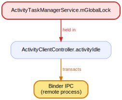

### O3. `BatteryService.update` holds `BatteryService.mLock` across an IPC

At `update` (line 716) the lock(s) `BatteryService.mLock` are held; the path reaches an outgoing Binder transaction via `BatteryService.processValuesLocked`. The lock is pinned for the whole cross-process round-trip.

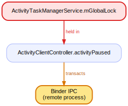

### O4. `ConsumerIrService.getCarrierFrequencies` holds `ConsumerIrService.mHalLock` across an IPC

At `getCarrierFrequencies` (line 146) the lock(s) `ConsumerIrService.mHalLock` are held; the path reaches an outgoing Binder transaction via `IConsumerIr$Stub$Proxy.getCarrierFreqs`. The lock is pinned for the whole cross-process round-trip.

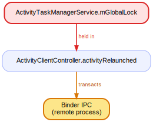

### O5. `ConsumerIrService.transmit` holds `ConsumerIrService.mHalLock` across an IPC

At `transmit` (line 122) the lock(s) `ConsumerIrService.mHalLock` are held; the path reaches an outgoing Binder transaction via `IConsumerIr$Stub$Proxy.transmit`. The lock is pinned for the whole cross-process round-trip.

### O6. `DeviceIdleController.addPowerSaveTempWhitelistAppDirectInternal` holds `server.DeviceIdleController` across an IPC

At `addPowerSaveTempWhitelistAppDirectInternal` (line 3308) the lock(s) `server.DeviceIdleController` are held; the path reaches an outgoing Binder transaction via `DeviceIdleController.updateTempWhitelistAppIdsLocked`. The lock is pinned for the whole cross-process round-trip.

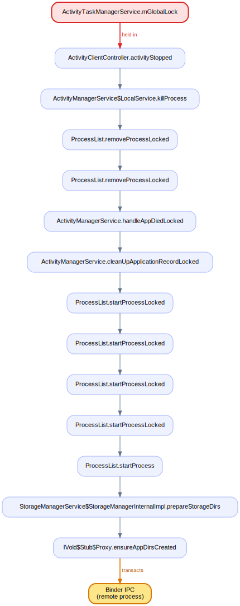

### O7. `DeviceIdleController.addPowerSaveTempWhitelistAppDirectInternal` holds `server.DeviceIdleController` across an IPC

At `addPowerSaveTempWhitelistAppDirectInternal` (line 3324) the lock(s) `server.DeviceIdleController` are held; the path reaches an outgoing Binder transaction via `ActivityManagerService$LocalService.updateDeviceIdleTempAllowlist`. The lock is pinned for the whole cross-process round-trip.

### O8. `DeviceIdleController.checkTempAppWhitelistTimeout` holds `server.DeviceIdleController` across an IPC

At `checkTempAppWhitelistTimeout` (line 3385) the lock(s) `server.DeviceIdleController` are held; the path reaches an outgoing Binder transaction via `DeviceIdleController.onAppRemovedFromTempWhitelistLocked`. The lock is pinned for the whole cross-process round-trip.

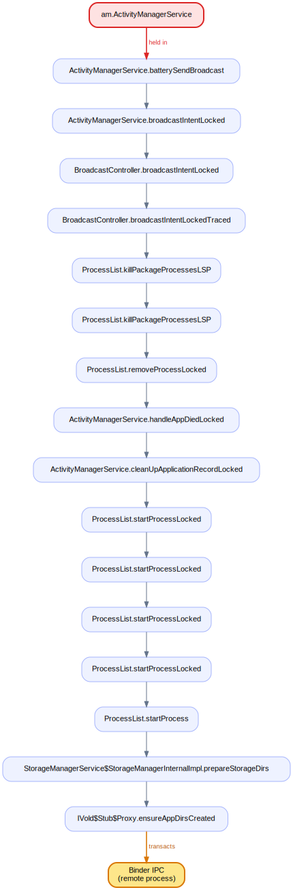

### O9. `DeviceIdleController.removePowerSaveTempWhitelistAppDirectInternal` holds `server.DeviceIdleController` across an IPC

At `removePowerSaveTempWhitelistAppDirectInternal` (line 3357) the lock(s) `server.DeviceIdleController` are held; the path reaches an outgoing Binder transaction via `DeviceIdleController.onAppRemovedFromTempWhitelistLocked`. The lock is pinned for the whole cross-process round-trip.

### O10. `StorageManagerService.mountProxyFileDescriptorBridge` holds `StorageManagerService.mAppFuseLock` across an IPC

At `mountProxyFileDescriptorBridge` (line 3717) the lock(s) `StorageManagerService.mAppFuseLock` are held; the path reaches an outgoing Binder transaction via `AppFuseBridge.addBridge`. The lock is pinned for the whole cross-process round-trip.

### O11. `StorageManagerService.openProxyFileDescriptor` holds `StorageManagerService.mAppFuseLock` across an IPC

At `openProxyFileDescriptor` (line 3748) the lock(s) `StorageManagerService.mAppFuseLock` are held; the path reaches an outgoing Binder transaction via `AppFuseBridge.openFile`. The lock is pinned for the whole cross-process round-trip.

### O12. `StorageManagerService.runSmartIdleMaint` holds `server.StorageManagerService` across an IPC

At `runSmartIdleMaint` (line 2938) the lock(s) `server.StorageManagerService` are held; the path reaches an outgoing Binder transaction via `IVold$Stub$Proxy.getWriteAmount`. The lock is pinned for the whole cross-process round-trip.

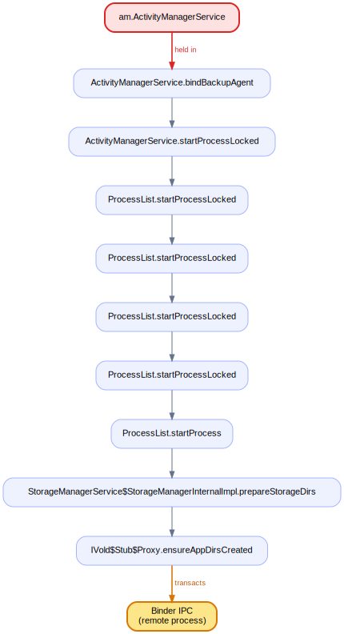

### O13. `StorageManagerService.runSmartIdleMaint` holds `server.StorageManagerService` across an IPC

At `runSmartIdleMaint` (line 2948) the lock(s) `server.StorageManagerService` are held; the path reaches an outgoing Binder transaction via `StorageManagerService.needsCheckpoint`. The lock is pinned for the whole cross-process round-trip.

### O14. `StorageManagerService.runSmartIdleMaint` holds `server.StorageManagerService` across an IPC

At `runSmartIdleMaint` (line 2949) the lock(s) `server.StorageManagerService` are held; the path reaches an outgoing Binder transaction via `StorageManagerService.refreshLifetimeConstraint`. The lock is pinned for the whole cross-process round-trip.

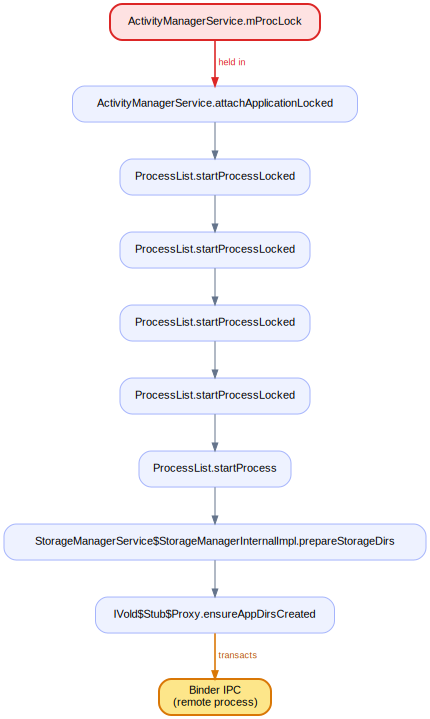

### O15. `StorageManagerService.runSmartIdleMaint` holds `server.StorageManagerService` across an IPC

At `runSmartIdleMaint` (line 2964) the lock(s) `server.StorageManagerService` are held; the path reaches an outgoing Binder transaction via `IVold$Stub$Proxy.setGCUrgentPace`. The lock is pinned for the whole cross-process round-trip.

### O16. `VpnManagerService.deleteVpnProfile` holds `VpnManagerService.mVpns` across an IPC

At `deleteVpnProfile` (line 340) the lock(s) `VpnManagerService.mVpns` are held; the path reaches an outgoing Binder transaction via `Vpn.deleteVpnProfile`. The lock is pinned for the whole cross-process round-trip.

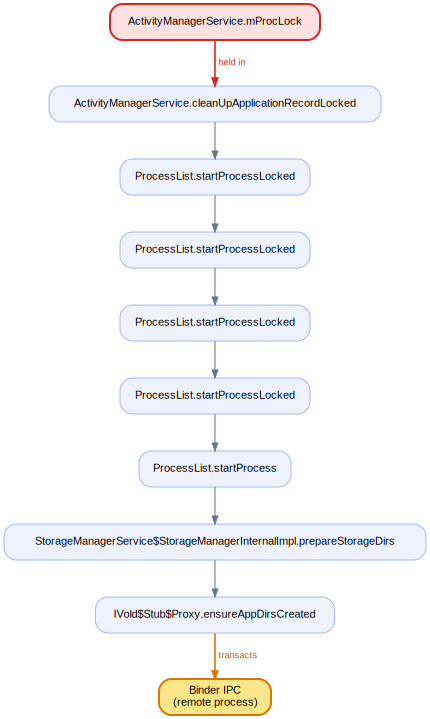

### O17. `VpnManagerService.factoryReset` holds `VpnManagerService.mVpns` across an IPC

At `factoryReset` (line 984) the lock(s) `VpnManagerService.mVpns` are held; the path reaches an outgoing Binder transaction via `VpnManagerService.setAlwaysOnVpnPackage`. The lock is pinned for the whole cross-process round-trip.

### O18. `VpnManagerService.factoryReset` holds `VpnManagerService.mVpns` across an IPC

At `factoryReset` (line 994) the lock(s) `VpnManagerService.mVpns` are held; the path reaches an outgoing Binder transaction via `VpnManagerService.setLockdownTracker`. The lock is pinned for the whole cross-process round-trip.

### O19. `VpnManagerService.factoryReset` holds `VpnManagerService.mVpns` across an IPC

At `factoryReset` (line 1004) the lock(s) `VpnManagerService.mVpns` are held; the path reaches an outgoing Binder transaction via `VpnManagerService.prepareVpn`. The lock is pinned for the whole cross-process round-trip.

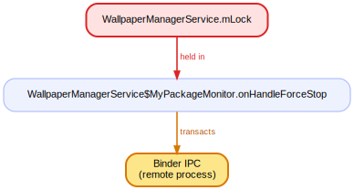

### O20. `VpnManagerService.factoryReset` holds `VpnManagerService.mVpns` across an IPC

At `factoryReset` (line 1011) the lock(s) `VpnManagerService.mVpns` are held; the path reaches an outgoing Binder transaction via `VpnManagerService.prepareVpn`. The lock is pinned for the whole cross-process round-trip.

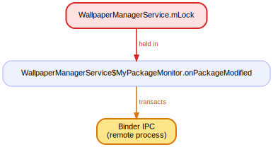

### O21. `VpnManagerService.onPackageRemoved` holds `VpnManagerService.mVpns` across an IPC

At `onPackageRemoved` (line 892) the lock(s) `VpnManagerService.mVpns` are held; the path reaches an outgoing Binder transaction via `Vpn.setAlwaysOnPackage`. The lock is pinned for the whole cross-process round-trip.

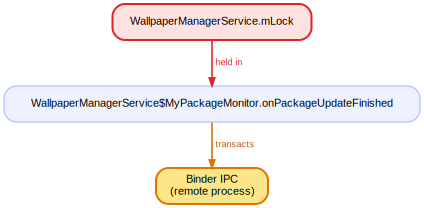

### O22. `VpnManagerService.onPackageRemoved` holds `VpnManagerService.mVpns` across an IPC

At `onPackageRemoved` (line 897) the lock(s) `VpnManagerService.mVpns` are held; the path reaches an outgoing Binder transaction via `Vpn.deleteVpnProfileDueToAppRemoval`. The lock is pinned for the whole cross-process round-trip.

### O23. `VpnManagerService.onPackageReplaced` holds `VpnManagerService.mVpns` across an IPC

At `onPackageReplaced` (line 871) the lock(s) `VpnManagerService.mVpns` are held; the path reaches an outgoing Binder transaction via `Vpn.startAlwaysOnVpn`. The lock is pinned for the whole cross-process round-trip.

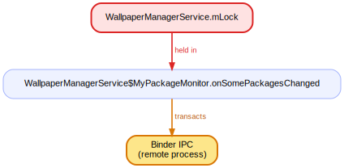

### O24. `VpnManagerService.onUserStarted` holds `VpnManagerService.mVpns` across an IPC

At `onUserStarted` (line 798) the lock(s) `VpnManagerService.mVpns` are held; the path reaches an outgoing Binder transaction via `VpnManagerService$Dependencies.createVpn`. The lock is pinned for the whole cross-process round-trip.

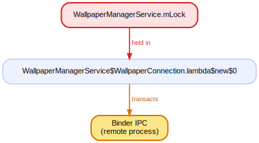

### O25. `VpnManagerService.onUserStarted` holds `VpnManagerService.mVpns` across an IPC

At `onUserStarted` (line 802) the lock(s) `VpnManagerService.mVpns` are held; the path reaches an outgoing Binder transaction via `VpnManagerService.updateLockdownVpn`. The lock is pinned for the whole cross-process round-trip.

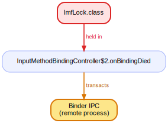

### O26. `VpnManagerService.onUserUnlocked` holds `VpnManagerService.mVpns` across an IPC

At `onUserUnlocked` (line 924) the lock(s) `VpnManagerService.mVpns` are held; the path reaches an outgoing Binder transaction via `VpnManagerService.updateLockdownVpn`. The lock is pinned for the whole cross-process round-trip.

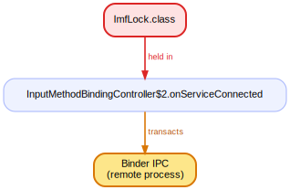

### O27. `VpnManagerService.onUserUnlocked` holds `VpnManagerService.mVpns` across an IPC

At `onUserUnlocked` (line 926) the lock(s) `VpnManagerService.mVpns` are held; the path reaches an outgoing Binder transaction via `VpnManagerService.startAlwaysOnVpn`. The lock is pinned for the whole cross-process round-trip.

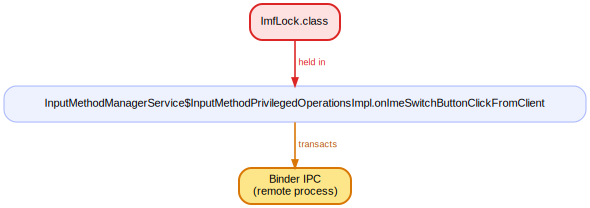

### O28. `VpnManagerService.onVpnLockdownReset` holds `VpnManagerService.mVpns` across an IPC

At `onVpnLockdownReset` (line 933) the lock(s) `VpnManagerService.mVpns` are held; the path reaches an outgoing Binder transaction via `LockdownVpnTracker.reset`. The lock is pinned for the whole cross-process round-trip.

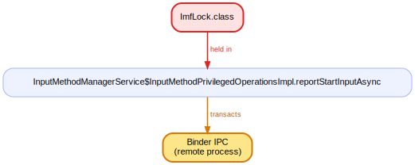

### O29. `VpnManagerService.prepareVpn` holds `VpnManagerService.mVpns` across an IPC

At `prepareVpn` (line 229) the lock(s) `VpnManagerService.mVpns` are held; the path reaches an outgoing Binder transaction via `Vpn.prepare`. The lock is pinned for the whole cross-process round-trip.

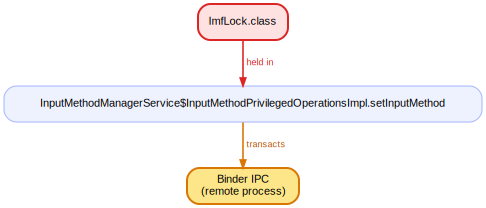

### O30. `VpnManagerService.setAlwaysOnVpnPackage` holds `VpnManagerService.mVpns` across an IPC

At `setAlwaysOnVpnPackage` (line 612) the lock(s) `VpnManagerService.mVpns` are held; the path reaches an outgoing Binder transaction via `Vpn.setAlwaysOnPackage`. The lock is pinned for the whole cross-process round-trip.

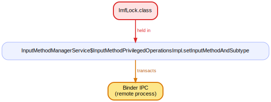

### O31. `VpnManagerService.setAlwaysOnVpnPackage` holds `VpnManagerService.mVpns` across an IPC

At `setAlwaysOnVpnPackage` (line 615) the lock(s) `VpnManagerService.mVpns` are held; the path reaches an outgoing Binder transaction via `VpnManagerService.startAlwaysOnVpn`. The lock is pinned for the whole cross-process round-trip.

### O32. `VpnManagerService.setAlwaysOnVpnPackage` holds `VpnManagerService.mVpns` across an IPC

At `setAlwaysOnVpnPackage` (line 616) the lock(s) `VpnManagerService.mVpns` are held; the path reaches an outgoing Binder transaction via `Vpn.setAlwaysOnPackage`. The lock is pinned for the whole cross-process round-trip.

### O33. `VpnManagerService.startAlwaysOnVpn` holds `VpnManagerService.mVpns` across an IPC

At `startAlwaysOnVpn` (line 576) the lock(s) `VpnManagerService.mVpns` are held; the path reaches an outgoing Binder transaction via `Vpn.startAlwaysOnVpn`. The lock is pinned for the whole cross-process round-trip.

### O34. `VpnManagerService.startLegacyVpn` holds `VpnManagerService.mVpns` across an IPC

At `startLegacyVpn` (line 439) the lock(s) `VpnManagerService.mVpns` are held; the path reaches an outgoing Binder transaction via `Vpn.startLegacyVpn`. The lock is pinned for the whole cross-process round-trip.

### O35. `VpnManagerService.startVpnProfile` holds `VpnManagerService.mVpns` across an IPC

At `startVpnProfile` (line 381) the lock(s) `VpnManagerService.mVpns` are held; the path reaches an outgoing Binder transaction via `Vpn.startVpnProfile`. The lock is pinned for the whole cross-process round-trip.

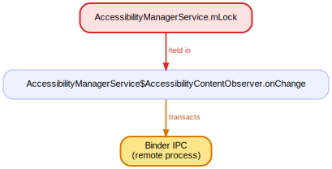

### O36. `VpnManagerService.stopVpnProfile` holds `VpnManagerService.mVpns` across an IPC

At `stopVpnProfile` (line 399) the lock(s) `VpnManagerService.mVpns` are held; the path reaches an outgoing Binder transaction via `Vpn.stopVpnProfile`. The lock is pinned for the whole cross-process round-trip.

### O37. `VpnManagerService.updateLockdownVpn` holds `VpnManagerService.mVpns` across an IPC

At `updateLockdownVpn` (line 495) the lock(s) `VpnManagerService.mVpns` are held; the path reaches an outgoing Binder transaction via `VpnManagerService.setLockdownTracker`. The lock is pinned for the whole cross-process round-trip.

### O38. `VpnManagerService.updateLockdownVpn` holds `VpnManagerService.mVpns` across an IPC

At `updateLockdownVpn` (line 509) the lock(s) `VpnManagerService.mVpns` are held; the path reaches an outgoing Binder transaction via `VpnManagerService.setLockdownTracker`. The lock is pinned for the whole cross-process round-trip.

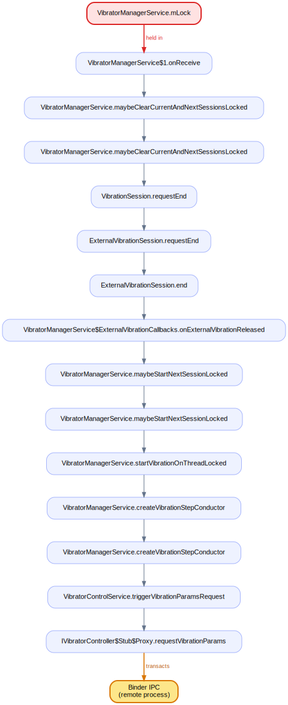

### O39. `VpnManagerService.updateLockdownVpn` holds `VpnManagerService.mVpns` across an IPC

At `updateLockdownVpn` (line 518) the lock(s) `VpnManagerService.mVpns` are held; the path reaches an outgoing Binder transaction via `VpnManagerService.setLockdownTracker`. The lock is pinned for the whole cross-process round-trip.

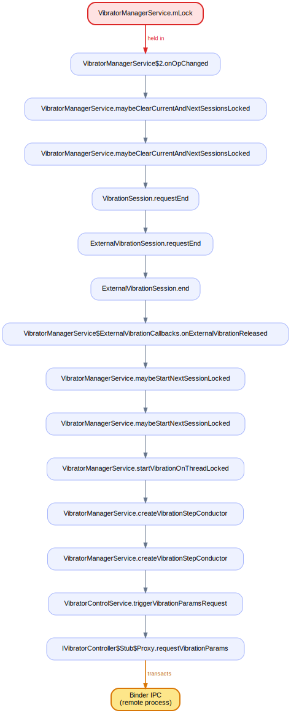

### O40. `AbstractAccessibilityServiceConnection.getWindow` holds `AbstractAccessibilityServiceConnection.mLock` across an IPC

At `getWindow` (line 645) the lock(s) `AbstractAccessibilityServiceConnection.mLock` are held; the path reaches an outgoing Binder transaction via `AbstractAccessibilityServiceConnection.ensureWindowsAvailableTimedLocked`. The lock is pinned for the whole cross-process round-trip.

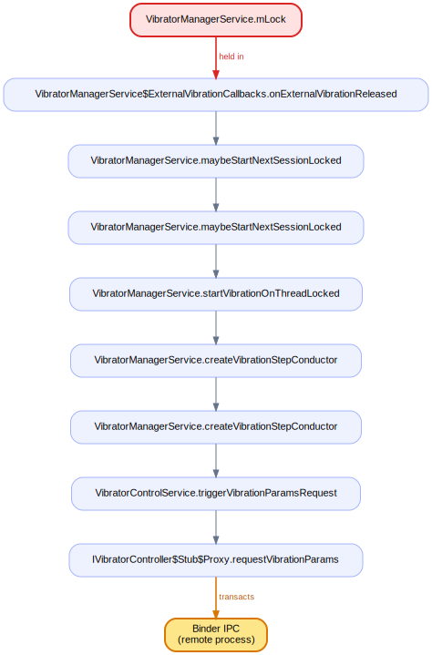

### O41. `AbstractAccessibilityServiceConnection.getWindows` holds `AbstractAccessibilityServiceConnection.mLock` across an IPC

At `getWindows` (line 613) the lock(s) `AbstractAccessibilityServiceConnection.mLock` are held; the path reaches an outgoing Binder transaction via `AbstractAccessibilityServiceConnection.ensureWindowsAvailableTimedLocked`. The lock is pinned for the whole cross-process round-trip.

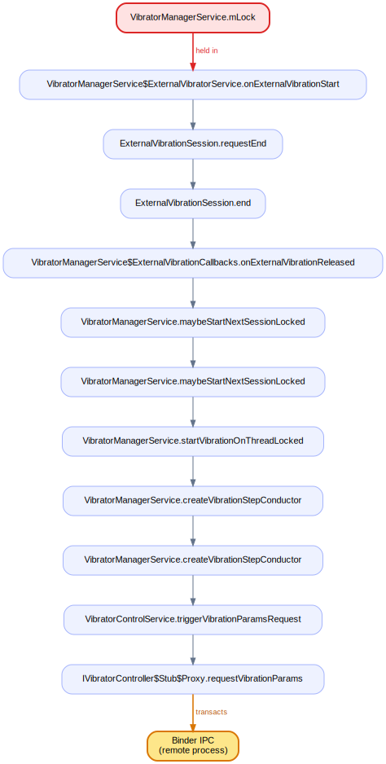

### O42. `AbstractAccessibilityServiceConnection.setCacheEnabled` holds `AbstractAccessibilityServiceConnection.mLock` across an IPC

At `setCacheEnabled` (line 2655) the lock(s) `AbstractAccessibilityServiceConnection.mLock` are held; the path reaches an outgoing Binder transaction via `AccessibilityManagerService.onClientChangeLocked`. The lock is pinned for the whole cross-process round-trip.

### O43. `AbstractAccessibilityServiceConnection.setServiceInfo` holds `AbstractAccessibilityServiceConnection.mLock` across an IPC

At `setServiceInfo` (line 547) the lock(s) `AbstractAccessibilityServiceConnection.mLock` are held; the path reaches an outgoing Binder transaction via `AccessibilityManagerService.onClientChangeLocked`. The lock is pinned for the whole cross-process round-trip.

### O44. `AccessibilityManagerService$AccessibilityContentObserver.onChange` holds `AccessibilityManagerService.mLock` across an IPC

At `onChange` (line 6129) the lock(s) `AccessibilityManagerService.mLock` are held; the path reaches an outgoing Binder transaction via `AccessibilityManagerService.-$$Nest$monUserStateChangedLocked`. The lock is pinned for the whole cross-process round-trip.

### O45. `AccessibilityManagerService$AccessibilityContentObserver.onChange` holds `AccessibilityManagerService.mLock` across an IPC

At `onChange` (line 6133) the lock(s) `AccessibilityManagerService.mLock` are held; the path reaches an outgoing Binder transaction via `AccessibilityManagerService.-$$Nest$monUserStateChangedLocked`. The lock is pinned for the whole cross-process round-trip.

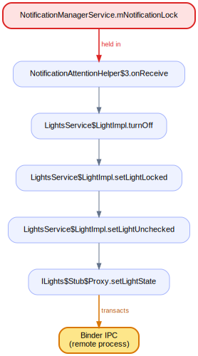

### O46. `AccessibilityManagerService$AccessibilityContentObserver.onChange` holds `AccessibilityManagerService.mLock` across an IPC

At `onChange` (line 6138) the lock(s) `AccessibilityManagerService.mLock` are held; the path reaches an outgoing Binder transaction via `AccessibilityManagerService.-$$Nest$monUserStateChangedLocked`. The lock is pinned for the whole cross-process round-trip.

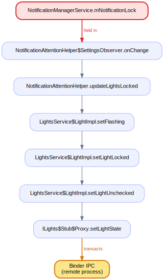

### O47. `AccessibilityManagerService$AccessibilityContentObserver.onChange` holds `AccessibilityManagerService.mLock` across an IPC

At `onChange` (line 6142) the lock(s) `AccessibilityManagerService.mLock` are held; the path reaches an outgoing Binder transaction via `AccessibilityManagerService.-$$Nest$monUserStateChangedLocked`. The lock is pinned for the whole cross-process round-trip.

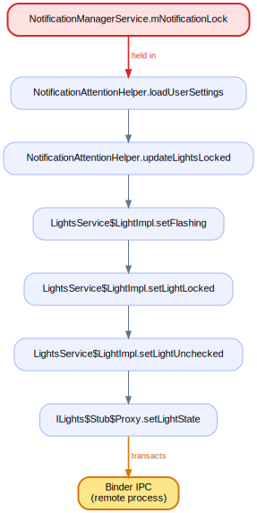

### O48. `AccessibilityManagerService$AccessibilityContentObserver.onChange` holds `AccessibilityManagerService.mLock` across an IPC

At `onChange` (line 6149) the lock(s) `AccessibilityManagerService.mLock` are held; the path reaches an outgoing Binder transaction via `AccessibilityManagerService.-$$Nest$monUserStateChangedLocked`. The lock is pinned for the whole cross-process round-trip.

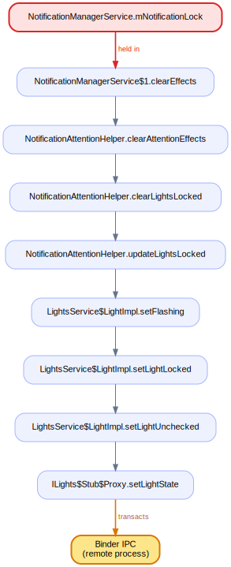

### O49. `AccessibilityManagerService$AccessibilityContentObserver.onChange` holds `AccessibilityManagerService.mLock` across an IPC

At `onChange` (line 6153) the lock(s) `AccessibilityManagerService.mLock` are held; the path reaches an outgoing Binder transaction via `AccessibilityManagerService.-$$Nest$monUserStateChangedLocked`. The lock is pinned for the whole cross-process round-trip.

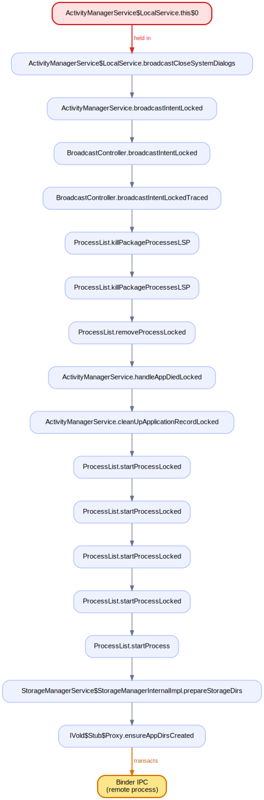

### O50. `AccessibilityManagerService$AccessibilityContentObserver.onChange` holds `AccessibilityManagerService.mLock` across an IPC

At `onChange` (line 6157) the lock(s) `AccessibilityManagerService.mLock` are held; the path reaches an outgoing Binder transaction via `AccessibilityManagerService.-$$Nest$monUserStateChangedLocked`. The lock is pinned for the whole cross-process round-trip.

## Incoming — a binder entry that acquires locks a remote caller blocks on

Each is a Binder entry point (a `Stub` method, a `binderDied`, a oneway callback) that takes the listed locks. A remote process blocks on those locks for the duration of the call. **HIGH** marks an entry that *also* holds one of them across its own outgoing transaction — so a remote caller can pin a `system_server` lock across a second IPC.

### I1. `BugreportManagerServiceImpl$DumpstateListener.binderDied` — **HIGH** (also held across its own outgoing transaction)

This binder entry acquires `BugreportManagerServiceImpl.mLock`, `Slogf.sMessageBuilder`; a remote caller blocks on them. It additionally holds a lock across an outgoing Binder transaction of its own — a remote caller can stall a `system_server` lock across a second cross-process call.

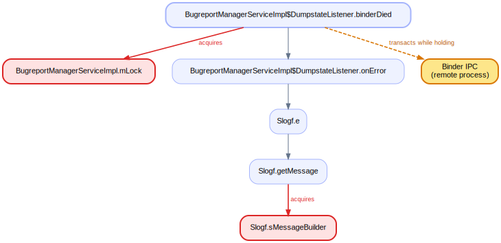

### I2. `BugreportManagerServiceImpl.cancelBugreport` — **HIGH** (also held across its own outgoing transaction)

This binder entry acquires `BugreportManagerServiceImpl.mLock`, `Slogf.sMessageBuilder`; a remote caller blocks on them. It additionally holds a lock across an outgoing Binder transaction of its own — a remote caller can stall a `system_server` lock across a second cross-process call.

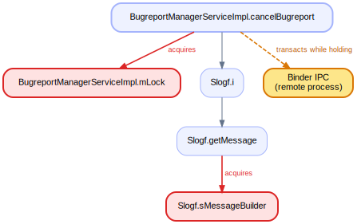

### I3. `BugreportManagerServiceImpl.preDumpUiData` — **HIGH** (also held across its own outgoing transaction)

This binder entry acquires `BugreportManagerServiceImpl.mLock`; a remote caller blocks on them. It additionally holds a lock across an outgoing Binder transaction of its own — a remote caller can stall a `system_server` lock across a second cross-process call.

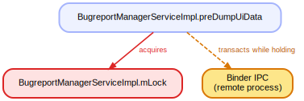

### I4. `BugreportManagerServiceImpl.retrieveBugreport` — **HIGH** (also held across its own outgoing transaction)

This binder entry acquires `BugreportManagerServiceImpl$BugreportFileManager.mLock`, `BugreportManagerServiceImpl.mLock`, `Slogf.sMessageBuilder`, `WatchableImpl.mObservers`; a remote caller blocks on them. It additionally holds a lock across an outgoing Binder transaction of its own — a remote caller can stall a `system_server` lock across a second cross-process call.

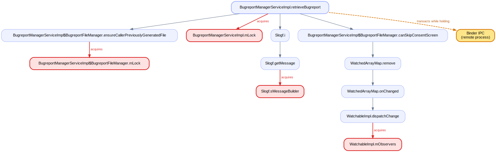

### I5. `BugreportManagerServiceImpl.startBugreport` — **HIGH** (also held across its own outgoing transaction)

This binder entry acquires `BugreportManagerServiceImpl$BugreportFileManager.mLock`, `BugreportManagerServiceImpl.mLock`, `Slogf.sMessageBuilder`, `WatchableImpl.mObservers`; a remote caller blocks on them. It additionally holds a lock across an outgoing Binder transaction of its own — a remote caller can stall a `system_server` lock across a second cross-process call.

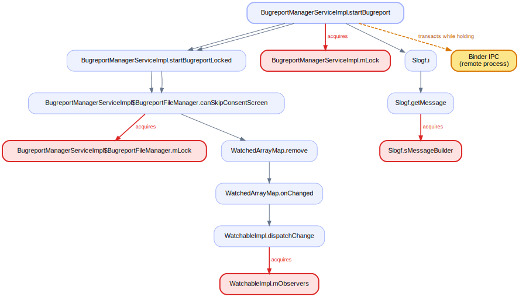

### I6. `VibratorControlService.triggerVibrationParamsRequest` — **HIGH** (also held across its own outgoing transaction)

This binder entry acquires `VibratorControlService.mLock`; a remote caller blocks on them. It additionally holds a lock across an outgoing Binder transaction of its own — a remote caller can stall a `system_server` lock across a second cross-process call.

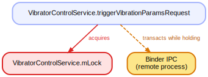

### I7. `BatteryService$BinderService.dump`

This binder entry acquires `BatteryService.mLock`; a remote caller blocks on them.

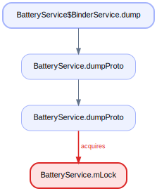

### I8. `DiskStatsService.dump`

This binder entry acquires `PrintWriter.lock`; a remote caller blocks on them.

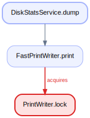

### I9. `DiskStatsService.reportCachedValues`

This binder entry acquires `PrintWriter.lock`; a remote caller blocks on them.

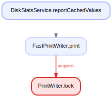

### I10. `DiskStatsService.reportDiskWriteSpeed`

This binder entry acquires `PrintWriter.lock`; a remote caller blocks on them.

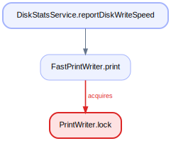

### I11. `DiskStatsService.reportFreeSpace`

This binder entry acquires `PrintWriter.lock`; a remote caller blocks on them.

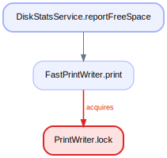

### I12. `DockObserver$BinderService.dump`

This binder entry acquires `DockObserver.mLock`; a remote caller blocks on them.

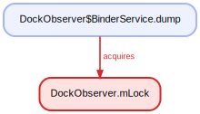

### I13. `DynamicSystemService$GsiServiceCallback.onResult`

This binder entry acquires `this`; a remote caller blocks on them.

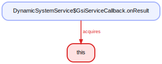

### I14. `LooperStatsService.dump`

This binder entry acquires `PrintWriter.lock`; a remote caller blocks on them.

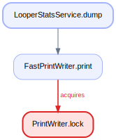

### I15. `RuntimeService.dump`

This binder entry acquires `PrintWriter.lock`; a remote caller blocks on them.

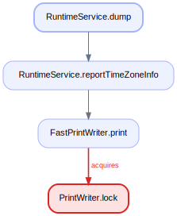

### I16. `StorageManagerService$10.onStatus`

This binder entry acquires `StorageManagerService.mLock`; a remote caller blocks on them.

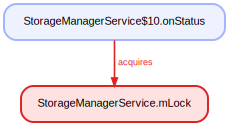

### I17. `StorageManagerService$13.onStatus`

This binder entry acquires `StorageManagerService.mLock`; a remote caller blocks on them.

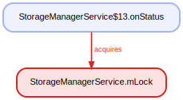

### I18. `StorageManagerService$3.onDiskCreated`

This binder entry acquires `StorageManagerService.mLock`; a remote caller blocks on them.

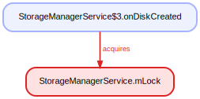

### I19. `StorageManagerService$3.onDiskDestroyed`

This binder entry acquires `StorageManagerService.mLock`; a remote caller blocks on them.

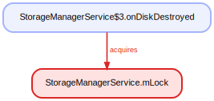

### I20. `StorageManagerService$3.onDiskMetadataChanged`

This binder entry acquires `StorageManagerService.mLock`; a remote caller blocks on them.

### I21. `StorageManagerService$3.onDiskScanned`

This binder entry acquires `StorageManagerService.mLock`; a remote caller blocks on them.

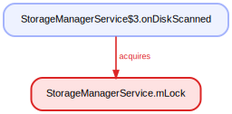

### I22. `StorageManagerService$3.onVolumeCreated`

This binder entry acquires `StorageManagerService.mLock`, `UserController.mLock`, `WatchableImpl.mObservers`; a remote caller blocks on them.

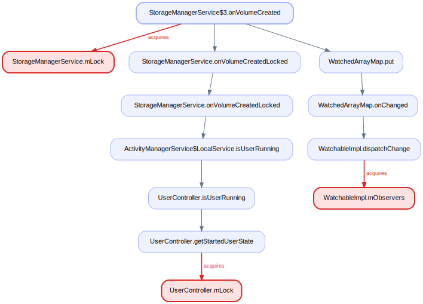

### I23. `StorageManagerService$3.onVolumeDestroyed`

This binder entry acquires `StorageManagerService.mLock`, `StorageSessionController.mLock`, `StorageUserConnection.mSessionsLock`, `WatchableImpl.mObservers`; a remote caller blocks on them.

### I24. `StorageManagerService$3.onVolumeInternalPathChanged`

This binder entry acquires `StorageManagerService.mLock`, `WatchableImpl.mObservers`; a remote caller blocks on them.

### I25. `StorageManagerService$3.onVolumeMetadataChanged`

This binder entry acquires `StorageManagerService.mLock`, `WatchableImpl.mObservers`; a remote caller blocks on them.

### I26. `StorageManagerService$3.onVolumePathChanged`

This binder entry acquires `StorageManagerService.mLock`, `WatchableImpl.mObservers`; a remote caller blocks on them.

### I27. `StorageManagerService$3.onVolumeStateChanged`

This binder entry acquires `StorageManagerService.mLock`, `WatchableImpl.mObservers`; a remote caller blocks on them.

### I28. `StorageManagerService$8.onVolumeChecking`

This binder entry acquires `StorageSessionController.mLock`, `StorageUserConnection$ActiveConnection.mLock`, `StorageUserConnection.mSessionsLock`, `WatchableImpl.mObservers`; a remote caller blocks on them.

### I29. `StorageManagerService$9.onFinished`

This binder entry acquires `StorageManagerService.mLock`; a remote caller blocks on them.

### I30. `SystemServer$SystemServerDumper.addDumpable`

This binder entry acquires `SystemServer$SystemServerDumper.mDumpables`; a remote caller blocks on them.

### I31. `SystemServer$SystemServerDumper.dump`

This binder entry acquires `SystemServer$SystemServerDumper.mDumpables`; a remote caller blocks on them.

### I32. `ActivityManagerService$CacheBinder.dump`

This binder entry acquires `ActivityManagerService.mProcLock`, `am.CachedAppOptimizer`, `CachedAppOptimizer.mAm`, `am.PackageList`, `PrintWriter.lock`; a remote caller blocks on them.

### I33. `ActivityManagerService$DbBinder.dump`

This binder entry acquires `ActivityManagerService.mProcLock`, `am.CachedAppOptimizer`, `CachedAppOptimizer.mAm`, `am.PackageList`, `PrintWriter.lock`; a remote caller blocks on them.

### I34. `ActivityManagerService$GraphicsBinder.dump`

This binder entry acquires `ActivityManagerService.mProcLock`, `am.CachedAppOptimizer`, `CachedAppOptimizer.mAm`, `am.PackageList`, `PrintWriter.lock`; a remote caller blocks on them.

### I35. `ActivityManagerService$IntentCreatorToken.completeFinalize`

This binder entry acquires `ActivityManagerService.sIntentCreatorTokenCache`, `WatchableImpl.mObservers`; a remote caller blocks on them.

### I36. `ActivityManagerService$MemBinder.dump`

This binder entry acquires `Clock.SYSTEM_CLOCK`, `ProtoLogImpl_842414855.class`, `ActiveServices.mAm`, `ActivityManagerConstants.mProcStateDebugUids`, `ActivityManagerService$1.this$0`, `ActivityManagerService.mCompanionAppUidsMap`, `ActivityManagerService.mDeliveryGroupPolicyIgnoredActions`, `ActivityManagerService.mOomAdjObserverLock`, `ActivityManagerService.mPidsSelfLocked`, `ActivityManagerService.mProcLock`, `ActivityManagerService.mProfileOwnerUids`, `ActivityManagerService.sActiveProcessInfoSelfLocked`, `AppErrors.mBadProcessLock`, `AppExitInfoTracker.mLock`, `AppProfiler.mProcessCpuTracker`, `AppProfiler.mProfilerLock`, `AppRestrictionController.mCarrierPrivilegedLock`, `AppRestrictionController.mLock`, `AppRestrictionController.mSettingsLock`, `AppRestrictionController.mSystemModulesCache`, `AppStartInfoTracker.mLock`, `am.BoundServiceSession`, `BroadcastController.mStickyBroadcasts`, `BroadcastQueueImpl.mBgConstants`, `BroadcastQueueImpl.mFgConstants`, `am.CachedAppOptimizer`, `CachedAppOptimizer.mAm`, `CachedAppOptimizer.mPhenotypeFlagLock`, `ComponentAliasResolver.mLock`, `ContentProviderConnection.mLock`, `FgsTempAllowList.mLock`, `LmkdConnection.mLmkdOutputStreamLock`, `LmkdConnection.mLmkdSocketLock`, `LmkdConnection.mReplyBufLock`, `am.PackageList`, `PendingIntentController.mLock`, `PendingTempAllowlists.mPendingTempAllowlist`, `PhantomProcessList.mLock`, `ProcessStatsService.mLock`, `ProviderMap.mAm`, `ServiceRecord$StartItem.uriPermissions`, `UidObserverController.mLock`, `UserController.mLock`, `GameManagerService$GamePackageConfiguration.mModeConfigLock`, `GameManagerService.mDeviceConfigLock`, `GameManagerService.mLock`, `GenericWindowPolicyController.mGenericWindowPolicyControllerLock`, `ImeTrackerService.mLock`, `ImfLock.class`, `UserDataRepository.mMutationLock`, `UserManagerService.mRestrictionsLock`, `UserManagerService.mUsersLock`, `WakeGestureListener.mLock`, `stats.BatteryExternalStatsWorker`, `stats.BatteryStatsImpl`, `BatteryStatsImpl.mPowerStatsUidResolver`, `PowerStatsCollector.mClock`, `PowerStatsStore.mFileLock`, `PowerStatsExporter.mPowerStatsAggregator`, `PowerStatsService.mInjector`, `UriGrantsManagerService.mLock`, `AnrTimer.mLock`, `AnrTimer.sAnrTimerList`, `AnrTimer.sErrors`, `Slogf.sMessageBuilder`, `WatchableImpl.mObservers`, `AccessibilityWindowsPopulator.mLock`, `ActivityRecord.uriPermissions`, `ActivityTaskManagerService.mGlobalLock`, `wm.BackgroundLaunchProcessController`, `HighRefreshRateDenylist.mLock`, `wm.MirrorActiveUids`, `PackageConfigPersister.mLock`, `SnapshotCache.mLock`, `SnapshotPersistQueue.mLock`, `VisibleActivityProcessTracker.mProcMap`, `WindowOrientationListener.mLock`, `WindowProcessController.mPkgList`, `PrintWriter.lock`; a remote caller blocks on them.

### I37. `AppProfiler$CpuBinder.dump`

This binder entry acquires `Clock.SYSTEM_CLOCK`, `ProtoLogImpl_842414855.class`, `ActiveServices.mAm`, `ActivityManagerConstants.mProcStateDebugUids`, `ActivityManagerService$1.this$0`, `ActivityManagerService.mCompanionAppUidsMap`, `ActivityManagerService.mDeliveryGroupPolicyIgnoredActions`, `ActivityManagerService.mOomAdjObserverLock`, `ActivityManagerService.mPidsSelfLocked`, `ActivityManagerService.mProcLock`, `ActivityManagerService.mProfileOwnerUids`, `ActivityManagerService.sActiveProcessInfoSelfLocked`, `AppErrors.mBadProcessLock`, `AppExitInfoTracker.mLock`, `AppProfiler.mProcessCpuTracker`, `AppProfiler.mProfilerLock`, `AppRestrictionController.mCarrierPrivilegedLock`, `AppRestrictionController.mLock`, `AppRestrictionController.mSettingsLock`, `AppRestrictionController.mSystemModulesCache`, `AppStartInfoTracker.mLock`, `am.BoundServiceSession`, `BroadcastController.mStickyBroadcasts`, `BroadcastQueueImpl.mBgConstants`, `BroadcastQueueImpl.mFgConstants`, `am.CachedAppOptimizer`, `CachedAppOptimizer.mAm`, `CachedAppOptimizer.mPhenotypeFlagLock`, `ComponentAliasResolver.mLock`, `ContentProviderConnection.mLock`, `FgsTempAllowList.mLock`, `LmkdConnection.mLmkdOutputStreamLock`, `LmkdConnection.mLmkdSocketLock`, `LmkdConnection.mReplyBufLock`, `am.PackageList`, `PendingIntentController.mLock`, `PendingTempAllowlists.mPendingTempAllowlist`, `PhantomProcessList.mLock`, `ProcessStatsService.mLock`, `ProviderMap.mAm`, `ServiceRecord$StartItem.uriPermissions`, `UidObserverController.mLock`, `UserController.mLock`, `GameManagerService$GamePackageConfiguration.mModeConfigLock`, `GameManagerService.mDeviceConfigLock`, `GameManagerService.mLock`, `GenericWindowPolicyController.mGenericWindowPolicyControllerLock`, `ImeTrackerService.mLock`, `ImfLock.class`, `UserDataRepository.mMutationLock`, `UserManagerService.mRestrictionsLock`, `UserManagerService.mUsersLock`, `WakeGestureListener.mLock`, `stats.BatteryExternalStatsWorker`, `stats.BatteryStatsImpl`, `BatteryStatsImpl.mPowerStatsUidResolver`, `PowerStatsCollector.mClock`, `PowerStatsStore.mFileLock`, `PowerStatsExporter.mPowerStatsAggregator`, `PowerStatsService.mInjector`, `UriGrantsManagerService.mLock`, `AnrTimer.mLock`, `AnrTimer.sAnrTimerList`, `AnrTimer.sErrors`, `Slogf.sMessageBuilder`, `WatchableImpl.mObservers`, `AccessibilityWindowsPopulator.mLock`, `ActivityRecord.uriPermissions`, `ActivityTaskManagerService.mGlobalLock`, `wm.BackgroundLaunchProcessController`, `HighRefreshRateDenylist.mLock`, `wm.MirrorActiveUids`, `PackageConfigPersister.mLock`, `SnapshotCache.mLock`, `SnapshotPersistQueue.mLock`, `VisibleActivityProcessTracker.mProcMap`, `WindowOrientationListener.mLock`, `WindowProcessController.mPkgList`, `PrintWriter.lock`; a remote caller blocks on them.

### I38. `BroadcastRecord.dump`

This binder entry acquires `PrintWriter.lock`; a remote caller blocks on them.

### I39. `ContentProviderConnection.adjustCounts`

This binder entry acquires `ContentProviderConnection.mLock`; a remote caller blocks on them.

### I40. `ContentProviderConnection.decrementCount`

This binder entry acquires `ContentProviderConnection.mLock`; a remote caller blocks on them.

### I41. `ContentProviderConnection.incrementCount`

This binder entry acquires `ContentProviderConnection.mLock`; a remote caller blocks on them.

### I42. `ContentProviderConnection.initializeCount`

This binder entry acquires `ContentProviderConnection.mLock`; a remote caller blocks on them.

### I43. `ContentProviderConnection.stableCount`

This binder entry acquires `ContentProviderConnection.mLock`; a remote caller blocks on them.

### I44. `ContentProviderConnection.startAssociationIfNeeded`

This binder entry acquires `ContentProviderConnection.mProcStatsLock`, `am.PackageList`; a remote caller blocks on them.

### I45. `ContentProviderConnection.stopAssociation`

This binder entry acquires `ContentProviderConnection.mProcStatsLock`; a remote caller blocks on them.

### I46. `ContentProviderConnection.toClientString`

This binder entry acquires `ContentProviderConnection.mLock`; a remote caller blocks on them.

### I47. `ContentProviderConnection.toClientString`

This binder entry acquires `ContentProviderConnection.mLock`; a remote caller blocks on them.

### I48. `ContentProviderConnection.toShortString`

This binder entry acquires `ContentProviderConnection.mLock`; a remote caller blocks on them.

### I49. `ContentProviderConnection.toShortString`

This binder entry acquires `ContentProviderConnection.mLock`; a remote caller blocks on them.

### I50. `ContentProviderConnection.toString`

This binder entry acquires `ContentProviderConnection.mLock`; a remote caller blocks on them.

