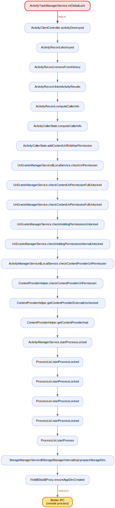

# Findings — locks across Binder IPC in `system_server`

`lockdex binder` flags a hazard distinct from the lock-order cycles in
[`FINDINGS.md`](FINDINGS.md): a lock held while a thread crosses a **process**
boundary. The peer process is outside the analysis, so this is not a provable
cycle — it is the shape that causes cross-process deadlocks, priority inversion,
and ANRs (a remote call stalls while a contended lock is pinned).

On a build's `services.jar`, `lockdex binder` reports, deterministically and in a
few seconds:

- **798** outgoing hold-sites — a lock held at a call site that reaches
  `IBinder.transact` — spread across ~130 distinct locks.
- **161** incoming server entries that take a lock a remote caller can block on.
- **4** high-risk incoming entries — they hold a lock *across their own* outgoing
  transaction (the nested pattern that genuinely deadlocks across processes).

Generated AIDL proxies (`$Stub$Proxy`, which `synchronized(this)` to cache an
interface hash), alloc-site / unresolved monitors, and compiler synthetics are
excluded as noise — only shared lock identities in real service code remain.

---

## What it finds — outgoing (a lock held across an outgoing transaction)

Ranked by how often each lock is held across IPC. The global `system_server`
locks dominate, exactly as expected:

| held across N IPCs | lock |
|---|---|
| 220 | `ActivityTaskManagerService.mGlobalLock` |
| 56 | `ActivityManagerService` (the AMS instance monitor) |
| 43 | `ActivityManagerService.mProcLock` |
| 27 | `AccessibilityManagerService.mLock` |
| 24 | `ActivityManagerService$LocalService` (outer-instance monitor) |
| 21 | `WallpaperManagerService.mLock` |
| 19 | `VibratorManagerService.mLock` |
| 18 | `ImfLock.class` (inputmethod) |
| 17 | `NotificationManagerService.mNotificationLock` |

### Example — `ActivityTaskManagerService.mGlobalLock` across a client callback



`ActivityClientController.activityDestroyed` holds the WM global lock and, still
holding it, calls into `ActivityRecord.destroyed` which dispatches further — a
chain that reaches an outgoing Binder transaction with `mGlobalLock` pinned the
whole time:

```text
  frameworks/base/.../server/wm/ActivityClientController.java:316
      314      final ActivityRecord r = ActivityRecord.forTokenLocked(token);
      315      if (r != null) {
  >>  316          r.destroyed("activityDestroyed");
      317      }
```

The diagram shows the held lock (red) → the call path → the **Binder IPC** node;
every one of the 220 `mGlobalLock` sites has its own. This is the single most
load-bearing lock in `system_server`, so each place it is pinned across IPC is a
latency cliff for whatever process is on the other end.

The full ranked report (every lock, every site, each with a call-path diagram and
source) is what `lockdex binder <input> --src-root <aosp> --out-dir <dir>` writes;
`--class ActivityManagerService` or `--lock mProcLock` narrows it to one service or
lock and emits the complete set of images for it.

---

## High-risk — incoming entries that hold a lock across their own outgoing call

These four are the dangerous case: a method a remote process can invoke acquires a
lock and *then itself* calls out over Binder while holding it. If the downstream
process calls back into a path that needs the same lock, the two processes
deadlock — and neither side can see the cycle from its own code.


All four are in `BugreportManagerServiceImpl`, holding `mLock` across an outgoing
call:

1. `BugreportManagerServiceImpl$DumpstateListener.binderDied` — `mLock`,
   `Slogf.sMessageBuilder`
2. `BugreportManagerServiceImpl.preDumpUiData` — `mLock`
3. `BugreportManagerServiceImpl.retrieveBugreport` — `mLock`,
   `BugreportFileManager.mLock`, `WatchableImpl.mObservers`
4. `BugreportManagerServiceImpl.startBugreport` — same set

`binderDied` is itself a Binder callback (a death-recipient), so it runs on a
Binder thread holding `mLock` while it reaches another transaction — the kind of
nested cross-process hold worth a second look during review.

---

## How to read a finding

A reported site is a real bytecode fact: at this instruction the lock is on the
monitor stack (or a `j.u.c` lock is held), and the call made here transitively
reaches `IBinder.transact`. The lock is therefore held for the entire duration of
the cross-process call.

What the tool does *not* decide is whether a given hold is a bug — many are
deliberate and safe (the callee is a fast `oneway`, or the protocol guarantees the
peer never re-enters). It is a ranked, source-anchored worklist: start at the
locks held across the most transactions, and at the four high-risk entries.

## Caveats

- The call graph over-approximates at megamorphic sites, so a held lock can be
  attributed to a transaction it does not actually reach at runtime.
- `oneway` vs two-way transactions are not yet distinguished; a `oneway` hold is
  lower risk (fire-and-forget) than a blocking one.
- Locks reached only through unresolved values are dropped, so this under-reports
  rather than inventing hazards.
