# Findings — the ActivityManager lock held across Binder IPC

`lockdex binder --lock ActivityManagerService`. The AMS lock is `system_server`'s busiest monitor — it serializes process lifecycle, service binding, broadcast dispatch, and OOM adjustment. **Holding it across an outgoing Binder transaction is the classic stall pattern:** while the call to another process is in flight, no other thread can take the AMS lock, so if that process is slow, janky, or dead, the entire activity-manager subsystem blocks behind it — ANRs, Watchdog kills, system-wide jank. It's also a cross-process AB-BA risk if the callee re-enters `system_server`.

Sound analysis: every site below is a real path on which an AMS lock (`ActivityManagerService` monitor, `mProcLock`, or an inner-class callback holding it via `this$0`) is held while the path reaches an `IBinder.transact` to another process. **130** distinct (holder, IPC-target) hazards, each with its diagram.

---

### 1. `ActivityManagerService$2.onActivityLaunched` holds the AMS monitor across an IPC at `ActivityManagerService$2.onActivityLaunched`

`ActivityManagerService$2.onActivityLaunched` (line 1095) holds the AMS monitor while the call path `AppStartInfoTracker.onActivityLaunched` → … → `ActivityManagerService$2.onActivityLaunched` reaches an outgoing Binder transaction to another process. The AMS lock is pinned for the whole round-trip; a slow or dead remote stalls every thread waiting on the activity manager.

### 2. `ActivityManagerService$5.onRemoveCompleted` holds the AMS monitor across an IPC at `IVold$Stub$Proxy.ensureAppDirsCreated`

`ActivityManagerService$5.onRemoveCompleted` (line 3640) holds the AMS monitor while the call path `ActivityManagerService.-$$Nest$mfinishForceStopPackageLocked` → … → `IVold$Stub$Proxy.ensureAppDirsCreated` reaches an outgoing Binder transaction to another process. The AMS lock is pinned for the whole round-trip; a slow or dead remote stalls every thread waiting on the activity manager.

### 3. `ActivityManagerService$6.onReceive` holds the AMS monitor across an IPC at `IVold$Stub$Proxy.ensureAppDirsCreated`

`ActivityManagerService$6.onReceive` (line 5292) holds the AMS monitor while the call path `ActivityManagerService.forceStopPackageLocked` → … → `IVold$Stub$Proxy.ensureAppDirsCreated` reaches an outgoing Binder transaction to another process. The AMS lock is pinned for the whole round-trip; a slow or dead remote stalls every thread waiting on the activity manager.

### 4. `ActivityManagerService$AppDeathRecipient.binderDied` holds the AMS monitor across an IPC at `IVold$Stub$Proxy.ensureAppDirsCreated`

`ActivityManagerService$AppDeathRecipient.binderDied` (line 1532) holds the AMS monitor while the call path `ActivityManagerService.appDiedLocked` → … → `IVold$Stub$Proxy.ensureAppDirsCreated` reaches an outgoing Binder transaction to another process. The AMS lock is pinned for the whole round-trip; a slow or dead remote stalls every thread waiting on the activity manager.

### 5. `ActivityManagerService$LocalService.broadcastCloseSystemDialogs` holds the AMS monitor across an IPC at `IVold$Stub$Proxy.ensureAppDirsCreated`

`ActivityManagerService$LocalService.broadcastCloseSystemDialogs` (line 17687) holds the AMS monitor while the call path `ActivityManagerService.broadcastIntentLocked` → … → `IVold$Stub$Proxy.ensureAppDirsCreated` reaches an outgoing Binder transaction to another process. The AMS lock is pinned for the whole round-trip; a slow or dead remote stalls every thread waiting on the activity manager.

### 6. `ActivityManagerService$LocalService.broadcastGlobalConfigurationChanged` holds the AMS monitor across an IPC at `IVold$Stub$Proxy.ensureAppDirsCreated`

`ActivityManagerService$LocalService.broadcastGlobalConfigurationChanged` (line 17621) holds the AMS monitor while the call path `ActivityManagerService.broadcastIntentLocked` → … → `IVold$Stub$Proxy.ensureAppDirsCreated` reaches an outgoing Binder transaction to another process. The AMS lock is pinned for the whole round-trip; a slow or dead remote stalls every thread waiting on the activity manager.

### 7. `ActivityManagerService$LocalService.broadcastIntent` holds the AMS monitor across an IPC at `IVold$Stub$Proxy.ensureAppDirsCreated`

`ActivityManagerService$LocalService.broadcastIntent` (line 17425) holds the AMS monitor while the call path `BroadcastController.broadcastIntentLocked` → … → `IVold$Stub$Proxy.ensureAppDirsCreated` reaches an outgoing Binder transaction to another process. The AMS lock is pinned for the whole round-trip; a slow or dead remote stalls every thread waiting on the activity manager.

### 8. `ActivityManagerService$LocalService.broadcastIntentInPackage` holds the AMS monitor across an IPC at `IVold$Stub$Proxy.ensureAppDirsCreated`

`ActivityManagerService$LocalService.broadcastIntentInPackage` (line 17402) holds the AMS monitor while the call path `BroadcastController.broadcastIntentInPackage` → … → `IVold$Stub$Proxy.ensureAppDirsCreated` reaches an outgoing Binder transaction to another process. The AMS lock is pinned for the whole round-trip; a slow or dead remote stalls every thread waiting on the activity manager.

### 9. `ActivityManagerService$LocalService.cleanUpServices` holds the AMS monitor across an IPC at `ActivityManagerService$LocalService.cleanUpServices`

`ActivityManagerService$LocalService.cleanUpServices` (line 17506) holds the AMS monitor while the call path `ActiveServices.cleanUpServices` → … → `ActivityManagerService$LocalService.cleanUpServices` reaches an outgoing Binder transaction to another process. The AMS lock is pinned for the whole round-trip; a slow or dead remote stalls every thread waiting on the activity manager.

### 10. `ActivityManagerService$LocalService.killAllBackgroundProcessesExcept` holds the AMS monitor across an IPC at `IVold$Stub$Proxy.ensureAppDirsCreated`

`ActivityManagerService$LocalService.killAllBackgroundProcessesExcept` (line 17702) holds the AMS monitor while the call path `ActivityManagerService.killAllBackgroundProcessesExcept` → … → `IVold$Stub$Proxy.ensureAppDirsCreated` reaches an outgoing Binder transaction to another process. The AMS lock is pinned for the whole round-trip; a slow or dead remote stalls every thread waiting on the activity manager.

### 11. `ActivityManagerService$LocalService.killApplicationSync` holds the AMS monitor across an IPC at `IVold$Stub$Proxy.ensureAppDirsCreated`

`ActivityManagerService$LocalService.killApplicationSync` (line 18313) holds the AMS monitor while the call path `ActivityManagerService.forceStopPackageLocked` → … → `IVold$Stub$Proxy.ensureAppDirsCreated` reaches an outgoing Binder transaction to another process. The AMS lock is pinned for the whole round-trip; a slow or dead remote stalls every thread waiting on the activity manager.

### 12. `ActivityManagerService$LocalService.killForegroundAppsForUser` holds the AMS monitor across an IPC at `IVold$Stub$Proxy.ensureAppDirsCreated`

`ActivityManagerService$LocalService.killForegroundAppsForUser` (line 16895) holds the AMS monitor while the call path `ProcessList.removeProcessLocked` → … → `IVold$Stub$Proxy.ensureAppDirsCreated` reaches an outgoing Binder transaction to another process. The AMS lock is pinned for the whole round-trip; a slow or dead remote stalls every thread waiting on the activity manager.

### 13. `ActivityManagerService$LocalService.killProcess` holds the AMS monitor across an IPC at `IVold$Stub$Proxy.ensureAppDirsCreated`

`ActivityManagerService$LocalService.killProcess` (line 17220) holds the AMS monitor while the call path `ProcessList.removeProcessLocked` → … → `IVold$Stub$Proxy.ensureAppDirsCreated` reaches an outgoing Binder transaction to another process. The AMS lock is pinned for the whole round-trip; a slow or dead remote stalls every thread waiting on the activity manager.

### 14. `ActivityManagerService$LocalService.killProcessesForRemovedTask` holds the AMS monitor across an IPC at `ActivityManagerService$LocalService.killProcessesForRemovedTask`

`ActivityManagerService$LocalService.killProcessesForRemovedTask` (line 17191) holds the AMS monitor while the call path `ProcessRecordInternal.killLocked` → … → `ActivityManagerService$LocalService.killProcessesForRemovedTask` reaches an outgoing Binder transaction to another process. The AMS lock is pinned for the whole round-trip; a slow or dead remote stalls every thread waiting on the activity manager.

### 15. `ActivityManagerService$LocalService.killSdkSandboxClientAppProcess` holds the AMS monitor across an IPC at `ActivityManagerService$LocalService.killSdkSandboxClientAppProcess`

`ActivityManagerService$LocalService.killSdkSandboxClientAppProcess` (line 16834) holds the AMS monitor while the call path `ProcessRecordInternal.killLocked` → … → `ActivityManagerService$LocalService.killSdkSandboxClientAppProcess` reaches an outgoing Binder transaction to another process. The AMS lock is pinned for the whole round-trip; a slow or dead remote stalls every thread waiting on the activity manager.

### 16. `ActivityManagerService$LocalService.notifyActiveMediaForegroundService` holds the AMS monitor across an IPC at `ActivityManagerService$LocalService.notifyActiveMediaForegroundService`

`ActivityManagerService$LocalService.notifyActiveMediaForegroundService` (line 18202) holds the AMS monitor while the call path `ActiveServices.notifyActiveMediaForegroundServiceLocked` → … → `ActivityManagerService$LocalService.notifyActiveMediaForegroundService` reaches an outgoing Binder transaction to another process. The AMS lock is pinned for the whole round-trip; a slow or dead remote stalls every thread waiting on the activity manager.

### 17. `ActivityManagerService$LocalService.notifyInactiveMediaForegroundService` holds the AMS monitor across an IPC at `ActivityManagerService$LocalService.notifyInactiveMediaForegroundService`

`ActivityManagerService$LocalService.notifyInactiveMediaForegroundService` (line 18211) holds the AMS monitor while the call path `ActiveServices.notifyInactiveMediaForegroundServiceLocked` → … → `ActivityManagerService$LocalService.notifyInactiveMediaForegroundService` reaches an outgoing Binder transaction to another process. The AMS lock is pinned for the whole round-trip; a slow or dead remote stalls every thread waiting on the activity manager.

### 18. `ActivityManagerService$LocalService.setDebugFlagsForStartingActivity` holds the AMS monitor across an IPC at `IVold$Stub$Proxy.ensureAppDirsCreated`

`ActivityManagerService$LocalService.setDebugFlagsForStartingActivity` (line 17745) holds the AMS monitor while the call path `ActivityManagerService.-$$Nest$msetDebugApp` → … → `IVold$Stub$Proxy.ensureAppDirsCreated` reaches an outgoing Binder transaction to another process. The AMS lock is pinned for the whole round-trip; a slow or dead remote stalls every thread waiting on the activity manager.

### 19. `ActivityManagerService$LocalService.setHasOverlayUi` holds the AMS monitor across an IPC at `ActivityManagerService$LocalService.setHasOverlayUi`

`ActivityManagerService$LocalService.setHasOverlayUi` (line 17040) holds the AMS monitor while the call path `ProcessStateController.runUpdate` → … → `ActivityManagerService$LocalService.setHasOverlayUi` reaches an outgoing Binder transaction to another process. The AMS lock is pinned for the whole round-trip; a slow or dead remote stalls every thread waiting on the activity manager.

### 20. `ActivityManagerService$LocalService.startForegroundServiceDelegate` holds the AMS monitor across an IPC at `ActivityManagerService$LocalService.startForegroundServiceDelegate`

`ActivityManagerService$LocalService.startForegroundServiceDelegate` (line 18179) holds the AMS monitor while the call path `ActiveServices.startForegroundServiceDelegateLocked` → … → `ActivityManagerService$LocalService.startForegroundServiceDelegate` reaches an outgoing Binder transaction to another process. The AMS lock is pinned for the whole round-trip; a slow or dead remote stalls every thread waiting on the activity manager.

### 21. `ActivityManagerService$LocalService.startProcess` holds the AMS monitor across an IPC at `IVold$Stub$Proxy.ensureAppDirsCreated`

`ActivityManagerService$LocalService.startProcess` (line 17722) holds the AMS monitor while the call path `ActivityManagerService.startProcessLocked` → … → `IVold$Stub$Proxy.ensureAppDirsCreated` reaches an outgoing Binder transaction to another process. The AMS lock is pinned for the whole round-trip; a slow or dead remote stalls every thread waiting on the activity manager.

### 22. `ActivityManagerService$LocalService.startServiceInPackage` holds the AMS monitor across an IPC at `IVold$Stub$Proxy.ensureAppDirsCreated`

`ActivityManagerService$LocalService.startServiceInPackage` (line 17471) holds the AMS monitor while the call path `ActiveServices.startServiceLocked` → … → `IVold$Stub$Proxy.ensureAppDirsCreated` reaches an outgoing Binder transaction to another process. The AMS lock is pinned for the whole round-trip; a slow or dead remote stalls every thread waiting on the activity manager.

### 23. `ActivityManagerService$LocalService.stopForegroundServiceDelegate` holds the AMS monitor across an IPC at `ActivityManagerService$LocalService.stopForegroundServiceDelegate`

`ActivityManagerService$LocalService.stopForegroundServiceDelegate` (line 18187) holds the AMS monitor while the call path `ActiveServices.stopForegroundServiceDelegateLocked` → … → `ActivityManagerService$LocalService.stopForegroundServiceDelegate` reaches an outgoing Binder transaction to another process. The AMS lock is pinned for the whole round-trip; a slow or dead remote stalls every thread waiting on the activity manager.

### 24. `ActivityManagerService$LocalService.tempAllowlistForPendingIntent` holds the AMS monitor across an IPC at `ActivityManagerService$LocalService.tempAllowlistForPendingIntent`

`ActivityManagerService$LocalService.tempAllowlistForPendingIntent` (line 17387) holds the AMS monitor while the call path `ActivityManagerService.tempAllowlistForPendingIntentLocked` → … → `ActivityManagerService$LocalService.tempAllowlistForPendingIntent` reaches an outgoing Binder transaction to another process. The AMS lock is pinned for the whole round-trip; a slow or dead remote stalls every thread waiting on the activity manager.

### 25. `ActivityManagerService$LocalService.updateDeviceIdleTempAllowlist` holds the AMS monitor + `mProcLock` across an IPC at `ActivityManagerService$LocalService.updateDeviceIdleTempAllowlist`

`ActivityManagerService$LocalService.updateDeviceIdleTempAllowlist` (line 16978) holds the AMS monitor + `mProcLock` while the call path `ActivityManagerService.setUidTempAllowlistStateLSP` → … → `ActivityManagerService$LocalService.updateDeviceIdleTempAllowlist` reaches an outgoing Binder transaction to another process. The AMS lock is pinned for the whole round-trip; a slow or dead remote stalls every thread waiting on the activity manager.

### 26. `ActivityManagerService$LocalService.updateOomAdj` holds the AMS monitor across an IPC at `ActivityManagerService$LocalService.updateOomAdj`

`ActivityManagerService$LocalService.updateOomAdj` (line 17244) holds the AMS monitor while the call path `ActivityManagerService.updateOomAdjLocked` → … → `ActivityManagerService$LocalService.updateOomAdj` reaches an outgoing Binder transaction to another process. The AMS lock is pinned for the whole round-trip; a slow or dead remote stalls every thread waiting on the activity manager.

### 27. `ActivityManagerService$MainHandler.handleMessage` holds the AMS monitor across an IPC at `IVold$Stub$Proxy.ensureAppDirsCreated`

`ActivityManagerService$MainHandler.handleMessage` (line 1823) holds the AMS monitor while the call path `ActivityManagerService.handleProcessStartOrKillTimeoutLocked` → … → `IVold$Stub$Proxy.ensureAppDirsCreated` reaches an outgoing Binder transaction to another process. The AMS lock is pinned for the whole round-trip; a slow or dead remote stalls every thread waiting on the activity manager.

### 28. `ActivityManagerService$MainHandler.handleMessage` holds the AMS monitor across an IPC at `IVold$Stub$Proxy.ensureAppDirsCreated`

`ActivityManagerService$MainHandler.handleMessage` (line 1841) holds the AMS monitor while the call path `ActivityManagerService.forceStopPackageLocked` → … → `IVold$Stub$Proxy.ensureAppDirsCreated` reaches an outgoing Binder transaction to another process. The AMS lock is pinned for the whole round-trip; a slow or dead remote stalls every thread waiting on the activity manager.

### 29. `ActivityManagerService.attachApplication` holds the AMS monitor across an IPC at `IVold$Stub$Proxy.ensureAppDirsCreated`

`ActivityManagerService.attachApplication` (line 4926) holds the AMS monitor while the call path `ActivityManagerService.attachApplicationLocked` → … → `IVold$Stub$Proxy.ensureAppDirsCreated` reaches an outgoing Binder transaction to another process. The AMS lock is pinned for the whole round-trip; a slow or dead remote stalls every thread waiting on the activity manager.

### 30. `ActivityManagerService.attachApplicationLocked` holds `mProcLock` across an IPC at `IVold$Stub$Proxy.ensureAppDirsCreated`

`ActivityManagerService.attachApplicationLocked` (line 4680) holds `mProcLock` while the call path `ActivityManagerService.clearProcessForegroundLocked` → … → `IVold$Stub$Proxy.ensureAppDirsCreated` reaches an outgoing Binder transaction to another process. The AMS lock is pinned for the whole round-trip; a slow or dead remote stalls every thread waiting on the activity manager.

### 31. `ActivityManagerService.batterySendBroadcast` holds the AMS monitor across an IPC at `IVold$Stub$Proxy.ensureAppDirsCreated`

`ActivityManagerService.batterySendBroadcast` (line 2815) holds the AMS monitor while the call path `ActivityManagerService.broadcastIntentLocked` → … → `IVold$Stub$Proxy.ensureAppDirsCreated` reaches an outgoing Binder transaction to another process. The AMS lock is pinned for the whole round-trip; a slow or dead remote stalls every thread waiting on the activity manager.

### 32. `ActivityManagerService.bindBackupAgent` holds the AMS monitor across an IPC at `IVold$Stub$Proxy.ensureAppDirsCreated`

`ActivityManagerService.bindBackupAgent` (line 14240) holds the AMS monitor while the call path `ActivityManagerService.startProcessLocked` → … → `IVold$Stub$Proxy.ensureAppDirsCreated` reaches an outgoing Binder transaction to another process. The AMS lock is pinned for the whole round-trip; a slow or dead remote stalls every thread waiting on the activity manager.

### 33. `ActivityManagerService.bindBackupAgent` holds the AMS monitor across an IPC at `IVold$Stub$Proxy.ensureAppDirsCreated`

`ActivityManagerService.bindBackupAgent` (line 14249) holds the AMS monitor while the call path `AppStartInfoTracker.handleProcessBackupStart` → … → `IVold$Stub$Proxy.ensureAppDirsCreated` reaches an outgoing Binder transaction to another process. The AMS lock is pinned for the whole round-trip; a slow or dead remote stalls every thread waiting on the activity manager.

### 34. `ActivityManagerService.bindBackupAgent` holds the AMS monitor across an IPC at `IVold$Stub$Proxy.ensureAppDirsCreated`

`ActivityManagerService.bindBackupAgent` (line 14269) holds the AMS monitor while the call path `ProcessStateController.setBackupTarget` → … → `IVold$Stub$Proxy.ensureAppDirsCreated` reaches an outgoing Binder transaction to another process. The AMS lock is pinned for the whole round-trip; a slow or dead remote stalls every thread waiting on the activity manager.

### 35. `ActivityManagerService.bindBackupAgent` holds the AMS monitor across an IPC at `IVold$Stub$Proxy.ensureAppDirsCreated`

`ActivityManagerService.bindBackupAgent` (line 14277) holds the AMS monitor while the call path `ActivityManagerService.updateOomAdjLocked` → … → `IVold$Stub$Proxy.ensureAppDirsCreated` reaches an outgoing Binder transaction to another process. The AMS lock is pinned for the whole round-trip; a slow or dead remote stalls every thread waiting on the activity manager.

### 36. `ActivityManagerService.bindServiceInstance` holds the AMS monitor across an IPC at `IVold$Stub$Proxy.ensureAppDirsCreated`

`ActivityManagerService.bindServiceInstance` (line 14045) holds the AMS monitor while the call path `ActiveServices.bindServiceLocked` → … → `IVold$Stub$Proxy.ensureAppDirsCreated` reaches an outgoing Binder transaction to another process. The AMS lock is pinned for the whole round-trip; a slow or dead remote stalls every thread waiting on the activity manager.

### 37. `ActivityManagerService.cleanUpApplicationRecordLocked` holds `mProcLock` across an IPC at `IVold$Stub$Proxy.ensureAppDirsCreated`

`ActivityManagerService.cleanUpApplicationRecordLocked` (line 13573) holds `mProcLock` while the call path `ActivityManagerService.removeLruProcessLocked` → … → `IVold$Stub$Proxy.ensureAppDirsCreated` reaches an outgoing Binder transaction to another process. The AMS lock is pinned for the whole round-trip; a slow or dead remote stalls every thread waiting on the activity manager.

### 38. `ActivityManagerService.cleanUpApplicationRecordLocked` holds `mProcLock` across an IPC at `IVold$Stub$Proxy.ensureAppDirsCreated`

`ActivityManagerService.cleanUpApplicationRecordLocked` (line 13579) holds `mProcLock` while the call path `ProcessRecord.onCleanupApplicationRecordLSP` → … → `IVold$Stub$Proxy.ensureAppDirsCreated` reaches an outgoing Binder transaction to another process. The AMS lock is pinned for the whole round-trip; a slow or dead remote stalls every thread waiting on the activity manager.

### 39. `ActivityManagerService.clearApplicationUserData` holds the AMS monitor across an IPC at `IVold$Stub$Proxy.ensureAppDirsCreated`

`ActivityManagerService.clearApplicationUserData` (line 3629) holds the AMS monitor while the call path `ActivityManagerService.forceStopPackageLocked` → … → `IVold$Stub$Proxy.ensureAppDirsCreated` reaches an outgoing Binder transaction to another process. The AMS lock is pinned for the whole round-trip; a slow or dead remote stalls every thread waiting on the activity manager.

### 40. `ActivityManagerService.clearApplicationUserData` holds the AMS monitor across an IPC at `IVold$Stub$Proxy.ensureAppDirsCreated`

`ActivityManagerService.clearApplicationUserData` (line 3630) holds the AMS monitor while the call path `ActivityTaskManagerService$LocalService.removeRecentTasksByPackageName` → … → `IVold$Stub$Proxy.ensureAppDirsCreated` reaches an outgoing Binder transaction to another process. The AMS lock is pinned for the whole round-trip; a slow or dead remote stalls every thread waiting on the activity manager.

### 41. `ActivityManagerService.clearPendingBackup` holds the AMS monitor across an IPC at `ActivityManagerService.clearPendingBackup`

`ActivityManagerService.clearPendingBackup` (line 14327) holds the AMS monitor while the call path `ProcessStateController.stopBackupTarget` → … → `ActivityManagerService.clearPendingBackup` reaches an outgoing Binder transaction to another process. The AMS lock is pinned for the whole round-trip; a slow or dead remote stalls every thread waiting on the activity manager.

### 42. `ActivityManagerService.crashApplicationWithTypeWithExtras` holds the AMS monitor across an IPC at `ActivityManagerService.crashApplicationWithTypeWithExtras`

`ActivityManagerService.crashApplicationWithTypeWithExtras` (line 3384) holds the AMS monitor while the call path `AppErrors.scheduleAppCrashLocked` → … → `ActivityManagerService.crashApplicationWithTypeWithExtras` reaches an outgoing Binder transaction to another process. The AMS lock is pinned for the whole round-trip; a slow or dead remote stalls every thread waiting on the activity manager.

### 43. `ActivityManagerService.finishAttachApplicationInner` holds the AMS monitor across an IPC at `IVold$Stub$Proxy.ensureAppDirsCreated`

`ActivityManagerService.finishAttachApplicationInner` (line 4974) holds the AMS monitor while the call path `ProcessRecordInternal.killLocked` → … → `IVold$Stub$Proxy.ensureAppDirsCreated` reaches an outgoing Binder transaction to another process. The AMS lock is pinned for the whole round-trip; a slow or dead remote stalls every thread waiting on the activity manager.

### 44. `ActivityManagerService.finishAttachApplicationInner` holds the AMS monitor across an IPC at `IVold$Stub$Proxy.ensureAppDirsCreated`

`ActivityManagerService.finishAttachApplicationInner` (line 4993) holds the AMS monitor while the call path `ActivityTaskManagerService$LocalService.attachApplication` → … → `IVold$Stub$Proxy.ensureAppDirsCreated` reaches an outgoing Binder transaction to another process. The AMS lock is pinned for the whole round-trip; a slow or dead remote stalls every thread waiting on the activity manager.

### 45. `ActivityManagerService.finishAttachApplicationInner` holds the AMS monitor across an IPC at `IVold$Stub$Proxy.ensureAppDirsCreated`

`ActivityManagerService.finishAttachApplicationInner` (line 5005) holds the AMS monitor while the call path `ActiveServices.attachApplicationLocked` → … → `IVold$Stub$Proxy.ensureAppDirsCreated` reaches an outgoing Binder transaction to another process. The AMS lock is pinned for the whole round-trip; a slow or dead remote stalls every thread waiting on the activity manager.

### 46. `ActivityManagerService.finishAttachApplicationInner` holds the AMS monitor across an IPC at `IVold$Stub$Proxy.ensureAppDirsCreated`

`ActivityManagerService.finishAttachApplicationInner` (line 5017) holds the AMS monitor while the call path `BroadcastQueueImpl.onApplicationAttachedLocked` → … → `IVold$Stub$Proxy.ensureAppDirsCreated` reaches an outgoing Binder transaction to another process. The AMS lock is pinned for the whole round-trip; a slow or dead remote stalls every thread waiting on the activity manager.

### 47. `ActivityManagerService.finishAttachApplicationInner` holds the AMS monitor across an IPC at `IVold$Stub$Proxy.ensureAppDirsCreated`

`ActivityManagerService.finishAttachApplicationInner` (line 5050) holds the AMS monitor while the call path `ActivityManagerService.handleAppDiedLocked` → … → `IVold$Stub$Proxy.ensureAppDirsCreated` reaches an outgoing Binder transaction to another process. The AMS lock is pinned for the whole round-trip; a slow or dead remote stalls every thread waiting on the activity manager.

### 48. `ActivityManagerService.finishAttachApplicationInner` holds the AMS monitor across an IPC at `IVold$Stub$Proxy.ensureAppDirsCreated`

`ActivityManagerService.finishAttachApplicationInner` (line 5055) holds the AMS monitor while the call path `ActivityManagerService.updateOomAdjLocked` → … → `IVold$Stub$Proxy.ensureAppDirsCreated` reaches an outgoing Binder transaction to another process. The AMS lock is pinned for the whole round-trip; a slow or dead remote stalls every thread waiting on the activity manager.

### 49. `ActivityManagerService.finishBooting` holds the AMS monitor across an IPC at `IVold$Stub$Proxy.ensureAppDirsCreated`

`ActivityManagerService.finishBooting` (line 5329) holds the AMS monitor while the call path `ProcessList.startProcessLocked` → … → `IVold$Stub$Proxy.ensureAppDirsCreated` reaches an outgoing Binder transaction to another process. The AMS lock is pinned for the whole round-trip; a slow or dead remote stalls every thread waiting on the activity manager.

### 50. `ActivityManagerService.finishBooting` holds the AMS monitor across an IPC at `IVold$Stub$Proxy.ensureAppDirsCreated`

`ActivityManagerService.finishBooting` (line 5347) holds the AMS monitor while the call path `UserController.onBootComplete` → … → `IVold$Stub$Proxy.ensureAppDirsCreated` reaches an outgoing Binder transaction to another process. The AMS lock is pinned for the whole round-trip; a slow or dead remote stalls every thread waiting on the activity manager.

### 51. `ActivityManagerService.forceStopPackage` holds the AMS monitor across an IPC at `IVold$Stub$Proxy.ensureAppDirsCreated`

`ActivityManagerService.forceStopPackage` (line 3927) holds the AMS monitor while the call path `ActivityManagerService.forceStopPackageLocked` → … → `IVold$Stub$Proxy.ensureAppDirsCreated` reaches an outgoing Binder transaction to another process. The AMS lock is pinned for the whole round-trip; a slow or dead remote stalls every thread waiting on the activity manager.

### 52. `ActivityManagerService.forceStopPackage` holds the AMS monitor across an IPC at `IVold$Stub$Proxy.ensureAppDirsCreated`

`ActivityManagerService.forceStopPackage` (line 3932) holds the AMS monitor while the call path `ActivityManagerService.finishForceStopPackageLocked` → … → `IVold$Stub$Proxy.ensureAppDirsCreated` reaches an outgoing Binder transaction to another process. The AMS lock is pinned for the whole round-trip; a slow or dead remote stalls every thread waiting on the activity manager.

### 53. `ActivityManagerService.forceStopPackageInternalLocked` holds `mProcLock` across an IPC at `IVold$Stub$Proxy.ensureAppDirsCreated`

`ActivityManagerService.forceStopPackageInternalLocked` (line 4408) holds `mProcLock` while the call path `ActivityTaskManagerService$LocalService.onForceStopPackage` → … → `IVold$Stub$Proxy.ensureAppDirsCreated` reaches an outgoing Binder transaction to another process. The AMS lock is pinned for the whole round-trip; a slow or dead remote stalls every thread waiting on the activity manager.

### 54. `ActivityManagerService.forceStopPackageInternalLocked` holds `mProcLock` across an IPC at `IVold$Stub$Proxy.ensureAppDirsCreated`

`ActivityManagerService.forceStopPackageInternalLocked` (line 4417) holds `mProcLock` while the call path `ProcessList.killPackageProcessesLSP` → … → `IVold$Stub$Proxy.ensureAppDirsCreated` reaches an outgoing Binder transaction to another process. The AMS lock is pinned for the whole round-trip; a slow or dead remote stalls every thread waiting on the activity manager.

### 55. `ActivityManagerService.grantUriPermission` holds the AMS monitor across an IPC at `IVold$Stub$Proxy.ensureAppDirsCreated`

`ActivityManagerService.grantUriPermission` (line 6878) holds the AMS monitor while the call path `UriGrantsManagerService$LocalService.checkGrantUriPermissionFromIntent` → … → `IVold$Stub$Proxy.ensureAppDirsCreated` reaches an outgoing Binder transaction to another process. The AMS lock is pinned for the whole round-trip; a slow or dead remote stalls every thread waiting on the activity manager.

### 56. `ActivityManagerService.handleFollowUpOomAdjusterUpdate` holds the AMS monitor across an IPC at `ActivityManagerService.handleFollowUpOomAdjusterUpdate`

`ActivityManagerService.handleFollowUpOomAdjusterUpdate` (line 5140) holds the AMS monitor while the call path `ProcessStateController.runFollowUpUpdate` → … → `ActivityManagerService.handleFollowUpOomAdjusterUpdate` reaches an outgoing Binder transaction to another process. The AMS lock is pinned for the whole round-trip; a slow or dead remote stalls every thread waiting on the activity manager.

### 57. `ActivityManagerService.handleProcessStartOrKillTimeoutLocked` holds `mProcLock` across an IPC at `IVold$Stub$Proxy.ensureAppDirsCreated`

`ActivityManagerService.handleProcessStartOrKillTimeoutLocked` (line 4546) holds `mProcLock` while the call path `ProcessList.removeProcessNameLocked` → … → `IVold$Stub$Proxy.ensureAppDirsCreated` reaches an outgoing Binder transaction to another process. The AMS lock is pinned for the whole round-trip; a slow or dead remote stalls every thread waiting on the activity manager.

### 58. `ActivityManagerService.handleProcessStartOrKillTimeoutLocked` holds `mProcLock` across an IPC at `IVold$Stub$Proxy.ensureAppDirsCreated`

`ActivityManagerService.handleProcessStartOrKillTimeoutLocked` (line 4549) holds `mProcLock` while the call path `ContentProviderHelper.cleanupAppInLaunchingProvidersLocked` → … → `IVold$Stub$Proxy.ensureAppDirsCreated` reaches an outgoing Binder transaction to another process. The AMS lock is pinned for the whole round-trip; a slow or dead remote stalls every thread waiting on the activity manager.

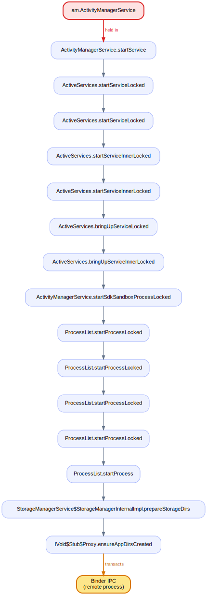

### 59. `ActivityManagerService.handleProcessStartOrKillTimeoutLocked` holds `mProcLock` across an IPC at `IVold$Stub$Proxy.ensureAppDirsCreated`

`ActivityManagerService.handleProcessStartOrKillTimeoutLocked` (line 4551) holds `mProcLock` while the call path `ActiveServices.processStartTimedOutLocked` → … → `IVold$Stub$Proxy.ensureAppDirsCreated` reaches an outgoing Binder transaction to another process. The AMS lock is pinned for the whole round-trip; a slow or dead remote stalls every thread waiting on the activity manager.

### 60. `ActivityManagerService.handleProcessStartOrKillTimeoutLocked` holds `mProcLock` across an IPC at `IVold$Stub$Proxy.ensureAppDirsCreated`

`ActivityManagerService.handleProcessStartOrKillTimeoutLocked` (line 4553) holds `mProcLock` while the call path `BroadcastQueueImpl.onApplicationTimeoutLocked` → … → `IVold$Stub$Proxy.ensureAppDirsCreated` reaches an outgoing Binder transaction to another process. The AMS lock is pinned for the whole round-trip; a slow or dead remote stalls every thread waiting on the activity manager.

### 61. `ActivityManagerService.handleProcessStartOrKillTimeoutLocked` holds `mProcLock` across an IPC at `IVold$Stub$Proxy.ensureAppDirsCreated`

`ActivityManagerService.handleProcessStartOrKillTimeoutLocked` (line 4556) holds `mProcLock` while the call path `ProcessRecordInternal.killLocked` → … → `IVold$Stub$Proxy.ensureAppDirsCreated` reaches an outgoing Binder transaction to another process. The AMS lock is pinned for the whole round-trip; a slow or dead remote stalls every thread waiting on the activity manager.

### 62. `ActivityManagerService.handleProcessStartOrKillTimeoutLocked` holds `mProcLock` across an IPC at `IVold$Stub$Proxy.ensureAppDirsCreated`

`ActivityManagerService.handleProcessStartOrKillTimeoutLocked` (line 4558) holds `mProcLock` while the call path `ActivityManagerService.removeLruProcessLocked` → … → `IVold$Stub$Proxy.ensureAppDirsCreated` reaches an outgoing Binder transaction to another process. The AMS lock is pinned for the whole round-trip; a slow or dead remote stalls every thread waiting on the activity manager.

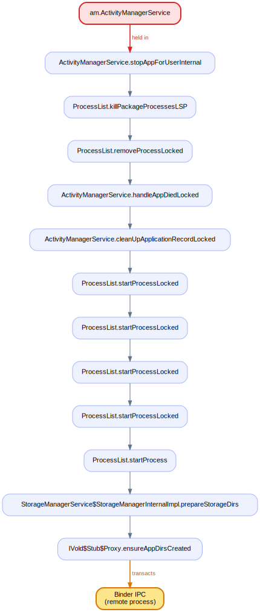

### 63. `ActivityManagerService.idleUids` holds the AMS monitor across an IPC at `ActivityManagerService.idleUids`

`ActivityManagerService.idleUids` (line 15729) holds the AMS monitor while the call path `OomAdjuster.idleUidsLocked` → … → `ActivityManagerService.idleUids` reaches an outgoing Binder transaction to another process. The AMS lock is pinned for the whole round-trip; a slow or dead remote stalls every thread waiting on the activity manager.

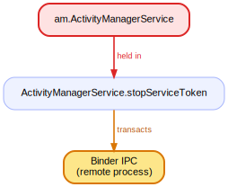

### 64. `ActivityManagerService.importanceTokenDied` holds the AMS monitor + `mPidsSelfLocked` across an IPC at `ActivityManagerService.importanceTokenDied`

`ActivityManagerService.importanceTokenDied` (line 5968) holds the AMS monitor + `mPidsSelfLocked` while the call path `ActivityManagerService.clearProcessForegroundLocked` → … → `ActivityManagerService.importanceTokenDied` reaches an outgoing Binder transaction to another process. The AMS lock is pinned for the whole round-trip; a slow or dead remote stalls every thread waiting on the activity manager.

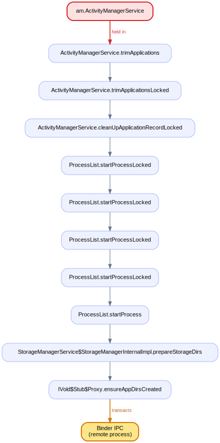

### 65. `ActivityManagerService.importanceTokenDied` holds the AMS monitor across an IPC at `ActivityManagerService.importanceTokenDied`

`ActivityManagerService.importanceTokenDied` (line 5970) holds the AMS monitor while the call path `ProcessStateController.runUpdate` → … → `ActivityManagerService.importanceTokenDied` reaches an outgoing Binder transaction to another process. The AMS lock is pinned for the whole round-trip; a slow or dead remote stalls every thread waiting on the activity manager.

### 66. `ActivityManagerService.inputDispatchingTimedOut` holds the AMS monitor across an IPC at `IVold$Stub$Proxy.ensureAppDirsCreated`

`ActivityManagerService.inputDispatchingTimedOut` (line 18396) holds the AMS monitor while the call path `ActivityManagerService.finishInstrumentationLocked` → … → `IVold$Stub$Proxy.ensureAppDirsCreated` reaches an outgoing Binder transaction to another process. The AMS lock is pinned for the whole round-trip; a slow or dead remote stalls every thread waiting on the activity manager.

### 67. `ActivityManagerService.killAllBackgroundProcesses` holds the AMS monitor + `mProcLock` across an IPC at `IVold$Stub$Proxy.ensureAppDirsCreated`

`ActivityManagerService.killAllBackgroundProcesses` (line 3763) holds the AMS monitor + `mProcLock` while the call path `ProcessList.killPackageProcessesLSP` → … → `IVold$Stub$Proxy.ensureAppDirsCreated` reaches an outgoing Binder transaction to another process. The AMS lock is pinned for the whole round-trip; a slow or dead remote stalls every thread waiting on the activity manager.

### 68. `ActivityManagerService.killAllBackgroundProcessesExcept` holds the AMS monitor + `mProcLock` across an IPC at `IVold$Stub$Proxy.ensureAppDirsCreated`

`ActivityManagerService.killAllBackgroundProcessesExcept` (line 3800) holds the AMS monitor + `mProcLock` while the call path `ProcessList.killAllBackgroundProcessesExceptLSP` → … → `IVold$Stub$Proxy.ensureAppDirsCreated` reaches an outgoing Binder transaction to another process. The AMS lock is pinned for the whole round-trip; a slow or dead remote stalls every thread waiting on the activity manager.

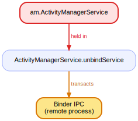

### 69. `ActivityManagerService.killAppAtUsersRequest` holds the AMS monitor across an IPC at `IVold$Stub$Proxy.ensureAppDirsCreated`

`ActivityManagerService.killAppAtUsersRequest` (line 9324) holds the AMS monitor while the call path `AppErrors.killAppAtUserRequestLocked` → … → `IVold$Stub$Proxy.ensureAppDirsCreated` reaches an outgoing Binder transaction to another process. The AMS lock is pinned for the whole round-trip; a slow or dead remote stalls every thread waiting on the activity manager.

### 70. `ActivityManagerService.killBackgroundProcesses` holds the AMS monitor + `mProcLock` across an IPC at `IVold$Stub$Proxy.ensureAppDirsCreated`

`ActivityManagerService.killBackgroundProcesses` (line 3734) holds the AMS monitor + `mProcLock` while the call path `ProcessList.killPackageProcessesLSP` → … → `IVold$Stub$Proxy.ensureAppDirsCreated` reaches an outgoing Binder transaction to another process. The AMS lock is pinned for the whole round-trip; a slow or dead remote stalls every thread waiting on the activity manager.

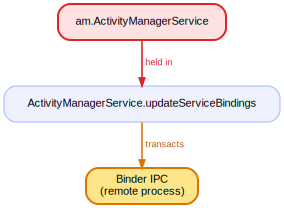

### 71. `ActivityManagerService.killPackageDependents` holds the AMS monitor + `mProcLock` across an IPC at `IVold$Stub$Proxy.ensureAppDirsCreated`

`ActivityManagerService.killPackageDependents` (line 18794) holds the AMS monitor + `mProcLock` while the call path `ProcessList.killPackageProcessesLSP` → … → `IVold$Stub$Proxy.ensureAppDirsCreated` reaches an outgoing Binder transaction to another process. The AMS lock is pinned for the whole round-trip; a slow or dead remote stalls every thread waiting on the activity manager.

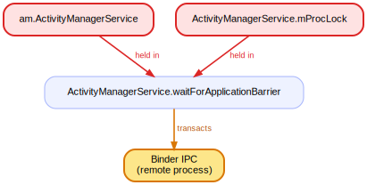

### 72. `ActivityManagerService.killProcessesBelowAdj` holds the AMS monitor + `mPidsSelfLocked` + `mProcLock` across an IPC at `ActivityManagerService.killProcessesBelowAdj`

`ActivityManagerService.killProcessesBelowAdj` (line 8809) holds the AMS monitor + `mPidsSelfLocked` + `mProcLock` while the call path `ProcessRecordInternal.killLocked` → … → `ActivityManagerService.killProcessesBelowAdj` reaches an outgoing Binder transaction to another process. The AMS lock is pinned for the whole round-trip; a slow or dead remote stalls every thread waiting on the activity manager.

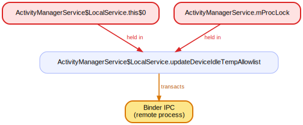

### 73. `ActivityManagerService.killUid` holds the AMS monitor + `mProcLock` across an IPC at `IVold$Stub$Proxy.ensureAppDirsCreated`

`ActivityManagerService.killUid` (line 8740) holds the AMS monitor + `mProcLock` while the call path `ProcessList.killPackageProcessesLSP` → … → `IVold$Stub$Proxy.ensureAppDirsCreated` reaches an outgoing Binder transaction to another process. The AMS lock is pinned for the whole round-trip; a slow or dead remote stalls every thread waiting on the activity manager.

### 74. `ActivityManagerService.killUidForPermissionChange` holds the AMS monitor + `mProcLock` across an IPC at `IVold$Stub$Proxy.ensureAppDirsCreated`

`ActivityManagerService.killUidForPermissionChange` (line 8768) holds the AMS monitor + `mProcLock` while the call path `ProcessList.killPackageProcessesLSP` → … → `IVold$Stub$Proxy.ensureAppDirsCreated` reaches an outgoing Binder transaction to another process. The AMS lock is pinned for the whole round-trip; a slow or dead remote stalls every thread waiting on the activity manager.

### 75. `ActivityManagerService.lambda$killPids$7` holds the AMS monitor across an IPC at `ActivityManagerService.lambda$killPids$7`

`ActivityManagerService.lambda$killPids$7` (line 8723) holds the AMS monitor while the call path `ProcessRecordInternal.killLocked` → … → `ActivityManagerService.lambda$killPids$7` reaches an outgoing Binder transaction to another process. The AMS lock is pinned for the whole round-trip; a slow or dead remote stalls every thread waiting on the activity manager.

### 76. `ActivityManagerService.lambda$updateAppProcessCpuTimeLPr$22` holds the AMS monitor across an IPC at `ActivityManagerService.lambda$updateAppProcessCpuTimeLPr$22`

`ActivityManagerService.lambda$updateAppProcessCpuTimeLPr$22` (line 15349) holds the AMS monitor while the call path `ProcessRecordInternal.killLocked` → … → `ActivityManagerService.lambda$updateAppProcessCpuTimeLPr$22` reaches an outgoing Binder transaction to another process. The AMS lock is pinned for the whole round-trip; a slow or dead remote stalls every thread waiting on the activity manager.

### 77. `ActivityManagerService.lambda$updatePhantomProcessCpuTimeLPr$23` holds the AMS monitor across an IPC at `ActivityManagerService.lambda$updatePhantomProcessCpuTimeLPr$23`

`ActivityManagerService.lambda$updatePhantomProcessCpuTimeLPr$23` (line 15378) holds the AMS monitor while the call path `PhantomProcessList.killPhantomProcessGroupLocked` → … → `ActivityManagerService.lambda$updatePhantomProcessCpuTimeLPr$23` reaches an outgoing Binder transaction to another process. The AMS lock is pinned for the whole round-trip; a slow or dead remote stalls every thread waiting on the activity manager.

### 78. `ActivityManagerService.onWakefulnessChanged` holds the AMS monitor across an IPC at `ActivityManagerService.onWakefulnessChanged`

`ActivityManagerService.onWakefulnessChanged` (line 7537) holds the AMS monitor while the call path `ActivityTaskManagerService.onScreenAwakeChanged` → … → `ActivityManagerService.onWakefulnessChanged` reaches an outgoing Binder transaction to another process. The AMS lock is pinned for the whole round-trip; a slow or dead remote stalls every thread waiting on the activity manager.

### 79. `ActivityManagerService.onWakefulnessChanged` holds the AMS monitor across an IPC at `ActivityManagerService.onWakefulnessChanged`

`ActivityManagerService.onWakefulnessChanged` (line 7541) holds the AMS monitor while the call path `ActivityManagerService.updateOomAdjLocked` → … → `ActivityManagerService.onWakefulnessChanged` reaches an outgoing Binder transaction to another process. The AMS lock is pinned for the whole round-trip; a slow or dead remote stalls every thread waiting on the activity manager.

### 80. `ActivityManagerService.publishService` holds the AMS monitor across an IPC at `ActivityManagerService.publishService`

`ActivityManagerService.publishService` (line 14106) holds the AMS monitor while the call path `ActiveServices.publishServiceLocked` → … → `ActivityManagerService.publishService` reaches an outgoing Binder transaction to another process. The AMS lock is pinned for the whole round-trip; a slow or dead remote stalls every thread waiting on the activity manager.

### 81. `ActivityManagerService.revokeUriPermission` holds the AMS monitor across an IPC at `IVold$Stub$Proxy.ensureAppDirsCreated`

`ActivityManagerService.revokeUriPermission` (line 6917) holds the AMS monitor while the call path `UriGrantsManagerService$LocalService.revokeUriPermission` → … → `IVold$Stub$Proxy.ensureAppDirsCreated` reaches an outgoing Binder transaction to another process. The AMS lock is pinned for the whole round-trip; a slow or dead remote stalls every thread waiting on the activity manager.

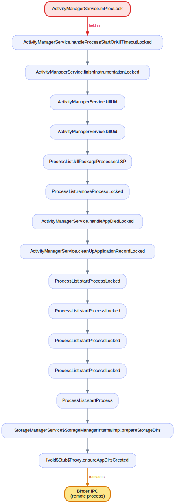

### 82. `ActivityManagerService.runInBackgroundDisabled` holds the AMS monitor across an IPC at `ActivityManagerService.runInBackgroundDisabled`

`ActivityManagerService.runInBackgroundDisabled` (line 15739) holds the AMS monitor while the call path `ActivityManagerService.doStopUidLocked` → … → `ActivityManagerService.runInBackgroundDisabled` reaches an outgoing Binder transaction to another process. The AMS lock is pinned for the whole round-trip; a slow or dead remote stalls every thread waiting on the activity manager.

### 83. `ActivityManagerService.scheduleApplicationInfoChanged` holds `mProcLock` across an IPC at `ActivityManagerService.scheduleApplicationInfoChanged`

`ActivityManagerService.scheduleApplicationInfoChanged` (line 18823) holds `mProcLock` while the call path `ActivityManagerService.updateApplicationInfoLOSP` → … → `ActivityManagerService.scheduleApplicationInfoChanged` reaches an outgoing Binder transaction to another process. The AMS lock is pinned for the whole round-trip; a slow or dead remote stalls every thread waiting on the activity manager.

### 84. `ActivityManagerService.serviceDoneExecuting` holds the AMS monitor across an IPC at `ActivityManagerService.serviceDoneExecuting`

`ActivityManagerService.serviceDoneExecuting` (line 14132) holds the AMS monitor while the call path `ActiveServices.serviceDoneExecutingLocked` → … → `ActivityManagerService.serviceDoneExecuting` reaches an outgoing Binder transaction to another process. The AMS lock is pinned for the whole round-trip; a slow or dead remote stalls every thread waiting on the activity manager.

### 85. `ActivityManagerService.setForegroundServiceDelegate` holds the AMS monitor across an IPC at `ActivityManagerService.setForegroundServiceDelegate`

`ActivityManagerService.setForegroundServiceDelegate` (line 18731) holds the AMS monitor while the call path `ActivityManagerService$LocalService.startForegroundServiceDelegate` → … → `ActivityManagerService.setForegroundServiceDelegate` reaches an outgoing Binder transaction to another process. The AMS lock is pinned for the whole round-trip; a slow or dead remote stalls every thread waiting on the activity manager.

### 86. `ActivityManagerService.setForegroundServiceDelegate` holds the AMS monitor across an IPC at `ActivityManagerService.setForegroundServiceDelegate`

`ActivityManagerService.setForegroundServiceDelegate` (line 18734) holds the AMS monitor while the call path `ActivityManagerService$LocalService.stopForegroundServiceDelegate` → … → `ActivityManagerService.setForegroundServiceDelegate` reaches an outgoing Binder transaction to another process. The AMS lock is pinned for the whole round-trip; a slow or dead remote stalls every thread waiting on the activity manager.

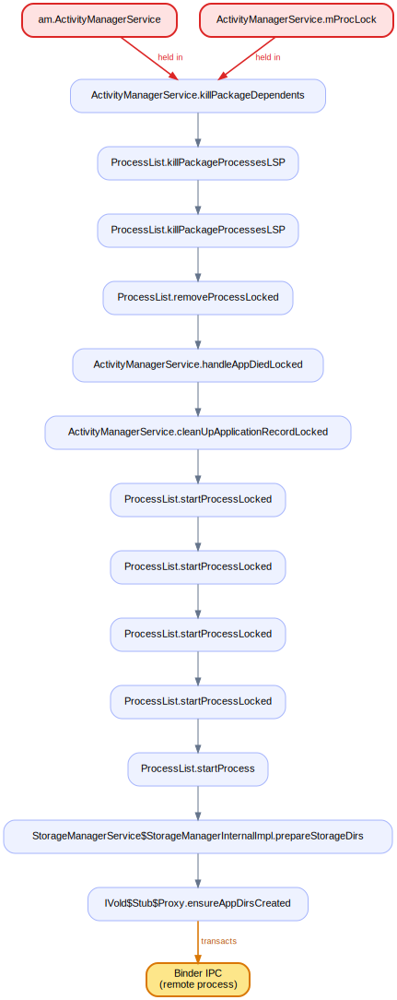

### 87. `ActivityManagerService.setHasTopUi` holds the AMS monitor across an IPC at `ActivityManagerService.setHasTopUi`

`ActivityManagerService.setHasTopUi` (line 8505) holds the AMS monitor while the call path `ProcessStateController.runUpdate` → … → `ActivityManagerService.setHasTopUi` reaches an outgoing Binder transaction to another process. The AMS lock is pinned for the whole round-trip; a slow or dead remote stalls every thread waiting on the activity manager.

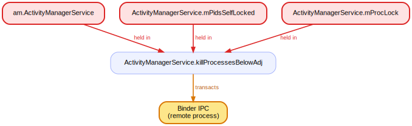

### 88. `ActivityManagerService.setMemFactorOverride` holds the AMS monitor across an IPC at `ActivityManagerService.setMemFactorOverride`

`ActivityManagerService.setMemFactorOverride` (line 10438) holds the AMS monitor while the call path `ActivityManagerService.updateOomAdjLocked` → … → `ActivityManagerService.setMemFactorOverride` reaches an outgoing Binder transaction to another process. The AMS lock is pinned for the whole round-trip; a slow or dead remote stalls every thread waiting on the activity manager.

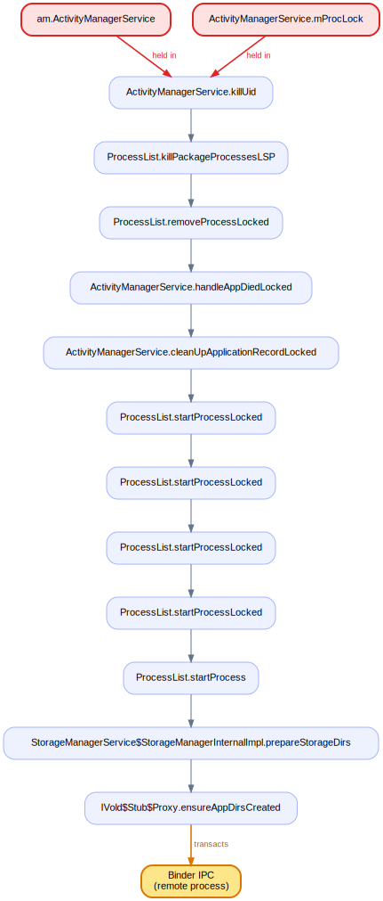

### 89. `ActivityManagerService.setProcessImportant` holds the AMS monitor across an IPC at `ActivityManagerService.setProcessImportant`

`ActivityManagerService.setProcessImportant` (line 6017) holds the AMS monitor while the call path `ProcessStateController.runUpdate` → … → `ActivityManagerService.setProcessImportant` reaches an outgoing Binder transaction to another process. The AMS lock is pinned for the whole round-trip; a slow or dead remote stalls every thread waiting on the activity manager.

### 90. `ActivityManagerService.setProcessLimit` holds the AMS monitor across an IPC at `IVold$Stub$Proxy.ensureAppDirsCreated`

`ActivityManagerService.setProcessLimit` (line 5942) holds the AMS monitor while the call path `ActivityManagerService.trimApplicationsLocked` → … → `IVold$Stub$Proxy.ensureAppDirsCreated` reaches an outgoing Binder transaction to another process. The AMS lock is pinned for the whole round-trip; a slow or dead remote stalls every thread waiting on the activity manager.

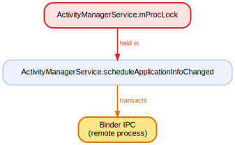

### 91. `ActivityManagerService.setServiceForeground` holds the AMS monitor across an IPC at `ActivityManagerService.setServiceForeground`

`ActivityManagerService.setServiceForeground` (line 13903) holds the AMS monitor while the call path `ActiveServices.setServiceForegroundLocked` → … → `ActivityManagerService.setServiceForeground` reaches an outgoing Binder transaction to another process. The AMS lock is pinned for the whole round-trip; a slow or dead remote stalls every thread waiting on the activity manager.

### 92. `ActivityManagerService.setSystemProcess` holds the AMS monitor across an IPC at `ActivityManagerService.setSystemProcess`

`ActivityManagerService.setSystemProcess` (line 1993) holds the AMS monitor while the call path `ProcessList.newProcessRecordLocked` → … → `ActivityManagerService.setSystemProcess` reaches an outgoing Binder transaction to another process. The AMS lock is pinned for the whole round-trip; a slow or dead remote stalls every thread waiting on the activity manager.

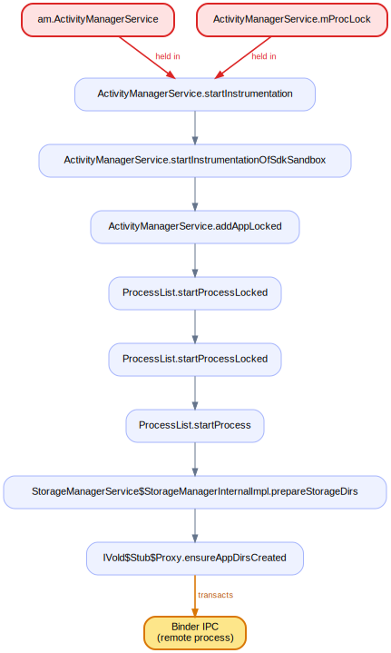

### 93. `ActivityManagerService.setSystemProcess` holds the AMS monitor across an IPC at `ActivityManagerService.setSystemProcess`

`ActivityManagerService.setSystemProcess` (line 2008) holds the AMS monitor while the call path `ActivityManagerService.updateOomAdjLocked` → … → `ActivityManagerService.setSystemProcess` reaches an outgoing Binder transaction to another process. The AMS lock is pinned for the whole round-trip; a slow or dead remote stalls every thread waiting on the activity manager.

### 94. `ActivityManagerService.setWindowManager` holds the AMS monitor across an IPC at `ActivityManagerService.setWindowManager`

`ActivityManagerService.setWindowManager` (line 2044) holds the AMS monitor while the call path `ActivityTaskManagerService.setWindowManager` → … → `ActivityManagerService.setWindowManager` reaches an outgoing Binder transaction to another process. The AMS lock is pinned for the whole round-trip; a slow or dead remote stalls every thread waiting on the activity manager.

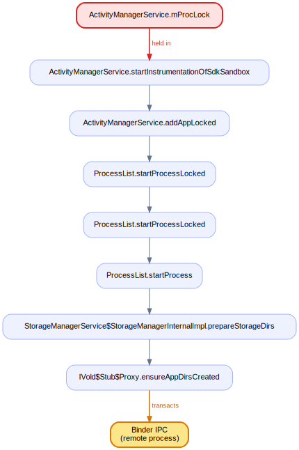

### 95. `ActivityManagerService.startInstrumentation` holds the AMS monitor across an IPC at `IVold$Stub$Proxy.ensureAppDirsCreated`

`ActivityManagerService.startInstrumentation` (line 14648) holds the AMS monitor while the call path `ActivityManagerService.startInstrumentationOfSdkSandbox` → … → `IVold$Stub$Proxy.ensureAppDirsCreated` reaches an outgoing Binder transaction to another process. The AMS lock is pinned for the whole round-trip; a slow or dead remote stalls every thread waiting on the activity manager.

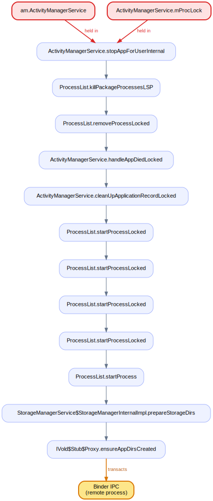

### 96. `ActivityManagerService.startInstrumentation` holds the AMS monitor + `mProcLock` across an IPC at `IVold$Stub$Proxy.ensureAppDirsCreated`

`ActivityManagerService.startInstrumentation` (line 14697) holds the AMS monitor + `mProcLock` while the call path `ActivityManagerService.forceStopPackageLocked` → … → `IVold$Stub$Proxy.ensureAppDirsCreated` reaches an outgoing Binder transaction to another process. The AMS lock is pinned for the whole round-trip; a slow or dead remote stalls every thread waiting on the activity manager.

### 97. `ActivityManagerService.startInstrumentation` holds the AMS monitor + `mProcLock` across an IPC at `IVold$Stub$Proxy.ensureAppDirsCreated`

`ActivityManagerService.startInstrumentation` (line 14704) holds the AMS monitor + `mProcLock` while the call path `ActivityManagerService.addAppLocked` → … → `IVold$Stub$Proxy.ensureAppDirsCreated` reaches an outgoing Binder transaction to another process. The AMS lock is pinned for the whole round-trip; a slow or dead remote stalls every thread waiting on the activity manager.

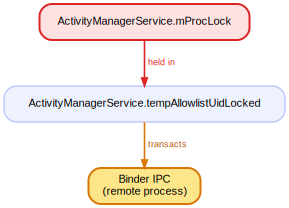

### 98. `ActivityManagerService.startInstrumentationOfSdkSandbox` holds `mProcLock` across an IPC at `IVold$Stub$Proxy.ensureAppDirsCreated`

`ActivityManagerService.startInstrumentationOfSdkSandbox` (line 14831) holds `mProcLock` while the call path `ActivityManagerService.forceStopPackageLocked` → … → `IVold$Stub$Proxy.ensureAppDirsCreated` reaches an outgoing Binder transaction to another process. The AMS lock is pinned for the whole round-trip; a slow or dead remote stalls every thread waiting on the activity manager.

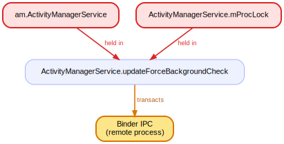

### 99. `ActivityManagerService.startInstrumentationOfSdkSandbox` holds `mProcLock` across an IPC at `IVold$Stub$Proxy.ensureAppDirsCreated`

`ActivityManagerService.startInstrumentationOfSdkSandbox` (line 14843) holds `mProcLock` while the call path `ActivityManagerService.addAppLocked` → … → `IVold$Stub$Proxy.ensureAppDirsCreated` reaches an outgoing Binder transaction to another process. The AMS lock is pinned for the whole round-trip; a slow or dead remote stalls every thread waiting on the activity manager.

### 100. `ActivityManagerService.startIsolatedProcess` holds the AMS monitor across an IPC at `IVold$Stub$Proxy.ensureAppDirsCreated`

`ActivityManagerService.startIsolatedProcess` (line 2947) holds the AMS monitor while the call path `ProcessList.startProcessLocked` → … → `IVold$Stub$Proxy.ensureAppDirsCreated` reaches an outgoing Binder transaction to another process. The AMS lock is pinned for the whole round-trip; a slow or dead remote stalls every thread waiting on the activity manager.

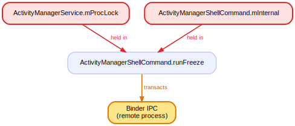

### 101. `ActivityManagerService.startPersistentApps` holds the AMS monitor across an IPC at `IVold$Stub$Proxy.ensureAppDirsCreated`

`ActivityManagerService.startPersistentApps` (line 7155) holds the AMS monitor while the call path `ActivityManagerService.addAppLocked` → … → `IVold$Stub$Proxy.ensureAppDirsCreated` reaches an outgoing Binder transaction to another process. The AMS lock is pinned for the whole round-trip; a slow or dead remote stalls every thread waiting on the activity manager.

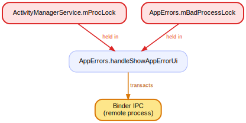

### 102. `ActivityManagerService.startService` holds the AMS monitor across an IPC at `IVold$Stub$Proxy.ensureAppDirsCreated`

`ActivityManagerService.startService` (line 13812) holds the AMS monitor while the call path `ActiveServices.startServiceLocked` → … → `IVold$Stub$Proxy.ensureAppDirsCreated` reaches an outgoing Binder transaction to another process. The AMS lock is pinned for the whole round-trip; a slow or dead remote stalls every thread waiting on the activity manager.

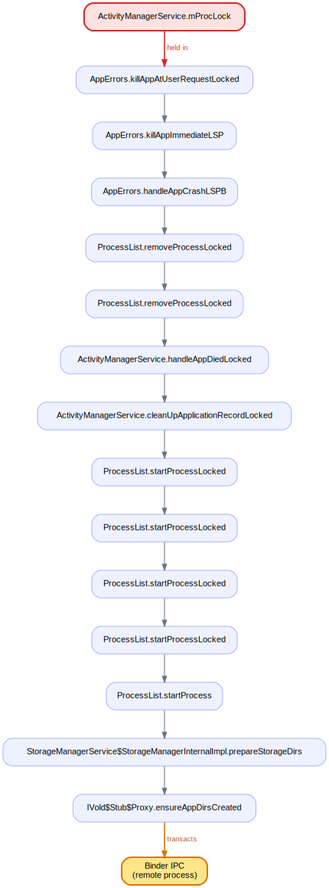

### 103. `ActivityManagerService.stopAppForUserInternal` holds the AMS monitor + `mProcLock` across an IPC at `IVold$Stub$Proxy.ensureAppDirsCreated`

`ActivityManagerService.stopAppForUserInternal` (line 4316) holds the AMS monitor + `mProcLock` while the call path `ActivityTaskManagerService$LocalService.onForceStopPackage` → … → `IVold$Stub$Proxy.ensureAppDirsCreated` reaches an outgoing Binder transaction to another process. The AMS lock is pinned for the whole round-trip; a slow or dead remote stalls every thread waiting on the activity manager.

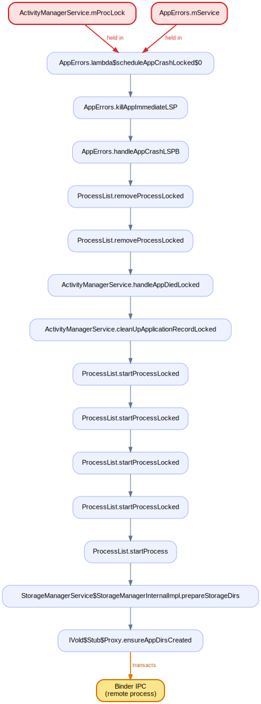

### 104. `ActivityManagerService.stopAppForUserInternal` holds the AMS monitor + `mProcLock` across an IPC at `IVold$Stub$Proxy.ensureAppDirsCreated`

`ActivityManagerService.stopAppForUserInternal` (line 4318) holds the AMS monitor + `mProcLock` while the call path `ProcessList.killPackageProcessesLSP` → … → `IVold$Stub$Proxy.ensureAppDirsCreated` reaches an outgoing Binder transaction to another process. The AMS lock is pinned for the whole round-trip; a slow or dead remote stalls every thread waiting on the activity manager.

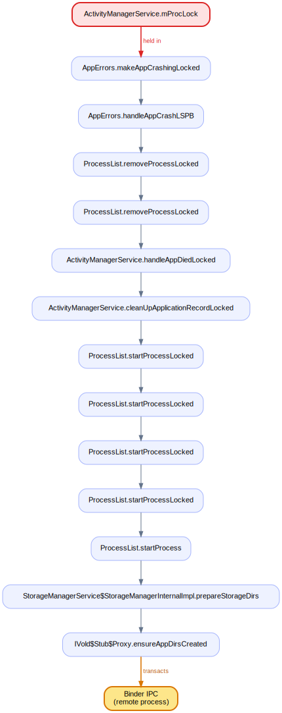

### 105. `ActivityManagerService.stopAppForUserInternal` holds the AMS monitor across an IPC at `IVold$Stub$Proxy.ensureAppDirsCreated`

`ActivityManagerService.stopAppForUserInternal` (line 4334) holds the AMS monitor while the call path `ActiveServices.bringDownDisabledPackageServicesLocked` → … → `IVold$Stub$Proxy.ensureAppDirsCreated` reaches an outgoing Binder transaction to another process. The AMS lock is pinned for the whole round-trip; a slow or dead remote stalls every thread waiting on the activity manager.

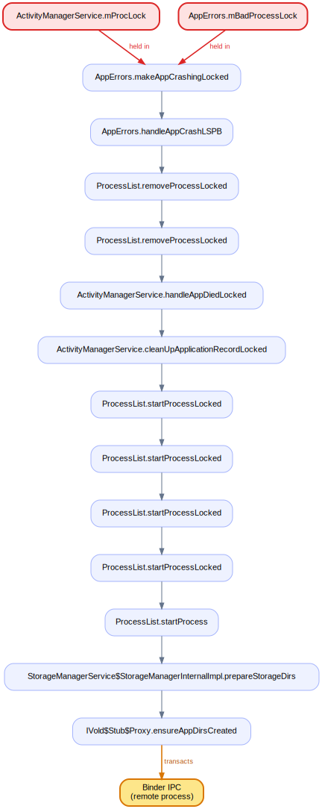

### 106. `ActivityManagerService.stopAppForUserInternal` holds the AMS monitor across an IPC at `IVold$Stub$Proxy.ensureAppDirsCreated`

`ActivityManagerService.stopAppForUserInternal` (line 4339) holds the AMS monitor while the call path `ActivityTaskManagerService$LocalService.resumeTopActivities` → … → `IVold$Stub$Proxy.ensureAppDirsCreated` reaches an outgoing Binder transaction to another process. The AMS lock is pinned for the whole round-trip; a slow or dead remote stalls every thread waiting on the activity manager.

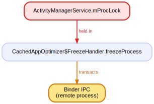

### 107. `ActivityManagerService.stopServiceToken` holds the AMS monitor across an IPC at `ActivityManagerService.stopServiceToken`

`ActivityManagerService.stopServiceToken` (line 13892) holds the AMS monitor while the call path `ActiveServices.stopServiceTokenLocked` → … → `ActivityManagerService.stopServiceToken` reaches an outgoing Binder transaction to another process. The AMS lock is pinned for the whole round-trip; a slow or dead remote stalls every thread waiting on the activity manager.

### 108. `ActivityManagerService.tempAllowlistUidLocked` holds `mProcLock` across an IPC at `ActivityManagerService.tempAllowlistUidLocked`

`ActivityManagerService.tempAllowlistUidLocked` (line 15863) holds `mProcLock` while the call path `ActivityManagerService.setUidTempAllowlistStateLSP` → … → `ActivityManagerService.tempAllowlistUidLocked` reaches an outgoing Binder transaction to another process. The AMS lock is pinned for the whole round-trip; a slow or dead remote stalls every thread waiting on the activity manager.

### 109. `ActivityManagerService.trimApplications` holds the AMS monitor across an IPC at `IVold$Stub$Proxy.ensureAppDirsCreated`

`ActivityManagerService.trimApplications` (line 15922) holds the AMS monitor while the call path `ActivityManagerService.trimApplicationsLocked` → … → `IVold$Stub$Proxy.ensureAppDirsCreated` reaches an outgoing Binder transaction to another process. The AMS lock is pinned for the whole round-trip; a slow or dead remote stalls every thread waiting on the activity manager.

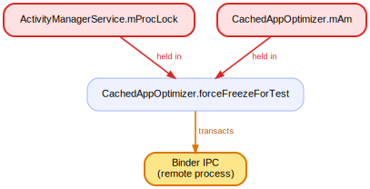

### 110. `ActivityManagerService.unbindBackupAgent` holds the AMS monitor across an IPC at `ActivityManagerService.unbindBackupAgent`

`ActivityManagerService.unbindBackupAgent` (line 14411) holds the AMS monitor while the call path `ActivityManagerService.updateOomAdjLocked` → … → `ActivityManagerService.unbindBackupAgent` reaches an outgoing Binder transaction to another process. The AMS lock is pinned for the whole round-trip; a slow or dead remote stalls every thread waiting on the activity manager.

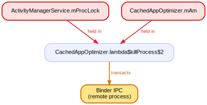

### 111. `ActivityManagerService.unbindBackupAgent` holds the AMS monitor across an IPC at `ActivityManagerService.unbindBackupAgent`

`ActivityManagerService.unbindBackupAgent` (line 14430) holds the AMS monitor while the call path `ProcessStateController.stopBackupTarget` → … → `ActivityManagerService.unbindBackupAgent` reaches an outgoing Binder transaction to another process. The AMS lock is pinned for the whole round-trip; a slow or dead remote stalls every thread waiting on the activity manager.

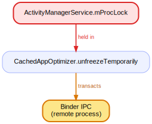

### 112. `ActivityManagerService.unbindFinished` holds the AMS monitor across an IPC at `ActivityManagerService.unbindFinished`

`ActivityManagerService.unbindFinished` (line 14121) holds the AMS monitor while the call path `ActiveServices.unbindFinishedLocked` → … → `ActivityManagerService.unbindFinished` reaches an outgoing Binder transaction to another process. The AMS lock is pinned for the whole round-trip; a slow or dead remote stalls every thread waiting on the activity manager.

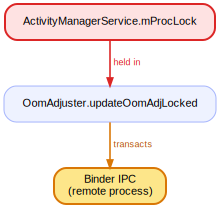

### 113. `ActivityManagerService.unbindService` holds the AMS monitor across an IPC at `ActivityManagerService.unbindService`

`ActivityManagerService.unbindService` (line 14089) holds the AMS monitor while the call path `ActiveServices.unbindServiceLocked` → … → `ActivityManagerService.unbindService` reaches an outgoing Binder transaction to another process. The AMS lock is pinned for the whole round-trip; a slow or dead remote stalls every thread waiting on the activity manager.

### 114. `ActivityManagerService.updateForceBackgroundCheck` holds the AMS monitor + `mProcLock` across an IPC at `ActivityManagerService.updateForceBackgroundCheck`

`ActivityManagerService.updateForceBackgroundCheck` (line 9315) holds the AMS monitor + `mProcLock` while the call path `ProcessList.doStopUidForIdleUidsLocked` → … → `ActivityManagerService.updateForceBackgroundCheck` reaches an outgoing Binder transaction to another process. The AMS lock is pinned for the whole round-trip; a slow or dead remote stalls every thread waiting on the activity manager.

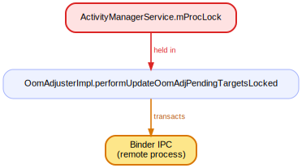

### 115. `ActivityManagerService.updateServiceBindings` holds the AMS monitor across an IPC at `ActivityManagerService.updateServiceBindings`

`ActivityManagerService.updateServiceBindings` (line 14076) holds the AMS monitor while the call path `ActiveServices.updateServiceBindingsLocked` → … → `ActivityManagerService.updateServiceBindings` reaches an outgoing Binder transaction to another process. The AMS lock is pinned for the whole round-trip; a slow or dead remote stalls every thread waiting on the activity manager.

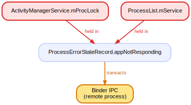

### 116. `ActivityManagerService.waitForApplicationBarrier` holds the AMS monitor + `mProcLock` across an IPC at `ActivityManagerService.waitForApplicationBarrier`

`ActivityManagerService.waitForApplicationBarrier` (line 18524) holds the AMS monitor + `mProcLock` while the call path `CachedAppOptimizer.unfreezeTemporarily` → … → `ActivityManagerService.waitForApplicationBarrier` reaches an outgoing Binder transaction to another process. The AMS lock is pinned for the whole round-trip; a slow or dead remote stalls every thread waiting on the activity manager.

### 117. `ActivityManagerShellCommand.runFreeze` holds `mProcLock` + the AMS monitor across an IPC at `ActivityManagerShellCommand.runFreeze`

`ActivityManagerShellCommand.runFreeze` (line 1370) holds `mProcLock` + the AMS monitor while the call path `CachedAppOptimizer.unfreezeAppLSP` → … → `ActivityManagerShellCommand.runFreeze` reaches an outgoing Binder transaction to another process. The AMS lock is pinned for the whole round-trip; a slow or dead remote stalls every thread waiting on the activity manager.

### 118. `AppErrors.handleShowAppErrorUi` holds `mProcLock` + `mBadProcessLock` across an IPC at `AppErrors.handleShowAppErrorUi`

`AppErrors.handleShowAppErrorUi` (line 1086) holds `mProcLock` + `mBadProcessLock` while the call path `ProcessList$MyProcessMap.put` → … → `AppErrors.handleShowAppErrorUi` reaches an outgoing Binder transaction to another process. The AMS lock is pinned for the whole round-trip; a slow or dead remote stalls every thread waiting on the activity manager.

### 119. `AppErrors.killAppAtUserRequestLocked` holds `mProcLock` across an IPC at `IVold$Stub$Proxy.ensureAppDirsCreated`

`AppErrors.killAppAtUserRequestLocked` (line 483) holds `mProcLock` while the call path `AppErrors.killAppImmediateLSP` → … → `IVold$Stub$Proxy.ensureAppDirsCreated` reaches an outgoing Binder transaction to another process. The AMS lock is pinned for the whole round-trip; a slow or dead remote stalls every thread waiting on the activity manager.

### 120. `AppErrors.lambda$scheduleAppCrashLocked$0` holds `mProcLock` + the AMS monitor across an IPC at `IVold$Stub$Proxy.ensureAppDirsCreated`

`AppErrors.lambda$scheduleAppCrashLocked$0` (line 569) holds `mProcLock` + the AMS monitor while the call path `AppErrors.killAppImmediateLSP` → … → `IVold$Stub$Proxy.ensureAppDirsCreated` reaches an outgoing Binder transaction to another process. The AMS lock is pinned for the whole round-trip; a slow or dead remote stalls every thread waiting on the activity manager.

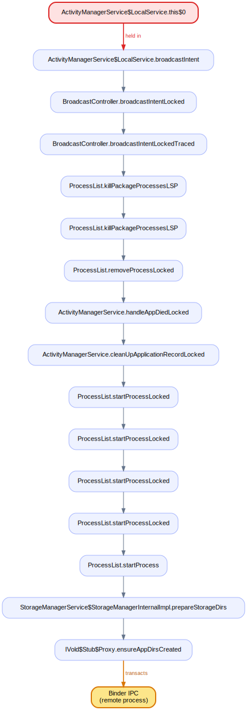

### 121. `AppErrors.makeAppCrashingLocked` holds `mProcLock` across an IPC at `IVold$Stub$Proxy.ensureAppDirsCreated`

`AppErrors.makeAppCrashingLocked` (line 796) holds `mProcLock` while the call path `ProcessErrorStateRecord.startAppProblemLSP` → … → `IVold$Stub$Proxy.ensureAppDirsCreated` reaches an outgoing Binder transaction to another process. The AMS lock is pinned for the whole round-trip; a slow or dead remote stalls every thread waiting on the activity manager.

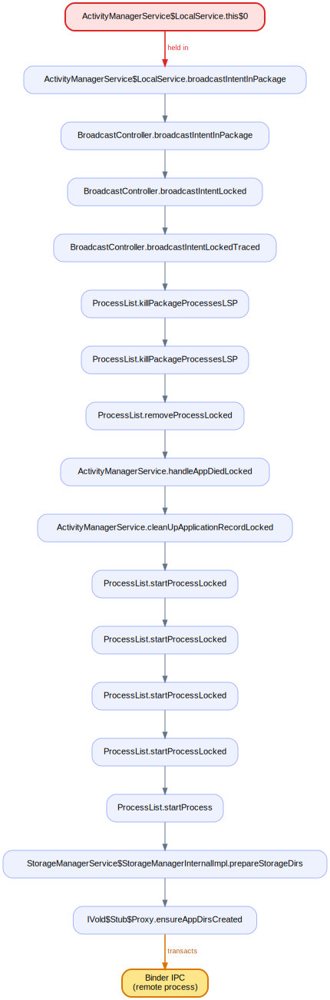

### 122. `AppErrors.makeAppCrashingLocked` holds `mProcLock` + `mBadProcessLock` across an IPC at `IVold$Stub$Proxy.ensureAppDirsCreated`

`AppErrors.makeAppCrashingLocked` (line 799) holds `mProcLock` + `mBadProcessLock` while the call path `AppErrors.handleAppCrashLSPB` → … → `IVold$Stub$Proxy.ensureAppDirsCreated` reaches an outgoing Binder transaction to another process. The AMS lock is pinned for the whole round-trip; a slow or dead remote stalls every thread waiting on the activity manager.

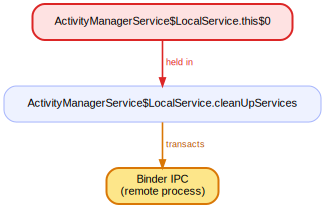

### 123. `CachedAppOptimizer$FreezeHandler.freezeProcess` holds `mProcLock` across an IPC at `CachedAppOptimizer$FreezeHandler.freezeProcess`

`CachedAppOptimizer$FreezeHandler.freezeProcess` (line 2103) holds `mProcLock` while the call path `CachedAppOptimizer$FreezeHandler.handleBinderFreezerFailure` → … → `CachedAppOptimizer$FreezeHandler.freezeProcess` reaches an outgoing Binder transaction to another process. The AMS lock is pinned for the whole round-trip; a slow or dead remote stalls every thread waiting on the activity manager.

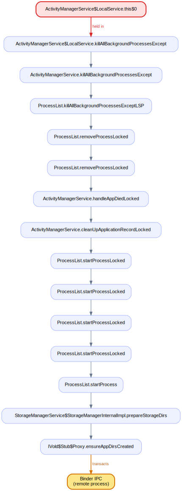

### 124. `CachedAppOptimizer$FreezeHandler.onBlockingFileLock` holds `mProcLock` + the AMS monitor across an IPC at `CachedAppOptimizer$FreezeHandler.onBlockingFileLock`

`CachedAppOptimizer$FreezeHandler.onBlockingFileLock` (line 2221) holds `mProcLock` + the AMS monitor while the call path `CachedAppOptimizer.unfreezeAppLSP` → … → `CachedAppOptimizer$FreezeHandler.onBlockingFileLock` reaches an outgoing Binder transaction to another process. The AMS lock is pinned for the whole round-trip; a slow or dead remote stalls every thread waiting on the activity manager.

### 125. `CachedAppOptimizer.forceFreezeForTest` holds `mProcLock` + the AMS monitor across an IPC at `CachedAppOptimizer.forceFreezeForTest`

`CachedAppOptimizer.forceFreezeForTest` (line 2373) holds `mProcLock` + the AMS monitor while the call path `CachedAppOptimizer.unfreezeAppLSP` → … → `CachedAppOptimizer.forceFreezeForTest` reaches an outgoing Binder transaction to another process. The AMS lock is pinned for the whole round-trip; a slow or dead remote stalls every thread waiting on the activity manager.

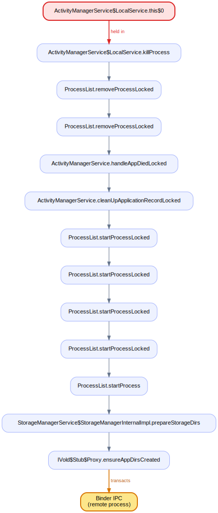

### 126. `CachedAppOptimizer.lambda$killProcess$2` holds `mProcLock` + the AMS monitor across an IPC at `CachedAppOptimizer.lambda$killProcess$2`

`CachedAppOptimizer.lambda$killProcess$2` (line 2356) holds `mProcLock` + the AMS monitor while the call path `ProcessRecordInternal.killLocked` → … → `CachedAppOptimizer.lambda$killProcess$2` reaches an outgoing Binder transaction to another process. The AMS lock is pinned for the whole round-trip; a slow or dead remote stalls every thread waiting on the activity manager.

### 127. `CachedAppOptimizer.unfreezeTemporarily` holds `mProcLock` across an IPC at `CachedAppOptimizer.unfreezeTemporarily`

`CachedAppOptimizer.unfreezeTemporarily` (line 1139) holds `mProcLock` while the call path `CachedAppOptimizer.unfreezeAppLSP` → … → `CachedAppOptimizer.unfreezeTemporarily` reaches an outgoing Binder transaction to another process. The AMS lock is pinned for the whole round-trip; a slow or dead remote stalls every thread waiting on the activity manager.

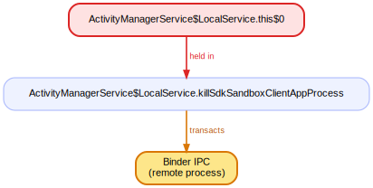

### 128. `OomAdjuster.updateOomAdjLocked` holds `mProcLock` across an IPC at `OomAdjuster.updateOomAdjLocked`

`OomAdjuster.updateOomAdjLocked` (line 587) holds `mProcLock` while the call path `OomAdjuster.updateOomAdjLSP` → … → `OomAdjuster.updateOomAdjLocked` reaches an outgoing Binder transaction to another process. The AMS lock is pinned for the whole round-trip; a slow or dead remote stalls every thread waiting on the activity manager.

### 129. `OomAdjusterImpl.performUpdateOomAdjPendingTargetsLocked` holds `mProcLock` across an IPC at `OomAdjusterImpl.performUpdateOomAdjPendingTargetsLocked`

`OomAdjusterImpl.performUpdateOomAdjPendingTargetsLocked` (line 695) holds `mProcLock` while the call path `OomAdjusterImpl.partialUpdateLSP` → … → `OomAdjusterImpl.performUpdateOomAdjPendingTargetsLocked` reaches an outgoing Binder transaction to another process. The AMS lock is pinned for the whole round-trip; a slow or dead remote stalls every thread waiting on the activity manager.

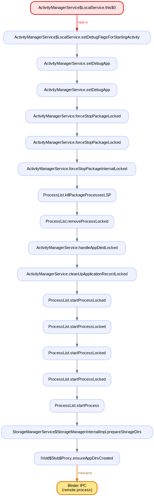

### 130. `ProcessErrorStateRecord.appNotResponding` holds `mProcLock` + the AMS monitor across an IPC at `ProcessErrorStateRecord.appNotResponding`

`ProcessErrorStateRecord.appNotResponding` (line 692) holds `mProcLock` + the AMS monitor while the call path `ProcessErrorStateRecord.makeAppNotRespondingLSP` → … → `ProcessErrorStateRecord.appNotResponding` reaches an outgoing Binder transaction to another process. The AMS lock is pinned for the whole round-trip; a slow or dead remote stalls every thread waiting on the activity manager.

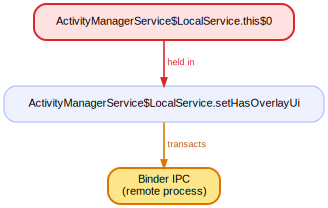

---

## Incoming — a binder entry that takes an AMS lock

(The 7 incoming AMS-lock entries are dominated by `dumpsys`, which legitimately walks every lock; the one of interest is below.)

### `ActivityManagerService$IntentCreatorToken.completeFinalize`

This binder entry acquires `sIntentCreatorTokenCache`, `mObservers`; a remote caller blocks on them.
