# Findings — the ActivityManager lock held across Binder IPC

`lockdex binder --lock ActivityManagerService`. The AMS lock is `system_server`'s busiest monitor — it serializes process lifecycle, service binding, broadcast dispatch, and OOM adjustment. **Holding it across an outgoing Binder transaction is the classic stall pattern:** while the call to another process is in flight, no other thread can take the AMS lock, so if that process is slow, janky, or dead, the entire activity-manager subsystem blocks behind it — ANRs, Watchdog kills, system-wide jank. It's also a cross-process AB-BA risk if the callee re-enters `system_server`.

A *hazard* here is one (lock, transaction-site) pair. The same site is frequently reachable from many AMS entry points — most strikingly the process-restart path, where **every** method that kills or restarts a process under the lock funnels through `startProcess` → `prepareStorageDirs` → a synchronous `vold` transaction — so each finding names the sink and lists the entry points it is reachable from, rather than counting one hazard per way in. Sound analysis over `services.jar`: **57** distinct hazards from 137 held-across-transaction sites.

---

### 1. the AMS monitor held across the transaction `StorageManagerService$StorageManagerInternalImpl.prepareStorageDirs` → `IVold$Stub$Proxy.ensureAppDirsCreated`

On 34 AMS entry points, the AMS monitor is held while the call chain reaches `StorageManagerService$StorageManagerInternalImpl.prepareStorageDirs`'s outgoing Binder transaction `IVold$Stub$Proxy.ensureAppDirsCreated` to another process. The lock is pinned for the whole cross-process round-trip; a slow, janky, or dead remote stalls every thread waiting on the activity manager.

Reachable from: `ActivityManagerService$5.onRemoveCompleted`, `ActivityManagerService$6.onReceive`, `ActivityManagerService$AppDeathRecipient.binderDied`, `ActivityManagerService$LocalService.broadcastCloseSystemDialogs`, `ActivityManagerService$LocalService.broadcastGlobalConfigurationChanged`, `ActivityManagerService$LocalService.broadcastIntent`, `ActivityManagerService$LocalService.broadcastIntentInPackage`, `ActivityManagerService$LocalService.killAllBackgroundProcessesExcept`, `ActivityManagerService$LocalService.killApplicationSync`, `ActivityManagerService$LocalService.killForegroundAppsForUser`, `ActivityManagerService$LocalService.killProcess`, `ActivityManagerService$LocalService.setDebugFlagsForStartingActivity` … (+22 more)

### 2. the AMS monitor + `mProcLock` held across the transaction `StorageManagerService$StorageManagerInternalImpl.prepareStorageDirs` → `IVold$Stub$Proxy.ensureAppDirsCreated`

On 8 AMS entry points, the AMS monitor + `mProcLock` is held while the call chain reaches `StorageManagerService$StorageManagerInternalImpl.prepareStorageDirs`'s outgoing Binder transaction `IVold$Stub$Proxy.ensureAppDirsCreated` to another process. The lock is pinned for the whole cross-process round-trip; a slow, janky, or dead remote stalls every thread waiting on the activity manager.

Reachable from: `ActivityManagerService.killAllBackgroundProcesses`, `ActivityManagerService.killAllBackgroundProcessesExcept`, `ActivityManagerService.killBackgroundProcesses`, `ActivityManagerService.killPackageDependents`, `ActivityManagerService.killUid`, `ActivityManagerService.killUidForPermissionChange`, `ActivityManagerService.startInstrumentation`, `ActivityManagerService.stopAppForUserInternal`

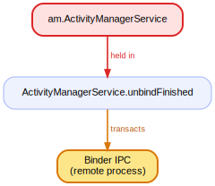

### 3. `mProcLock` held across the transaction `StorageManagerService$StorageManagerInternalImpl.prepareStorageDirs` → `IVold$Stub$Proxy.ensureAppDirsCreated`

On 7 AMS entry points, `mProcLock` is held while the call chain reaches `StorageManagerService$StorageManagerInternalImpl.prepareStorageDirs`'s outgoing Binder transaction `IVold$Stub$Proxy.ensureAppDirsCreated` to another process. The lock is pinned for the whole cross-process round-trip; a slow, janky, or dead remote stalls every thread waiting on the activity manager.

Reachable from: `ActivityManagerService.attachApplicationLocked`, `ActivityManagerService.cleanUpApplicationRecordLocked`, `ActivityManagerService.forceStopPackageInternalLocked`, `ActivityManagerService.handleProcessStartOrKillTimeoutLocked`, `ActivityManagerService.startInstrumentationOfSdkSandbox`, `AppErrors.killAppAtUserRequestLocked`, `AppErrors.makeAppCrashingLocked`

### 4. the AMS monitor held across the transaction in `ActivityManagerService$2.onActivityLaunched`

`ActivityManagerService$2.onActivityLaunched` issues an outgoing Binder transaction while the AMS monitor is held. The lock is pinned for the whole cross-process round-trip; a slow, janky, or dead remote stalls every thread waiting on the activity manager.

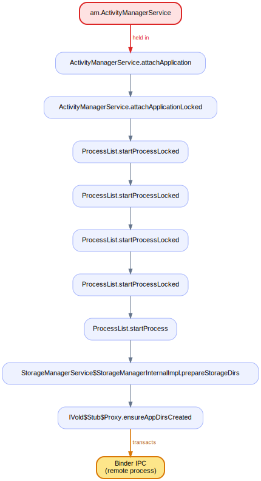

### 5. the AMS monitor held across the transaction in `ActivityManagerService$LocalService.cleanUpServices`

`ActivityManagerService$LocalService.cleanUpServices` issues an outgoing Binder transaction while the AMS monitor is held. The lock is pinned for the whole cross-process round-trip; a slow, janky, or dead remote stalls every thread waiting on the activity manager.

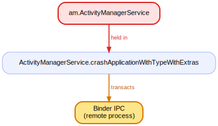

### 6. the AMS monitor held across the transaction in `ActivityManagerService$LocalService.killProcessesForRemovedTask`

`ActivityManagerService$LocalService.killProcessesForRemovedTask` issues an outgoing Binder transaction while the AMS monitor is held. The lock is pinned for the whole cross-process round-trip; a slow, janky, or dead remote stalls every thread waiting on the activity manager.

### 7. the AMS monitor held across the transaction in `ActivityManagerService$LocalService.killSdkSandboxClientAppProcess`

`ActivityManagerService$LocalService.killSdkSandboxClientAppProcess` issues an outgoing Binder transaction while the AMS monitor is held. The lock is pinned for the whole cross-process round-trip; a slow, janky, or dead remote stalls every thread waiting on the activity manager.

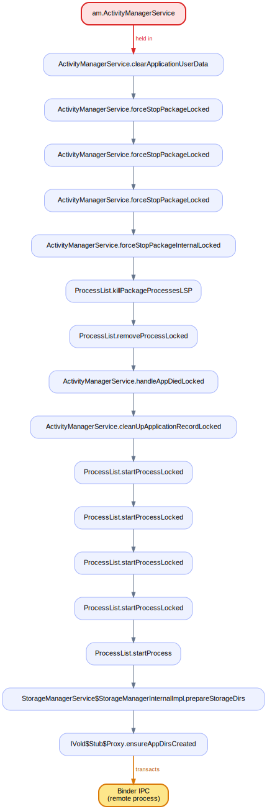

### 8. the AMS monitor held across the transaction in `ActivityManagerService$LocalService.notifyActiveMediaForegroundService`

`ActivityManagerService$LocalService.notifyActiveMediaForegroundService` issues an outgoing Binder transaction while the AMS monitor is held. The lock is pinned for the whole cross-process round-trip; a slow, janky, or dead remote stalls every thread waiting on the activity manager.

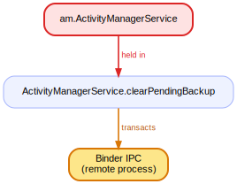

### 9. the AMS monitor held across the transaction in `ActivityManagerService$LocalService.notifyInactiveMediaForegroundService`

`ActivityManagerService$LocalService.notifyInactiveMediaForegroundService` issues an outgoing Binder transaction while the AMS monitor is held. The lock is pinned for the whole cross-process round-trip; a slow, janky, or dead remote stalls every thread waiting on the activity manager.

### 10. the AMS monitor held across the transaction in `ActivityManagerService$LocalService.setHasOverlayUi`

`ActivityManagerService$LocalService.setHasOverlayUi` issues an outgoing Binder transaction while the AMS monitor is held. The lock is pinned for the whole cross-process round-trip; a slow, janky, or dead remote stalls every thread waiting on the activity manager.

### 11. the AMS monitor held across the transaction in `ActivityManagerService$LocalService.startForegroundServiceDelegate`

`ActivityManagerService$LocalService.startForegroundServiceDelegate` issues an outgoing Binder transaction while the AMS monitor is held. The lock is pinned for the whole cross-process round-trip; a slow, janky, or dead remote stalls every thread waiting on the activity manager.

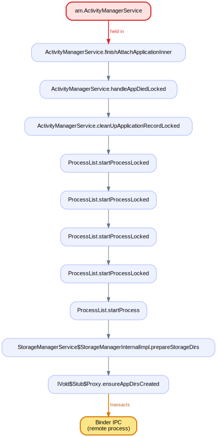

### 12. the AMS monitor held across the transaction in `ActivityManagerService$LocalService.stopForegroundServiceDelegate`

`ActivityManagerService$LocalService.stopForegroundServiceDelegate` issues an outgoing Binder transaction while the AMS monitor is held. The lock is pinned for the whole cross-process round-trip; a slow, janky, or dead remote stalls every thread waiting on the activity manager.

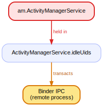

### 13. the AMS monitor held across the transaction in `ActivityManagerService$LocalService.tempAllowlistForPendingIntent`

`ActivityManagerService$LocalService.tempAllowlistForPendingIntent` issues an outgoing Binder transaction while the AMS monitor is held. The lock is pinned for the whole cross-process round-trip; a slow, janky, or dead remote stalls every thread waiting on the activity manager.

### 14. the AMS monitor + `mProcLock` held across the transaction in `ActivityManagerService$LocalService.updateDeviceIdleTempAllowlist`

`ActivityManagerService$LocalService.updateDeviceIdleTempAllowlist` issues an outgoing Binder transaction while the AMS monitor + `mProcLock` is held. The lock is pinned for the whole cross-process round-trip; a slow, janky, or dead remote stalls every thread waiting on the activity manager.

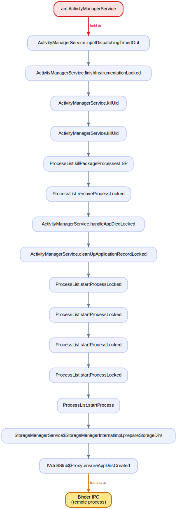

### 15. the AMS monitor held across the transaction in `ActivityManagerService$LocalService.updateOomAdj`

`ActivityManagerService$LocalService.updateOomAdj` issues an outgoing Binder transaction while the AMS monitor is held. The lock is pinned for the whole cross-process round-trip; a slow, janky, or dead remote stalls every thread waiting on the activity manager.

### 16. the AMS monitor held across the transaction in `ActivityManagerService.clearPendingBackup`

`ActivityManagerService.clearPendingBackup` issues an outgoing Binder transaction while the AMS monitor is held. The lock is pinned for the whole cross-process round-trip; a slow, janky, or dead remote stalls every thread waiting on the activity manager.

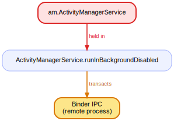

### 17. the AMS monitor held across the transaction in `ActivityManagerService.crashApplicationWithTypeWithExtras`

`ActivityManagerService.crashApplicationWithTypeWithExtras` issues an outgoing Binder transaction while the AMS monitor is held. The lock is pinned for the whole cross-process round-trip; a slow, janky, or dead remote stalls every thread waiting on the activity manager.

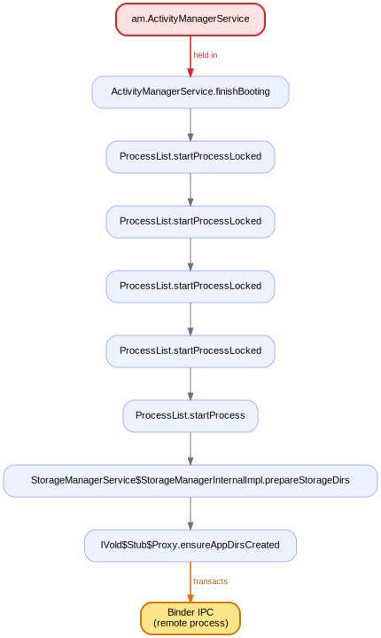

### 18. the AMS monitor held across the transaction in `ActivityManagerService.handleFollowUpOomAdjusterUpdate`

`ActivityManagerService.handleFollowUpOomAdjusterUpdate` issues an outgoing Binder transaction while the AMS monitor is held. The lock is pinned for the whole cross-process round-trip; a slow, janky, or dead remote stalls every thread waiting on the activity manager.

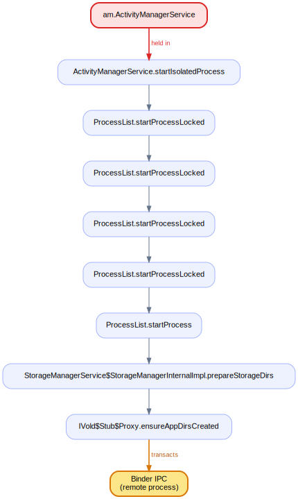

### 19. the AMS monitor held across the transaction in `ActivityManagerService.idleUids`

`ActivityManagerService.idleUids` issues an outgoing Binder transaction while the AMS monitor is held. The lock is pinned for the whole cross-process round-trip; a slow, janky, or dead remote stalls every thread waiting on the activity manager.

### 20. the AMS monitor + `mPidsSelfLocked` held across the transaction in `ActivityManagerService.importanceTokenDied`

`ActivityManagerService.importanceTokenDied` issues an outgoing Binder transaction while the AMS monitor + `mPidsSelfLocked` is held. The lock is pinned for the whole cross-process round-trip; a slow, janky, or dead remote stalls every thread waiting on the activity manager.

### 21. the AMS monitor held across the transaction in `ActivityManagerService.importanceTokenDied`

`ActivityManagerService.importanceTokenDied` issues an outgoing Binder transaction while the AMS monitor is held. The lock is pinned for the whole cross-process round-trip; a slow, janky, or dead remote stalls every thread waiting on the activity manager.

### 22. the AMS monitor + `mPidsSelfLocked` + `mProcLock` held across the transaction in `ActivityManagerService.killProcessesBelowAdj`

`ActivityManagerService.killProcessesBelowAdj` issues an outgoing Binder transaction while the AMS monitor + `mPidsSelfLocked` + `mProcLock` is held. The lock is pinned for the whole cross-process round-trip; a slow, janky, or dead remote stalls every thread waiting on the activity manager.

### 23. the AMS monitor held across the transaction in `ActivityManagerService.lambda$killPids$7`

`ActivityManagerService.lambda$killPids$7` issues an outgoing Binder transaction while the AMS monitor is held. The lock is pinned for the whole cross-process round-trip; a slow, janky, or dead remote stalls every thread waiting on the activity manager.

### 24. the AMS monitor held across the transaction in `ActivityManagerService.lambda$updateAppProcessCpuTimeLPr$22`

`ActivityManagerService.lambda$updateAppProcessCpuTimeLPr$22` issues an outgoing Binder transaction while the AMS monitor is held. The lock is pinned for the whole cross-process round-trip; a slow, janky, or dead remote stalls every thread waiting on the activity manager.

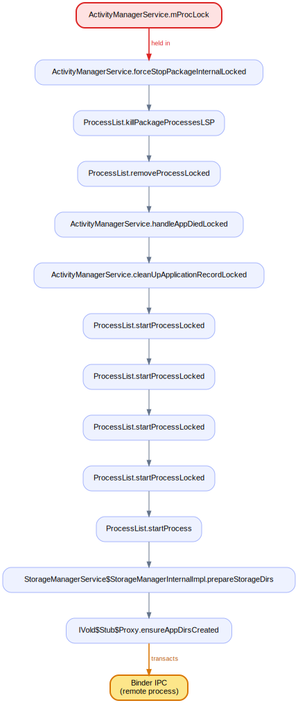

### 25. the AMS monitor held across the transaction in `ActivityManagerService.lambda$updatePhantomProcessCpuTimeLPr$23`

`ActivityManagerService.lambda$updatePhantomProcessCpuTimeLPr$23` issues an outgoing Binder transaction while the AMS monitor is held. The lock is pinned for the whole cross-process round-trip; a slow, janky, or dead remote stalls every thread waiting on the activity manager.

### 26. the AMS monitor held across the transaction in `ActivityManagerService.onWakefulnessChanged`

`ActivityManagerService.onWakefulnessChanged` issues an outgoing Binder transaction while the AMS monitor is held. The lock is pinned for the whole cross-process round-trip; a slow, janky, or dead remote stalls every thread waiting on the activity manager.

### 27. the AMS monitor held across the transaction in `ActivityManagerService.publishService`

`ActivityManagerService.publishService` issues an outgoing Binder transaction while the AMS monitor is held. The lock is pinned for the whole cross-process round-trip; a slow, janky, or dead remote stalls every thread waiting on the activity manager.

### 28. the AMS monitor held across the transaction in `ActivityManagerService.runInBackgroundDisabled`

`ActivityManagerService.runInBackgroundDisabled` issues an outgoing Binder transaction while the AMS monitor is held. The lock is pinned for the whole cross-process round-trip; a slow, janky, or dead remote stalls every thread waiting on the activity manager.

### 29. `mProcLock` held across the transaction in `ActivityManagerService.scheduleApplicationInfoChanged`

`ActivityManagerService.scheduleApplicationInfoChanged` issues an outgoing Binder transaction while `mProcLock` is held. The lock is pinned for the whole cross-process round-trip; a slow, janky, or dead remote stalls every thread waiting on the activity manager.

### 30. the AMS monitor held across the transaction in `ActivityManagerService.serviceDoneExecuting`

`ActivityManagerService.serviceDoneExecuting` issues an outgoing Binder transaction while the AMS monitor is held. The lock is pinned for the whole cross-process round-trip; a slow, janky, or dead remote stalls every thread waiting on the activity manager.

### 31. the AMS monitor held across the transaction in `ActivityManagerService.setForegroundServiceDelegate`

`ActivityManagerService.setForegroundServiceDelegate` issues an outgoing Binder transaction while the AMS monitor is held. The lock is pinned for the whole cross-process round-trip; a slow, janky, or dead remote stalls every thread waiting on the activity manager.

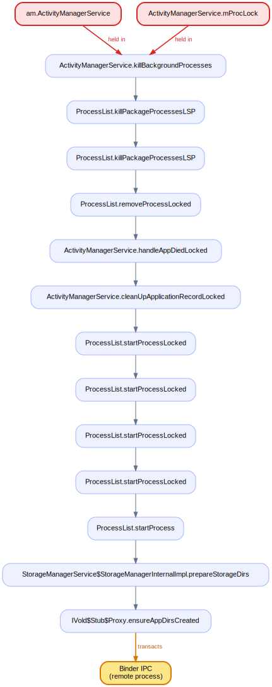

### 32. the AMS monitor held across the transaction in `ActivityManagerService.setHasTopUi`

`ActivityManagerService.setHasTopUi` issues an outgoing Binder transaction while the AMS monitor is held. The lock is pinned for the whole cross-process round-trip; a slow, janky, or dead remote stalls every thread waiting on the activity manager.

### 33. the AMS monitor held across the transaction in `ActivityManagerService.setMemFactorOverride`

`ActivityManagerService.setMemFactorOverride` issues an outgoing Binder transaction while the AMS monitor is held. The lock is pinned for the whole cross-process round-trip; a slow, janky, or dead remote stalls every thread waiting on the activity manager.

### 34. the AMS monitor held across the transaction in `ActivityManagerService.setProcessImportant`

`ActivityManagerService.setProcessImportant` issues an outgoing Binder transaction while the AMS monitor is held. The lock is pinned for the whole cross-process round-trip; a slow, janky, or dead remote stalls every thread waiting on the activity manager.

### 35. the AMS monitor held across the transaction in `ActivityManagerService.setServiceForeground`

`ActivityManagerService.setServiceForeground` issues an outgoing Binder transaction while the AMS monitor is held. The lock is pinned for the whole cross-process round-trip; a slow, janky, or dead remote stalls every thread waiting on the activity manager.

### 36. the AMS monitor held across the transaction in `ActivityManagerService.setSystemProcess`

`ActivityManagerService.setSystemProcess` issues an outgoing Binder transaction while the AMS monitor is held. The lock is pinned for the whole cross-process round-trip; a slow, janky, or dead remote stalls every thread waiting on the activity manager.

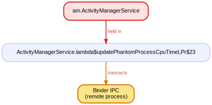

### 37. the AMS monitor held across the transaction in `ActivityManagerService.setWindowManager`

`ActivityManagerService.setWindowManager` issues an outgoing Binder transaction while the AMS monitor is held. The lock is pinned for the whole cross-process round-trip; a slow, janky, or dead remote stalls every thread waiting on the activity manager.

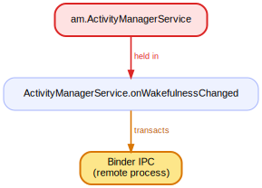

### 38. the AMS monitor held across the transaction in `ActivityManagerService.stopServiceToken`

`ActivityManagerService.stopServiceToken` issues an outgoing Binder transaction while the AMS monitor is held. The lock is pinned for the whole cross-process round-trip; a slow, janky, or dead remote stalls every thread waiting on the activity manager.

### 39. `mProcLock` held across the transaction in `ActivityManagerService.tempAllowlistUidLocked`

`ActivityManagerService.tempAllowlistUidLocked` issues an outgoing Binder transaction while `mProcLock` is held. The lock is pinned for the whole cross-process round-trip; a slow, janky, or dead remote stalls every thread waiting on the activity manager.

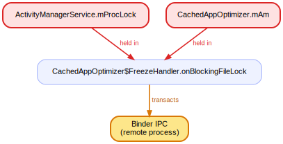

### 40. the AMS monitor held across the transaction in `ActivityManagerService.unbindBackupAgent`

`ActivityManagerService.unbindBackupAgent` issues an outgoing Binder transaction while the AMS monitor is held. The lock is pinned for the whole cross-process round-trip; a slow, janky, or dead remote stalls every thread waiting on the activity manager.

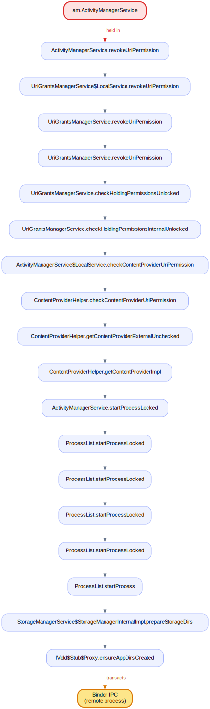

### 41. the AMS monitor held across the transaction in `ActivityManagerService.unbindFinished`

`ActivityManagerService.unbindFinished` issues an outgoing Binder transaction while the AMS monitor is held. The lock is pinned for the whole cross-process round-trip; a slow, janky, or dead remote stalls every thread waiting on the activity manager.

### 42. the AMS monitor held across the transaction in `ActivityManagerService.unbindService`

`ActivityManagerService.unbindService` issues an outgoing Binder transaction while the AMS monitor is held. The lock is pinned for the whole cross-process round-trip; a slow, janky, or dead remote stalls every thread waiting on the activity manager.

### 43. the AMS monitor + `mProcLock` held across the transaction in `ActivityManagerService.updateForceBackgroundCheck`

`ActivityManagerService.updateForceBackgroundCheck` issues an outgoing Binder transaction while the AMS monitor + `mProcLock` is held. The lock is pinned for the whole cross-process round-trip; a slow, janky, or dead remote stalls every thread waiting on the activity manager.

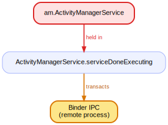

### 44. the AMS monitor held across the transaction in `ActivityManagerService.updateServiceBindings`

`ActivityManagerService.updateServiceBindings` issues an outgoing Binder transaction while the AMS monitor is held. The lock is pinned for the whole cross-process round-trip; a slow, janky, or dead remote stalls every thread waiting on the activity manager.

### 45. the AMS monitor + `mProcLock` held across the transaction in `ActivityManagerService.waitForApplicationBarrier`

`ActivityManagerService.waitForApplicationBarrier` issues an outgoing Binder transaction while the AMS monitor + `mProcLock` is held. The lock is pinned for the whole cross-process round-trip; a slow, janky, or dead remote stalls every thread waiting on the activity manager.

### 46. `mProcLock` + the AMS monitor held across the transaction in `ActivityManagerShellCommand.runFreeze`

`ActivityManagerShellCommand.runFreeze` issues an outgoing Binder transaction while `mProcLock` + the AMS monitor is held. The lock is pinned for the whole cross-process round-trip; a slow, janky, or dead remote stalls every thread waiting on the activity manager.

### 47. `mProcLock` + `mBadProcessLock` held across the transaction in `AppErrors.handleShowAppErrorUi`

`AppErrors.handleShowAppErrorUi` issues an outgoing Binder transaction while `mProcLock` + `mBadProcessLock` is held. The lock is pinned for the whole cross-process round-trip; a slow, janky, or dead remote stalls every thread waiting on the activity manager.

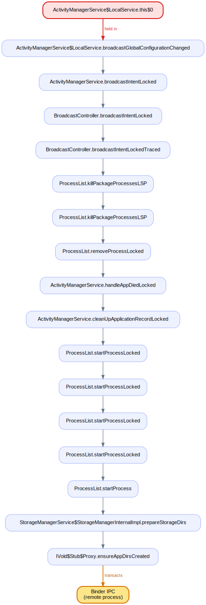

### 48. `mProcLock` held across the transaction in `CachedAppOptimizer$FreezeHandler.freezeProcess`

`CachedAppOptimizer$FreezeHandler.freezeProcess` issues an outgoing Binder transaction while `mProcLock` is held. The lock is pinned for the whole cross-process round-trip; a slow, janky, or dead remote stalls every thread waiting on the activity manager.

### 49. `mProcLock` + the AMS monitor held across the transaction in `CachedAppOptimizer$FreezeHandler.onBlockingFileLock`

`CachedAppOptimizer$FreezeHandler.onBlockingFileLock` issues an outgoing Binder transaction while `mProcLock` + the AMS monitor is held. The lock is pinned for the whole cross-process round-trip; a slow, janky, or dead remote stalls every thread waiting on the activity manager.

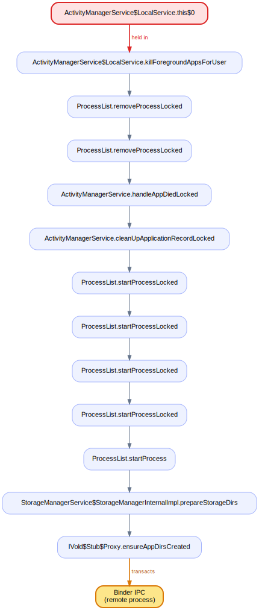

### 50. `mProcLock` + the AMS monitor held across the transaction in `CachedAppOptimizer.forceFreezeForTest`

`CachedAppOptimizer.forceFreezeForTest` issues an outgoing Binder transaction while `mProcLock` + the AMS monitor is held. The lock is pinned for the whole cross-process round-trip; a slow, janky, or dead remote stalls every thread waiting on the activity manager.

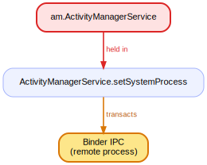

### 51. `mProcLock` + the AMS monitor held across the transaction in `CachedAppOptimizer.lambda$killProcess$2`

`CachedAppOptimizer.lambda$killProcess$2` issues an outgoing Binder transaction while `mProcLock` + the AMS monitor is held. The lock is pinned for the whole cross-process round-trip; a slow, janky, or dead remote stalls every thread waiting on the activity manager.

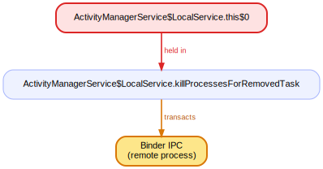

### 52. `mProcLock` held across the transaction in `CachedAppOptimizer.unfreezeTemporarily`

`CachedAppOptimizer.unfreezeTemporarily` issues an outgoing Binder transaction while `mProcLock` is held. The lock is pinned for the whole cross-process round-trip; a slow, janky, or dead remote stalls every thread waiting on the activity manager.

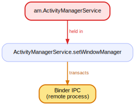

### 53. `mProcLock` + the AMS monitor held across the transaction `StorageManagerService$StorageManagerInternalImpl.prepareStorageDirs` → `IVold$Stub$Proxy.ensureAppDirsCreated`

On 1 AMS entry point, `mProcLock` + the AMS monitor is held while the call chain reaches `StorageManagerService$StorageManagerInternalImpl.prepareStorageDirs`'s outgoing Binder transaction `IVold$Stub$Proxy.ensureAppDirsCreated` to another process. The lock is pinned for the whole cross-process round-trip; a slow, janky, or dead remote stalls every thread waiting on the activity manager.

### 54. `mProcLock` + `mBadProcessLock` held across the transaction `StorageManagerService$StorageManagerInternalImpl.prepareStorageDirs` → `IVold$Stub$Proxy.ensureAppDirsCreated`

On 1 AMS entry point, `mProcLock` + `mBadProcessLock` is held while the call chain reaches `StorageManagerService$StorageManagerInternalImpl.prepareStorageDirs`'s outgoing Binder transaction `IVold$Stub$Proxy.ensureAppDirsCreated` to another process. The lock is pinned for the whole cross-process round-trip; a slow, janky, or dead remote stalls every thread waiting on the activity manager.

### 55. `mProcLock` held across the transaction in `OomAdjuster.updateOomAdjLocked`

`OomAdjuster.updateOomAdjLocked` issues an outgoing Binder transaction while `mProcLock` is held. The lock is pinned for the whole cross-process round-trip; a slow, janky, or dead remote stalls every thread waiting on the activity manager.

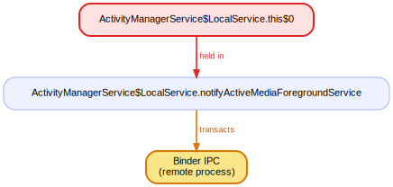

### 56. `mProcLock` held across the transaction in `OomAdjusterImpl.performUpdateOomAdjPendingTargetsLocked`

`OomAdjusterImpl.performUpdateOomAdjPendingTargetsLocked` issues an outgoing Binder transaction while `mProcLock` is held. The lock is pinned for the whole cross-process round-trip; a slow, janky, or dead remote stalls every thread waiting on the activity manager.

### 57. `mProcLock` + the AMS monitor held across the transaction in `ProcessErrorStateRecord.appNotResponding`

`ProcessErrorStateRecord.appNotResponding` issues an outgoing Binder transaction while `mProcLock` + the AMS monitor is held. The lock is pinned for the whole cross-process round-trip; a slow, janky, or dead remote stalls every thread waiting on the activity manager.

---

## Incoming — a binder entry that takes an AMS lock

The incoming AMS-lock entries are dominated by `dumpsys`, which legitimately walks every lock; the one of interest is below.

### `ActivityManagerService$IntentCreatorToken.completeFinalize`

This binder entry acquires `sIntentCreatorTokenCache`, `mObservers`; a remote caller blocks on them.
