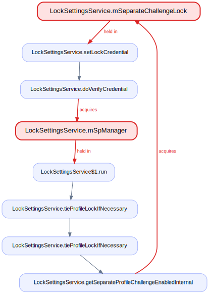
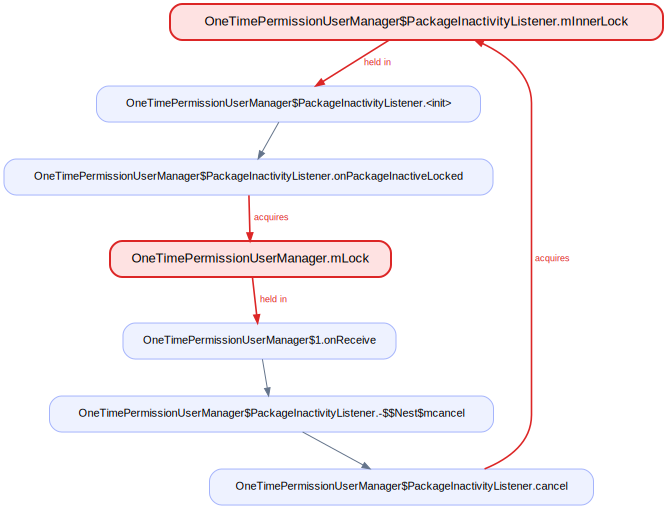
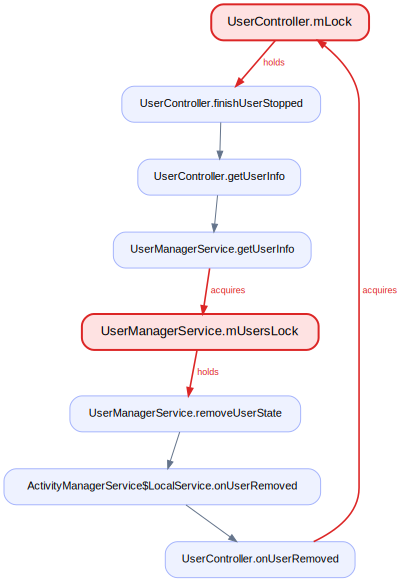
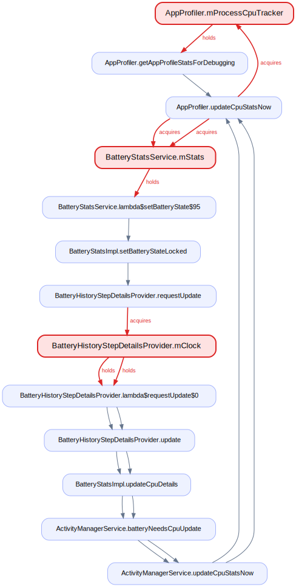
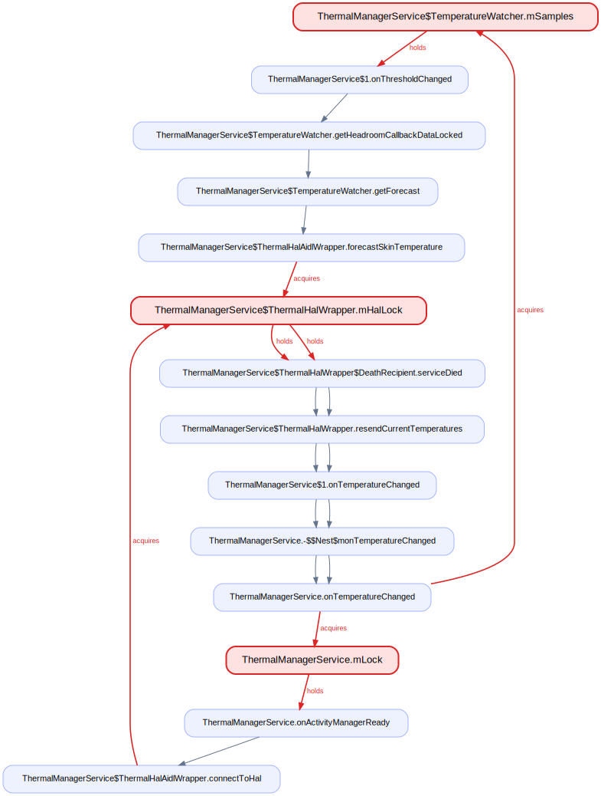

# Findings — lock-order analysis of `system_server`

`lockdex` flagged 17 candidate lock-order cycles on a build's `services.jar`;
`lockdex verify` traced each to source. Each was then read against AOSP
`frameworks/base`: call paths followed, locks checked for object identity,
`@GuardedBy`/threading annotations and any documented lock ordering accounted for.

Confident inversions come first, each with a fix. The candidates that did not
survive review are at the end with the reason.

A reported cycle is a real pair of opposite-order acquisitions in the bytecode.
Deadlock additionally needs the two sites to run on different threads
concurrently; that is checked per finding, not assumed.

---

## Confident inversions

### 1. `LockSettingsService.mSeparateChallengeLock` ⇄ `mSpManager`

`LockSettingsService` declares a canonical order in a class comment:
`mSeparateChallengeLock -> mSpManager` (`LockSettingsService.java:262-263`). One
path honors it; another inverts it, on a different thread.

- **`mSeparateChallengeLock` → `mSpManager`** — `setLockCredential` takes
  `mSeparateChallengeLock` (`:1921`) then `mSpManager` via `setLockCredentialInternal`
  (`:1980`). Binder thread; matches the documented order.
- **`mSpManager` → `mSeparateChallengeLock`** — the runnable posted by
  `onUserUnlocking` takes `mSpManager` (`:953`) then `mSeparateChallengeLock` via
  `tieProfileLockIfNecessary` → `getSeparateProfileChallengeEnabledInternal`
  (`:1368`). `mHandler` thread; **inverts** the documented order.

The locks are distinct objects (`:267`, `:289`) and the two sites run on a Binder
thread and the `mHandler` thread, so they can interleave. The maintainers treat
this order as load-bearing — that's why it's written down — and the unlock path
breaks it.

**Fix.** On the unlock path, take `mSeparateChallengeLock` before `mSpManager`
(the documented order), or read the separate-challenge flag — the only thing that
needs `mSeparateChallengeLock` inside that block — before entering
`synchronized (mSpManager)`.

### 2. `RemoteTaskStore.mRemoteDeviceTaskLists` ⇄ `mRemoteTaskListeners`

Two monitors in one class, taken in both orders, with no `@GuardedBy` or ordering
comment anywhere in the file — the nesting discipline is implicit and the code
breaks it.

- **`mRemoteDeviceTaskLists` → `mRemoteTaskListeners`** — `removeDevice` holds the
  map lock (`:173`) then calls `notifyListeners()` → `synchronized (mRemoteTaskListeners)`
  (`:188`). Runs on the transport-teardown thread (`onAssociationDisconnected`,
  no Handler hop).
- **`mRemoteTaskListeners` → `mRemoteDeviceTaskLists`** — `addListener` holds the
  listener lock (`:128`) then calls `getMostRecentTasks()` → `synchronized
  (mRemoteDeviceTaskLists)` (`:52`). Reached over Binder
  (`ITaskContinuityManager.Stub.registerRemoteTaskListener`).

Distinct objects, different threads. A Binder client registering a listener while
a device disconnects hits both orders. `notifyListeners` itself nests lock-2 then
lock-1 in one chain, so the ordering is mixed by design.

**Fix.** Establish one order and keep `getMostRecentTasks()` (which takes
`mRemoteDeviceTaskLists`) out of any `synchronized (mRemoteTaskListeners)` block —
snapshot the tasks before taking the listener lock. Collapsing both to a single
lock is the robust option for a class this small.

### 3. `OneTimePermissionUserManager.mLock` ⇄ `PackageInactivityListener.mInnerLock`

The manager-wide `mLock` guards the uid→listener map (`@GuardedBy("mLock")`,
`:98`); the per-listener `mInnerLock` guards that listener's alarm/uid-observer
state. They are acquired in both orders across different threads.

- **`mInnerLock` → `mLock`** — the uid-observer callback
  `onUidGone`/`onUidStateChanged` → `updateUidState` takes `mInnerLock` (`:347`) →
  `onPackageInactiveLocked` takes `mLock` via `mListeners.remove(mUid)` (`:471`).
  Oneway Binder thread.
- **`mLock` → `mInnerLock`** — `mUninstallListener.onReceive` takes `mLock` (`:82`)
  → `listener.cancel()` takes `mInnerLock` (`:394`). Main thread (receiver
  registered with no Handler).

Distinct objects, opposite order, concurrent threads (Binder observer vs. main-
thread broadcast), on the same listener instance during an uninstall-while-active
session.

**Fix.** Pick a global order — `mLock → mInnerLock` is the natural one — and hold
to it both ways. `onPackageInactiveLocked` takes `mInnerLock` then `mLock`; hoist
the `mListeners.remove(mUid)` out of the `mInnerLock` region (or take `mLock`
first) so it matches the `onReceive` side.

### 4. `BatteryController.mLock` ⇄ `LocalBluetoothBatteryManager.mBroadcastReceiver`

`BatteryController`'s class javadoc notes it is touched from Binder threads, the
UEventObserver thread, and its own Handler. One lock is a `BroadcastReceiver`
object used as a monitor; the other is the controller's `mLock`. Both `@GuardedBy`
sets are internally consistent, but the two are nested in opposite orders on
different threads.

- **`mBroadcastReceiver` → `mLock`** — `onReceive` holds `mBroadcastReceiver`
  (`:964`) then invokes the listener `handleBluetoothBatteryLevelChange`, which
  takes `mLock` (`:387`). Main Looper (receiver registered without a scheduler).
- **`mLock` → `mBroadcastReceiver`** — `onInputDeviceAdded` holds `mLock` (`:478`),
  constructs a `UsiDeviceMonitor` → `addBatteryListener` → `synchronized
  (mBroadcastReceiver)` (`:981`). DisplayThread (input listener on `mHandler`).

Distinct objects; the main-thread leg fires on a BT battery-level broadcast, the
DisplayThread leg on adding/changing an input device — both normal operation,
narrow window, nothing forbids the nesting.

**Fix.** Never take `mBroadcastReceiver` while holding `mLock`: register the BT
listener (`addBatteryListener`) outside the `synchronized (mLock)` region.
Symmetrically, have `onReceive` copy the level and release `mBroadcastReceiver`
before calling the listener that takes `mLock`.

### 5. `UserController.mLock` ⇄ `UserManagerService.mUsersLock`

Two service monitors across the `am`/`pm` boundary: `UserController.mLock` guards
started-user state, `UserManagerService.mUsersLock` guards the user list. No
documented order exists between them.

- **`mLock` → `mUsersLock`** — `finishUserStopped` holds `mLock` (`:1563`) and via
  `updateUserToLockLU` → `getUserPropertiesInternal`/`hasUserRestriction` takes
  `mUsersLock` (`UserManagerService.java:2732`). UserController `mHandler` thread.
  (Reachability is gated by the delayed-locking config branch.)
- **`mUsersLock` → `mLock`** — `removeUserState` holds `mUsersLock` (`:7430`) and
  calls `getActivityManagerInternal().onUserRemoved` → `UserController.onUserRemoved`,
  `synchronized (mLock)` (`UserController.java:3927`). Removal/Binder thread.

Distinct objects, opposite order, different threads. The forward leg is config-
dependent, which is why this sits below the four above.

**Fix.** Don't call across the service boundary while holding the other service's
lock. On the removal side, move `getActivityManagerInternal().onUserRemoved(...)`
out of `synchronized (mUsersLock)` (`UserManagerService.java:7430-7433`); on the
stop side, hoist the UMS property/restriction queries in `updateUserToLockLU` out
of the `mLock` region. Either break is sufficient.

---

## Lower confidence — worth a runtime/lockdep check

### `BatteryStatsService.mStats` ⇄ `SYSTEM_CLOCK` (`BatteryHistoryStepDetailsProvider.mClock`)

`mClock` is `Clock.SYSTEM_CLOCK`, a process-global singleton shared into the
step-details provider — so the 3-lock SCC is really a two-lock pair, `mStats` vs.
that clock monitor. Forward `mStats → mClock` is synchronous in
`setBatteryStateLocked` → `requestUpdate` `else`-branch
(`BatteryHistoryStepDetailsProvider.java:106`), on a Binder thread; reverse
`mClock → mStats` is on the `mHandler` thread inside the `requestUpdate`
`if`-branch `postDelayed` runnable (`:99` → `AppProfiler.java:2181`). Distinct
monitors, opposite order, different threads. Whether both orders are ever in
flight at once depends on which threads drive each, and the boot-gated `if`-branch
(`!mSystemReady || mFirstUpdate`) leaves that unproven. A lockdep/trace check
settles it.

### `ThermalManagerService.mLock` ⇄ `ThermalHalWrapper.mHalLock`

Distinct monitors. `mLock → mHalLock` runs once at boot (`onActivityManagerReady`,
`:253` → `connectToHal`, `:1413`); `mHalLock → mLock` runs in the HAL death
recipient (`serviceDied` holds `mHalLock` at `:1216`, then `resendCurrentTemperatures`
→ service `onTemperatureChanged` takes `mLock` at `:482`). A real cross-thread
inversion, but reachable only if the thermal HAL dies during boot bring-up — low
probability, not impossible.

**Fix (if confirmed).** Release `mHalLock` before the listener callout in
`serviceDied` (post the resend), so HAL-handle state and the service lock never
nest.

---

The remaining candidates are not deadlocks: documented-order nestings
(`AudioService`, `AudioDeviceBroker`, both with an explicit lock hierarchy) or
async-severed back-edges (`Display`, `DeviceIdle`, `location`) — reentrant or
unreachable. The most common false positive — a singleton lock stored under
several field names (`mLock = service.getLock()`) — is resolved automatically:
lockdex collapsed 2,700+ such aliases on this build, so the `Hdmi`, `Slice`,
`JobScheduler`, and time-zone "cycles" that earlier reviews caught no longer
appear.
