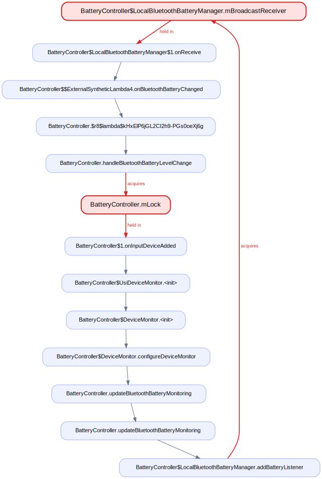
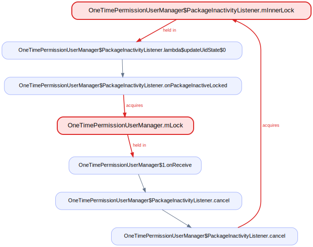
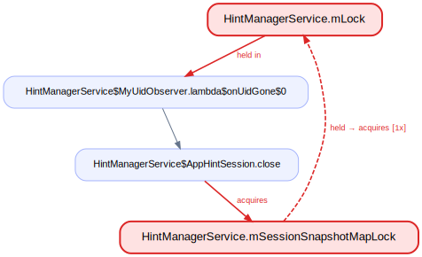
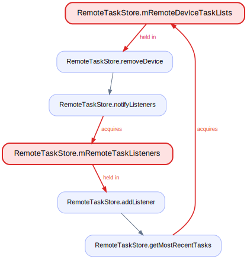
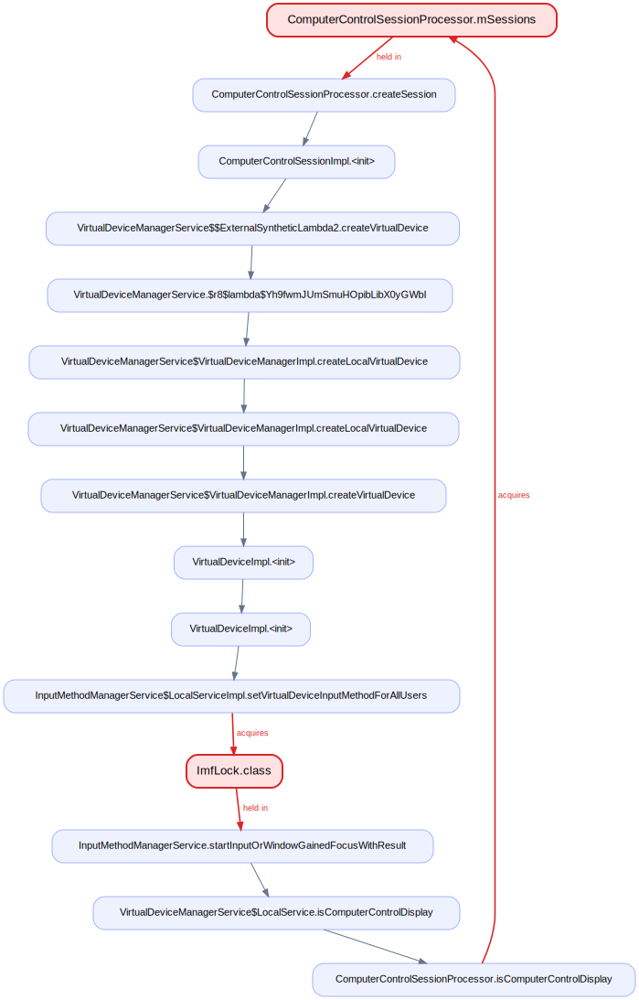
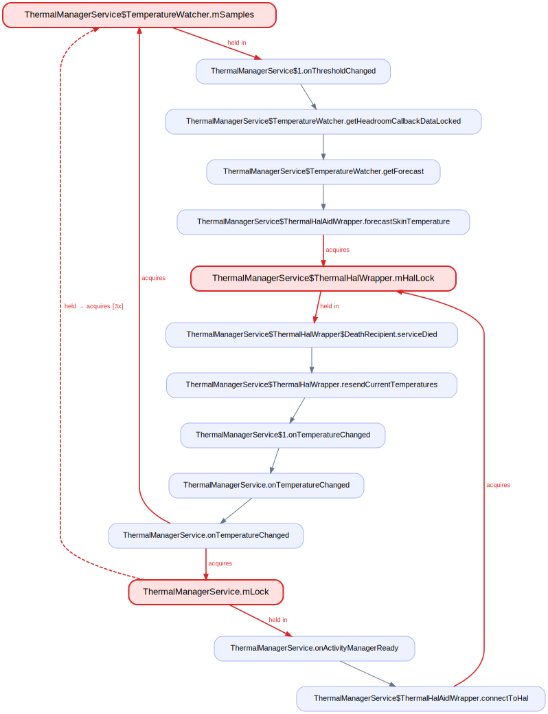

# Findings — lock-order deadlocks in `system_server`

`lockdex` flagged 19 candidate lock-order cycles on a build's `services.jar`. Each
of the 18 with ≤4 locks was traced to source by `lockdex verify` and then **read
against AOSP** — call paths followed, locks checked for object identity, threads
checked for real concurrency, documented orderings accounted for.

**8 are real deadlocks** (distinct objects, both acquisition orders present, sites
on different threads). They lead, each with a fix. The 10 that did not survive are
listed after, with the reason — the two dominant causes are an over-approximated
call path and **two differently-named locks that are the same object** (a lock
passed into a constructor, so `A.mLock` and `B.mLock` are one monitor).

A reported cycle is a real pair of opposite-order acquisitions in the bytecode.
Deadlock additionally needs the two sites to run on different threads concurrently;
that is checked per finding, not assumed.

---

## Confirmed deadlocks

### 1. `LockSettingsService.mSeparateChallengeLock` ⇄ `mSpManager`

`LockSettingsService` documents the order `mSeparateChallengeLock -> mSpManager`
(`LockSettingsService.java:262-263`). `setLockCredential` honors it — takes
`mSeparateChallengeLock` (`:1921`) then `mSpManager` via `setLockCredentialInternal`
(`:1980`), on a binder thread. The runnable posted by `onUserUnlocking` inverts it:
`LockSettingsService$1.run` takes `mSpManager` (`:953`) then, via
`tieProfileLockIfNecessary` → `getSeparateProfileChallengeEnabledInternal`, takes
`mSeparateChallengeLock` (`:1368`), on the LSS `ServiceThread`. Two threads, the
class's own documented order broken.

**Fix.** Read the separate-challenge flag before entering the `mSpManager` section
(or hoist `mSeparateChallengeLock` above `mSpManager` at `:953`).

### 2. `UserController.mLock` ⇄ `UserManagerService.mUsersLock`

Distinct objects (`UserController.java:300` `new Object()`;
`UserManagerService.java:403` `installNewLock`). `finishUserStopped` holds `mLock`
(`:1563`) and reaches `mUsersLock` via `updateUserToLockLU` → `getUserInfo`
(`UserManagerService.java:1057`). `removeUserState` holds `mUsersLock` (`:7430`) and
calls `getActivityManagerInternal().onUserRemoved` (`:7432`) → AMS →
`UserController.onUserRemoved` taking `mLock` (`:3927`). Different threads, different
users — they interleave.

**Fix.** Move the `onUserRemoved` AMS callout outside the `synchronized (mUsersLock)`
block in `removeUserState`.

### 3. `OneTimePermissionUserManager$PackageInactivityListener.mInnerLock` ⇄ `mLock`

`mLock` is the manager's `new Object()` (`:75`); `mInnerLock` a per-listener
`new Object()` (`:206`) — distinct, no documented order. The `ACTION_UID_REMOVED`
receiver (`onReceive`, main thread) takes `mLock` (`:82`) then `listener.cancel()` →
`mInnerLock` (`:394`). The `IUidObserver.onUidGone` callback (binder thread) takes
`mInnerLock` via `updateUidState` (`:347`) then `mLock` via `onPackageInactiveLocked`
(`:471`). Opposite orders, two threads.

**Fix.** In `onReceive`, snapshot/remove the listener under `mLock`, then call
`cancel()` after releasing `mLock`.

### 4. `HintManagerService.mLock` ⇄ `mSessionSnapshotMapLock`

Distinct `new Object()`s (`:170`, `:182`); the file documents
`mSessionSnapshotMapLock` *before* `mLock` (`:177-180`). `restoreSessionSnapshot`
honors it — `mSessionSnapshotMapLock` (`:717`) then `mLock` (`:719`) — on a StatsD
pull thread. `MyUidObserver.onUidGone` (FgThread) takes `mLock` (`:873`) then
`AppHintSession.close()` → `mSessionSnapshotMapLock` (`:2264`), the forbidden order.

**Fix.** In `onUidGone`, collect the sessions under `mLock`, then call `close()`
after releasing `mLock`.

### 5. `RemoteTaskStore.mRemoteDeviceTaskLists` ⇄ `mRemoteTaskListeners`

Two distinct final fields of one `RemoteTaskStore` (`:38` HashMap, `:39`
RemoteCallbackList). `removeDevice` takes `mRemoteDeviceTaskLists` (`:173`) then
`notifyListeners` → `mRemoteTaskListeners` (`:188`). `addListener` takes
`mRemoteTaskListeners` (`:128`) then `getMostRecentTasks` → `mRemoteDeviceTaskLists`
(`:113`). Strict opposite order, both synchronous, reachable from different threads.

**Fix.** Move `notifyListeners()` outside the `mRemoteDeviceTaskLists` block in
`removeDevice`.

### 6. `BatteryController.mLock` ⇄ `LocalBluetoothBatteryManager.mBroadcastReceiver`

`mLock = new Object()`; `mBroadcastReceiver` is the inner manager's receiver field,
`@GuardedBy("mBroadcastReceiver")` (`:951`). `registerBatteryListener`
(`@BinderThread`, `:134`) holds `mLock` (`:137`) and reaches
`synchronized(mBroadcastReceiver)` via `updateBluetoothBatteryMonitoring` →
`addBatteryListener` (`:981`). The receiver's `onReceive` (DisplayThread looper)
holds `mBroadcastReceiver` (`:964`) then `handleBluetoothBatteryLevelChange` →
`mLock` (`:387`). Binder thread vs. looper.

**Fix.** Register/unregister the battery listener outside the `mLock` block.

### 7. `ComputerControlSessionProcessor.mSessions` ⇄ `ImfLock.class`

Distinct (a per-instance `ArraySet` vs. a static class monitor). `createSession`
holds `mSessions` (`:230`) and synchronously constructs a `VirtualDeviceImpl` whose
ctor reaches `setVirtualDeviceInputMethodForAllUsers` →
`synchronized(ImfLock.class)` (`InputMethodManagerService.java:5647`).
`startInputOrWindowGainedFocusWithResult` holds `ImfLock.class` (`:3552`) then calls
`isComputerControlDisplay` → `mSessions` (`:397`). Two binder threads.

**Fix.** Construct the session/VirtualDevice outside `synchronized(mSessions)`,
taking the lock only for the `mSessions.add(...)`.

### 8. `ThermalManagerService` — `mSamples` → `mHalLock` → `mLock` (3-lock)

Three distinct objects. `onThresholdChanged`/`onTemperatureChanged` hold
`mTemperatureWatcher.mSamples` (`:203`/`:502`) and reach `mHalLock` via
`forecastSkinTemperature` (`:2199`). The HAL death recipient `serviceDied` holds
`mHalLock` (`:1216`) then `onTemperatureChanged` → `mLock` (`:482`).
`onActivityManagerReady` holds `mLock` (`:253`) then `mSamples` (`:288`). The HAL can
die during init, so the death thread, a HAL-callback thread, and the init thread
interleave.

**Fix.** In `serviceDied`, deliver reconnected temperatures outside the `mHalLock`
block (post to the handler), enforcing `mLock → mSamples → mHalLock`.

---

## Did not survive review

Ten candidates were read and rejected. The causes — and what each says about the
tool's limits:

**Two locks that are the same object.** **cand17**
(`AutofillInlineSessionController.mLock` → `AbstractMasterSystemService.mLock` →
`AbstractPerUserSystemService.mLock` → `ServiceNameBaseResolver.mLock`): three of the
four are one object. `AbstractPerUserSystemService.mLock = lock` (`:75`) is the
master's lock passed in (`new …PerUserService(this, mLock, …)`), threaded again into
`Session` and `AutofillInlineSessionController` (`Session.java:551` comments "which
is the same as mLock"). lockdex resolves constructor-parameter aliases but not
through `super(...)` chains, so it sees four locks. (A real 2-lock
`mLock ⇄ ServiceNameBaseResolver.mLock` AB-BA *does* hide inside.) This is a
fixable lock-identity gap — `super()` argument threading.

**Over-approximated call path** — a reported reverse edge cannot execute:
- **cand2** (`DisplayPowerController.mLock` ⇄ `DisplayBrightnessController.mLock`):
  the reverse path calls `switchMode(..., sendUpdate=false)`, severing the callback
  into DPC before its lock is taken.
- **cand7** (`mMultiplexerLock` ⇄ `mInitializationLock`): the reverse edge needs
  `setState` to fire a listener that is still null while `mInitializationLock` is held.
- **cand12** (`PrintManagerImpl.mLock` ⇄ `RemotePrintService.mLock`): the reverse
  edge was stitched onto an unrelated `binderDied → onServiceDied` chain that holds
  no `RemotePrintService.mLock`.
- **cand15** (`mHandshakeLock` → `mTransports` → `mRemoteIn`): a CHA over-approx
  across the abstract `Transport.sendMessage`; the `mRemoteIn` holder is
  `RawTransport`, which has no `SecureChannel`, so the cycle never closes.

**Reentrant outer lock held by an externally-callable method.** **cand9**
(`mDeviceConnections` ⇄ `mDevicesByInfo`, documented order at `MidiService.java:86`),
**cand14** (AudioService `mSettingsLock`/`mHdmiClientLock`/`mVolumeStateLock`,
documented total order), **cand18** (AudioDeviceBroker, `mDeviceStateLock` outermost
per `:1158-1162`). The "reverse" acquisition is a reentrant re-acquire of a lock the
*caller* always holds. lockdex suppresses this when the re-acquiring method is
private (all callers known) but **cannot** soundly when it is public — a public
method can be entered from anywhere with no lock held. Dismissing these needs
whole-program + thread knowledge and the AOSP locking conventions, which a sound,
component-local analysis does not have.

**Single-threaded.** **cand13** (`mProcessCpuTracker`/`mClock`/`BatteryStatsImpl`):
the three only interleave on the one `batterystats-handler` thread, and `mClock` is a
shared `Clock.SYSTEM_CLOCK` singleton.

---

Read every reported cycle against the source before changing any locking. The
verified eight above were; the fixes are specific.
