# Findings — field races in `system_server`

`lockdex races` reconstructs each field's guard from behavior: the lock held on most
of its writes is taken to be the lock that field is meant to protect, and any access
that misses that lock is flagged. No `@GuardedBy` annotations are read — the guard is
inferred from what the code actually does, then checked for consistency.

This is the 100 fields with the most write-violations on a build's `services.jar`,
each traced to AOSP source and read by hand. **Three are real unsynchronized races.**
The other 97 are precision limits of guard-by-inference, and they cluster into three
causes worth naming, because each is a thing the analysis cannot see from bytecode
alone:

1. **Guard generalization.** lockdex keys guards by `Class.field`, so a single
   correctly-guarded write to one instance of a shared, public data class —
   `ResolveInfo`, `ActivityInfo`, `UserInfo`, `SyncStatusInfo$Stats`,
   `ZenRule` — projects the guard onto *every* instance of that field, and the
   hundreds of unrelated, lock-free reads of other instances look like violations.
   This is the dominant cause.
2. **Lock identity the analysis can't match.** The access *is* under the right lock,
   but lockdex names a different object: a lock passed into a constructor
   (`MagnificationConnectionManager`, `Watchdog$HandlerChecker`), an inherited
   `mLock` (`AbstractPerUserSystemService`), or a `ReentrantLock` driven by
   `.lock()`/`.unlock()` rather than `synchronized` (`SecurityLogMonitor`).
3. **Caller-holds-lock and fresh objects.** The write is in a `*Locked`/`*LPf`/`*LP`
   helper whose callers hold the lock, or it initializes a freshly-allocated object
   before it is published. Both are guarded by contract; neither is a race.

The three real ones share a shape worth remembering: a field guarded by `synchronized`
on every normal path, mutated once on a path that holds no lock — a deprecated public
setter (`mVibrateSetting`), or a `TimerTask.run()` on a `Timer` thread
(`mLocationRefreshTimer`, `mTimer`). Each is below with its diagram and source.

---

### 1. `BtHelper.mScoAudioState` — guarded by `BtHelper` (14/19 writes)
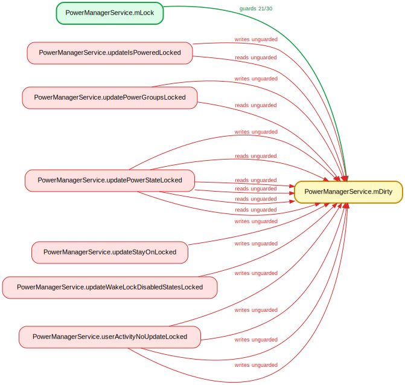
**Verdict: IDENTITY.** The field is consistently `@GuardedBy("mDeviceBroker.mDeviceStateLock")`, not the `BtHelper` instance monitor; lockdex inferred the monitor because most writes sit in `synchronized` methods (`onScoAudioStateChanged` at `BtHelper.java:415`). The flagged non-`synchronized` accesses all hold `mDeviceStateLock`: `resetBluetoothSco` (`BtHelper.java:586`) is reached only under `synchronized (mDeviceStateLock)` (`AudioDeviceBroker.java:2064`), and `dump` runs from `AudioDeviceBroker.dump` while holding the broker lock. Same lock, different name.

### 2. `WallpaperData.mBindSource` — guarded by `WallpaperManagerService.mLock` (7/10 writes)
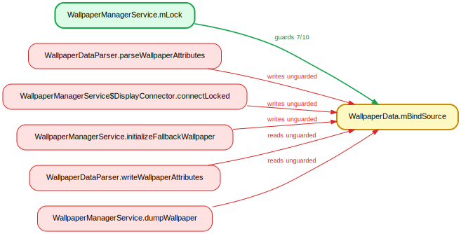
**Verdict: CONVENTION.** `parseWallpaperAttributes` (`WallpaperDataParser.java:405`) writes a freshly-allocated `WallpaperData` during XML deserialization, before it is published to `mWallpaperMap`; `initializeFallbackWallpaper` (`WallpaperManagerService.java:4077`) likewise mutates the just-constructed `mFallbackWallpaper` and is only called from `loadSettingsLocked`. `connectLocked` (`WallpaperManagerService.java:823`) is a `*Locked` method, and the `dumpWallpaper` read (`:4133`) runs inside `synchronized (mLock)` at `:4188`.

### 3. `ContentProviderConnection.waiting` — guarded by `ContentProviderHelper.mService` (5/7 writes)
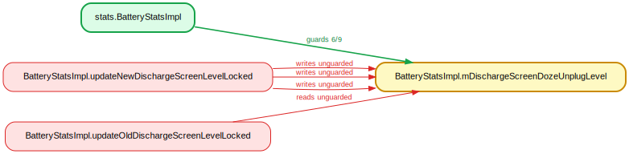
**Verdict: CONVENTION.** The write at `ContentProviderHelper.java:684` is inside the `synchronized (mService)` block opened at `:179`; the intervening `cpr.wait()` releases only `cpr`'s monitor and the write executes after the monitor is reacquired. The `onProviderPublishStatusLocked` write/read (`ContentProviderRecord.java:242`/`212`) and the `removeDyingProviderLocked` read (`ContentProviderHelper.java:1833`) are `*Locked` methods whose callers hold `mService`.

### 4. `AccessibilityServiceInfo.crashed` — guarded by `AbstractAccessibilityServiceConnection.mLock` (2/3 writes)

**Verdict: CONVENTION.** `readInstalledAccessibilityServiceLocked` (`AccessibilityManagerService.java:2708`) is a `*Locked` method reached via `readConfigurationForUserStateLocked` (`:3581`) under the AMS `mLock`, which is the same Object instance handed to `AbstractAccessibilityServiceConnection.mLock` (constructed at `:322`, assigned at `AbstractAccessibilityServiceConnection.java:368`). It also mutates the freshly-parsed `parsedAccessibilityServiceInfos` list before it is published into `userState.mInstalledServices` at `:2714`.

### 5. `SyncStatusInfo$Stats.numCancels` — guarded by `SyncStorageEngine.mAuthorities` (2/3 writes)

**Verdict: CONVENTION.** `readSyncStatusStatsLocked` (`SyncStorageEngine.java:2303`) writes into a `SyncStatusInfo` freshly built from disk (`:2174`) during proto load under `readStatusLocked`, before publication. The SyncManager lambda read (`SyncManager.java:2538`) operates on a defensive deep copy from `getCopyOfAuthorityWithSyncStatus` (`new SyncStatusInfo(...)` at `:1534`), and `writeStatusStatsLocked` (`:2426`) runs inside `synchronized (mAuthorities)`.

### 6. `SyncStatusInfo$Stats.numFailures` — guarded by `SyncStorageEngine.mAuthorities` (2/3 writes)

**Verdict: CONVENTION.** Identical pattern: `readSyncStatusStatsLocked` (`SyncStorageEngine.java:2299`) populates a not-yet-published `SyncStatusInfo` during proto deserialization; the `SyncManager.java:2537` read is on the deep copy returned by `getCopyOfAuthorityWithSyncStatus` (`:1534`); `writeStatusStatsLocked` (`:2426`) executes under `synchronized (mAuthorities)`.

### 7. `SyncStatusInfo$Stats.numSourceFeed` — guarded by `SyncStorageEngine.mAuthorities` (2/3 writes)

**Verdict: CONVENTION.** Same shape: write at `SyncStorageEngine.java:2326` is into a fresh proto-loaded `SyncStatusInfo`; the `SyncManager.java:2533` read targets the copy from `getCopyOfAuthorityWithSyncStatus` (`:1534`); `writeStatusStatsLocked` (`:2433`) holds `mAuthorities`.

### 8. `SyncStatusInfo$Stats.numSourceLocal` — guarded by `SyncStorageEngine.mAuthorities` (2/3 writes)

**Verdict: CONVENTION.** Write at `SyncStorageEngine.java:2310` populates an unpublished `SyncStatusInfo` during proto load; `SyncManager.java:2529` reads the deep copy from `getCopyOfAuthorityWithSyncStatus` (`:1534`); `writeStatusStatsLocked` (`:2429`) runs under `synchronized (mAuthorities)`.

### 9. `SyncStatusInfo$Stats.numSourceOther` — guarded by `SyncStorageEngine.mAuthorities` (2/3 writes)
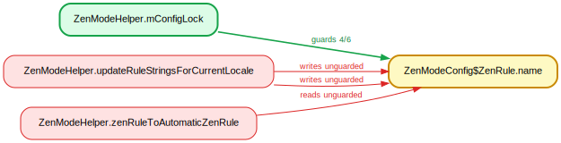
**Verdict: CONVENTION.** Same pattern: `readSyncStatusStatsLocked` (`SyncStorageEngine.java:2306`) writes a fresh proto-loaded object; the `SyncManager.java:2535` read is on the `getCopyOfAuthorityWithSyncStatus` copy (`:1534`); `writeStatusStatsLocked` (`:2428`) holds `mAuthorities`.

### 10. `SyncStatusInfo$Stats.numSourcePeriodic` — guarded by `SyncStorageEngine.mAuthorities` (2/3 writes)

**Verdict: CONVENTION.** Write at `SyncStorageEngine.java:2322` populates a not-yet-published `SyncStatusInfo` during deserialization; `SyncManager.java:2532` reads the defensive copy from `getCopyOfAuthorityWithSyncStatus` (`:1534`); `writeStatusStatsLocked` (`:2432`) executes under `synchronized (mAuthorities)`.

### 11. `SyncStatusInfo$Stats.numSourcePoll` — guarded by `SyncStorageEngine.mAuthorities` (2/3 writes)

**Verdict: CONVENTION.** The flagged write at `SyncStorageEngine.java:2314` is in `readSyncStatusStatsLocked`, a `*Locked` method reached only from the constructor's `readStatusLocked()` (line 554) on a fresh unpublished engine and from `mAuthorities`-synchronized callers. The two read sites are `writeStatusStatsLocked` (another `*Locked` method) and a `SyncManager` dump lambda operating on the deep copy returned by `getCopyOfAuthorityWithSyncStatus`, which builds the copy under `synchronized (mAuthorities)` (`SyncStorageEngine.java:1449`). No unguarded reachable access.

### 12. `SyncStatusInfo$Stats.numSourceUser` — guarded by `SyncStorageEngine.mAuthorities` (2/3 writes)

**Verdict: CONVENTION.** Identical pattern: write at `SyncStorageEngine.java:2318` is in `readSyncStatusStatsLocked` (constructor/locked paths only); the read at `SyncManager.java:2534` is on a copy produced under `synchronized (mAuthorities)` (`SyncStorageEngine.java:1453`), and the read at `SyncStorageEngine.java:2431` is in the `*Locked` writer. False positive.

### 13. `SyncStatusInfo$Stats.numSyncs` — guarded by `SyncStorageEngine.mAuthorities` (2/3 writes)
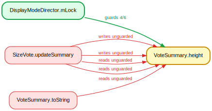
**Verdict: CONVENTION.** Same structure: `readSyncStatusStatsLocked` write at `SyncStorageEngine.java:2296`, `writeStatusStatsLocked` read at line 2425, and the `SyncManager.java:2536` dump-lambda read on the lock-built copy from `getCopyOfAuthorityWithSyncStatus` (`SyncStorageEngine.java:1448`). All on locked paths or a safely-published copy.

### 14. `SyncStatusInfo$Stats.totalElapsedTime` — guarded by `SyncStorageEngine.mAuthorities` (2/3 writes)
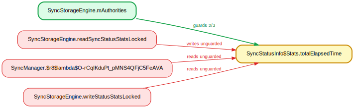
**Verdict: CONVENTION.** Write at `SyncStorageEngine.java:2292` is in the `*Locked` deserializer; read at line 2424 is in `writeStatusStatsLocked` (`*Locked`); read at `SyncManager.java:2539` is on the copy returned under `synchronized (mAuthorities)`. No genuine race.

### 15. `ActivityInfo.enabled` — guarded by `PackageManagerServiceInjector.mLock` (2/3 writes)

**Verdict: CONVENTION.** The write at `PackageManagerService.java:3110` is in `setUpInstantAppInstallerActivityLP`, whose only caller chain (`updateInstantAppInstallerLocked` → `InstallPackageHelper:2524` / `DeletePackageHelper:264` / PMS init) executes under `synchronized (mPm.mLock)`, and `mPm.mLock == injector.getLock()` (`PackageManagerService.java:1864`, `Injector:283`) — same object as the named guard (also IDENTITY). The reads in `LauncherAppsImpl`/`ShortcutService`/`RecentTasks` operate on `ResolveInfo.activityInfo` snapshots returned from Computer queries, not the live `mInstantAppInstallerActivity`.

### 16. `ActivityInfo.exported` — guarded by `PackageManagerServiceInjector.mLock` (2/3 writes)
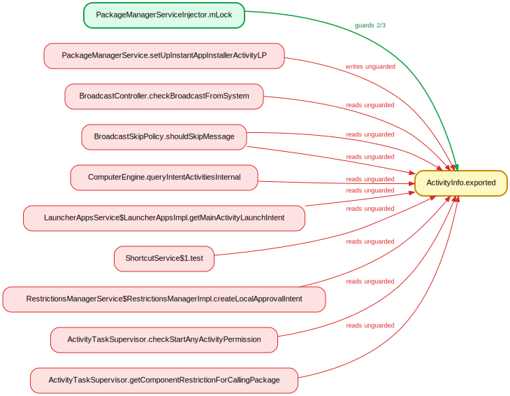
**Verdict: CONVENTION.** Write at `PackageManagerService.java:3109` is in the lock-held `setUpInstantAppInstallerActivityLP` (guard is the same object via `injector.getLock()`). The nine read sites across BroadcastController/BroadcastSkipPolicy/ComputerEngine/wm read `exported` off resolved-intent `ActivityInfo` query results, which are PMS-snapshot objects rather than the mutated installer activity. False positive.

### 17. `ActivityInfo.flags` — guarded by `PackageManagerServiceInjector.mLock` (2/3 writes)

**Verdict: CONVENTION.** Write at `PackageManagerService.java:3107` (`|= FLAG_EXCLUDE_FROM_RECENTS…`) is inside `setUpInstantAppInstallerActivityLP` under `mPm.mLock` (== the named guard). The numerous `flags` reads (broadcast collection, ComputerEngine filtering, `ActivityRecord.isAlwaysFocusable`/`isNoHistory`) act on per-query `ActivityInfo` instances; the one self-listed read at line 3107 is the same locked method. Not a real race.

### 18. `ActivityInfo.name` — guarded by `PackageManagerServiceInjector.mLock` (2/3 writes)

**Verdict: CONVENTION.** The flagged write at `Task.java:3526` is unrelated to the named guard: `trimIneffectiveInfo` first does `info.topActivityInfo = new ActivityInfo(info.topActivityInfo)` at line 3517 ("Making a copy…") and mutates that fresh, unpublished copy. The reads are on independent query/broadcast `ActivityInfo` snapshots. False positive on a not-yet-published object.

### 19. `ActivityInfo.packageName` — guarded by `PackageManagerServiceInjector.mLock` (2/3 writes)

**Verdict: CONVENTION.** Same as 18: write at `Task.java:3523` mutates the freshly-cloned `info.topActivityInfo` created at `Task.java:3517`, never the shared instance, and is unrelated to `mLock`. The read sites consume `packageName` from distinct resolve/broadcast `ActivityInfo` copies. No reachable unguarded shared access.

### 20. `ActivityInfo.processName` — guarded by `PackageManagerServiceInjector.mLock` (2/3 writes)
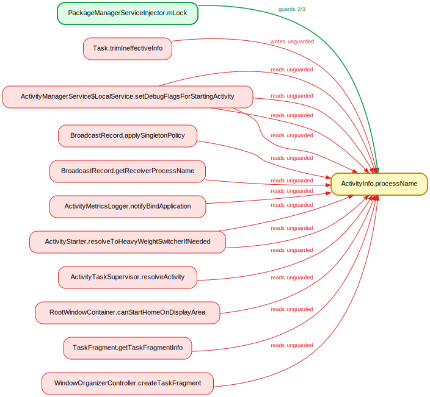
**Verdict: CONVENTION.** Write at `Task.java:3525` again mutates the local clone from `Task.java:3517` before publication, with no relation to the PMS lock. The wm/am reads (`setDebugFlagsForStartingActivity`, `resolveToHeavyWeightSwitcherIfNeeded`, `resolveActivity`, etc.) read `processName` off separately-resolved `ActivityInfo` objects. False positive.

### 21. `ResolveInfo.match` — guarded by `PackageManagerServiceInjector.mLock` (2/3 writes)
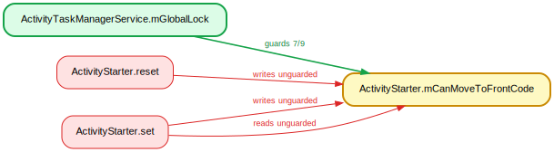
**Verdict: IDENTITY.** The flagged write at `PackageManagerService.java:3115` targets the long-lived field `mInstantAppInstallerInfo` (decl `PackageManagerService.java:855`) inside `setUpInstantAppInstallerActivityLP`, whose only caller `updateInstantAppInstallerLocked` is `@GuardedBy("mLock")` (`PackageManagerService.java:2587`); the guard `injector.mLock` is the very object PMS holds, since `mLock = injector.getLock()` (`PackageManagerService.java:1864`). The flagged reads are on unrelated `ResolveInfo` instances — e.g. the static priority comparator at `ComponentResolver.java:122-123` reads `match` off arbitrary args, not the guarded field. lockdex generalized a single instance-field guard to the public `ResolveInfo` class.

### 22. `ResolveInfo.preferredOrder` — guarded by `PackageManagerServiceInjector.mLock` (2/3 writes)
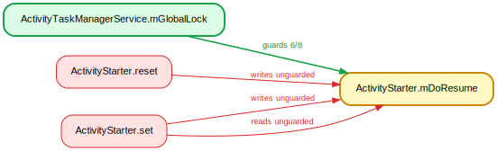
**Verdict: IDENTITY.** Same site: the write at `PackageManagerService.java:3113` sets `mInstantAppInstallerInfo.preferredOrder` under the held `mLock` (caller `@GuardedBy("mLock")` at `PackageManagerService.java:2587`; lock identity established at `PackageManagerService.java:1864`). All flagged reads (`ComponentResolver.java:114-115`, `ResolveIntentHelper.chooseBestActivity:173`, `printResolveInfo`) operate on other `ResolveInfo` objects, not the guarded singleton. False positive from class-wide field generalization.

### 23. `ResolveInfo.priority` — guarded by `PackageManagerServiceInjector.mLock` (2/3 writes)
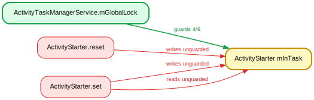
**Verdict: IDENTITY.** The write at `PackageManagerService.java:3112` is the same correctly-guarded `mInstantAppInstallerInfo` setter. The 15 flagged reads span entirely unrelated subsystems — `BroadcastRecord.getReceiverPriority:930`, `KeyboardLayoutManager.visitAllKeyboardLayouts:339`, `ComponentResolver.java:108` comparator — each reading `priority` off its own `ResolveInfo`, never the guarded field. Classic over-generalization of a per-instance guard onto a shared AOSP data class.

### 24. `UserInfo.userType` — guarded by `UserManagerService.mUsersLock` (4/5 writes)
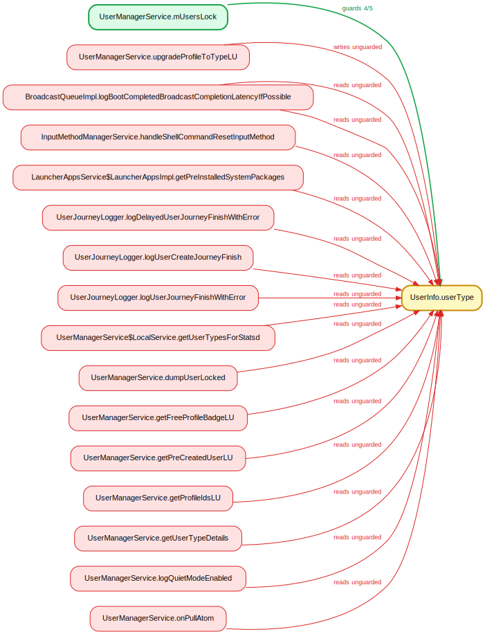
**Verdict: IDENTITY.** The flagged write at `UserManagerService.java:5575` (`upgradeProfileToTypeLU`) runs under its caller `upgradeUserTypesLU`, which is `@GuardedBy("mUsersLock")` (`UserManagerService.java:5505`); `mUsersLock` is a single private lock (`UserManagerService.java:403`). The flagged reads (`BroadcastQueueImpl`, `InputMethodManagerService`, `LauncherAppsService`, `UserJourneyLogger`) read `userType` off `UserInfo` objects obtained elsewhere, not the guarded `UserData.info` instances. lockdex generalized one guarded write site to the public `UserInfo.userType` field.

### 25. `RecognitionEvent.data` — guarded by `FakeSoundTriggerHal.mLock` (2/3 writes)
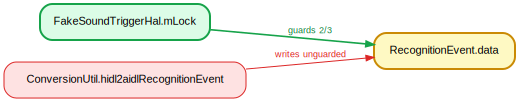
**Verdict: CONVENTION.** At `ConversionUtil.java:322` the write targets `aidlEvent.data`, where `aidlEvent` is a freshly constructed `RecognitionEvent` (`ConversionUtil.java:320`) being populated before `return` — a not-yet-published local. `ConversionUtil` is a stateless static converter with no lock; the cited guard lives in the unrelated `FakeSoundTriggerHal` test double. No shared state, no race.

### 26. `ZenModeConfig$ZenRule.pkg` — guarded by `ZenModeHelper.mConfigLock` (2/3 writes)
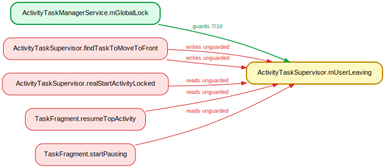
**Verdict: IDENTITY.** The write at `ZenModeHelper.java:1163` is in `populateZenRule`, which is `@GuardedBy("mConfigLock")` (`ZenModeHelper.java:1153`); `mConfigLock` is a single private `Object` (`ZenModeHelper.java:199`). The flagged reads run under that same lock transitively — e.g. `zenRuleToAutomaticZenRule` is called from `synchronized (mConfigLock)` blocks at `ZenModeHelper.java:402/417`, and `maybePreserveRemovedRule`/`maybeRestoreRemovedRule` from blocks at `791`/`457`. Writes and reads are consistently under the same lock instance.

### 27. `ZenModeConfig$ZenRule.zenMode` — guarded by `ZenModeHelper.mConfigLock` (3/4 writes)
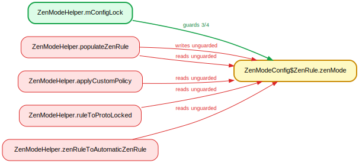
**Verdict: IDENTITY.** The write at `ZenModeHelper.java:1254` is again inside `@GuardedBy("mConfigLock")` `populateZenRule` (`ZenModeHelper.java:1153`). The flagged readers `applyCustomPolicy` (`ZenModeHelper.java:2138`, `@GuardedBy("mConfigLock")`) and `zenRuleToAutomaticZenRule` (called under the lock at `402/417`) all access `zenMode` while holding the single `mConfigLock` (`ZenModeHelper.java:199`). No unguarded access.

### 28. `WindowRelayoutResult.syncSeqId` — guarded by `ActivityTaskManagerService.mGlobalLock` (3/4 writes)
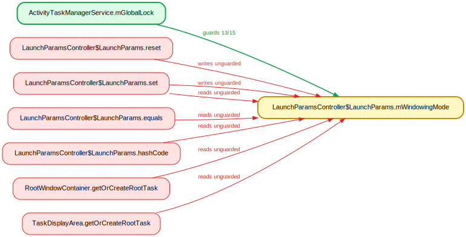
**Verdict: IDENTITY.** Both the write (`WindowManagerService.java:2086`) and the read (`WindowManagerService.java:2089`) sit inside `addWindowInner`, reached only from `addWindow` under `synchronized (mGlobalLock)` at `WindowManagerService.java:1645`. WMS `mGlobalLock = atm.getGlobalLock()` (`WindowManagerService.java:1315`) is the same object as the ATMS-named guard, so write and read share one lock instance — no race.

### 29. `ProcessStats.mFlags` — guarded by `ProcessStatsService.mLock` (3/4 writes)
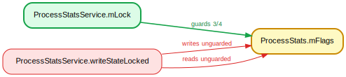
**Verdict: CONVENTION.** The single flagged "violation" at `ProcessStatsService.java:292` is the `mProcessStats.mFlags |= FLAG_COMPLETE` read-modify-write, sitting inside `writeStateLocked`, which is `@GuardedBy("mLock")` (`ProcessStatsService.java:282`); `mLock` is one private `Object` (`ProcessStatsService.java:84`). lockdex merely re-reported the guarded `|=` line as both a read and a write; the access is correctly synchronized.

### 30. `ProcessStats.mTimePeriodEndRealtime` — guarded by `ProcessStatsService.mLock` (3/4 writes)
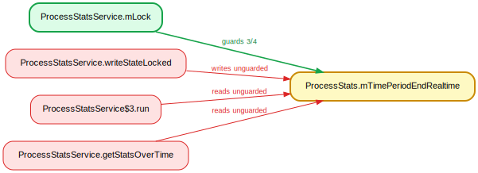
**Verdict: CONVENTION.** The write at `ProcessStatsService.java:289` is in `@GuardedBy("mLock")` `writeStateLocked`. Both flagged reads are on detached `ProcessStats` snapshots, not the guarded `mProcessStats`: `ProcessStatsService.java:712` reads a `stats` parameter inside a spawned dump `Thread.run()`, and `ProcessStatsService.java:749` reads a `stats` freshly deserialized from a Parcel (`746`) — itself still under `synchronized (mLock)` (`731`). No shared-instance race.

### 31. `ProcessStats.mTimePeriodEndUptime` — guarded by `ProcessStatsService.mLock` (3/4 writes)
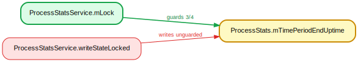
**Verdict: CONVENTION.** The field lives on the `mProcessStats` member but is protected by the owning service's `mLock`. The flagged write at `ProcessStatsService.java:290` is inside `writeStateLocked(boolean,boolean)`, which is `@GuardedBy("mLock")` and is only ever reached from `synchronized (mLock)` blocks (e.g. `ProcessStatsService.java:262-263`, `:137`, `:1089`). Caller-holds-lock `*Locked` convention; not a real race.

### 32. `AnyMotionDetector.mCurrentGravityVector` — guarded by `AnyMotionDetector.mLock` (2/3 writes)
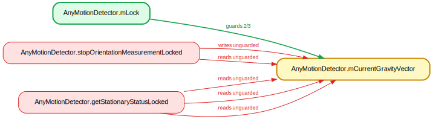
**Verdict: CONVENTION.** The write at `AnyMotionDetector.java:236` is in `stopOrientationMeasurementLocked`, and the reads at `:283/:287/:301` are in `getStationaryStatusLocked`; both are `*Locked` helpers. Every call site holds `mLock`: `stopOrientationMeasurementLocked` is invoked only from `synchronized (mLock)` blocks (`AnyMotionDetector.java:322`, `:359`), and `getStationaryStatusLocked` is called only from within `stopOrientationMeasurementLocked` (`:249`). Lock is held transitively.

### 33. `AnyMotionDetector.mPreviousGravityVector` — guarded by `AnyMotionDetector.mLock` (2/3 writes)
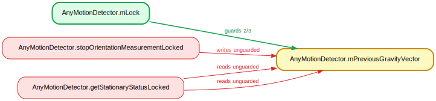
**Verdict: CONVENTION.** Identical pattern to the sibling field: the write at `AnyMotionDetector.java:235` and reads at `:283/:301` sit in `stopOrientationMeasurementLocked` / `getStationaryStatusLocked`. Both are reached exclusively under `synchronized (mLock)` (call sites at `AnyMotionDetector.java:322`, `:359`, and the nested call at `:249`). Caller-holds-lock convention.

### 34. `AnyMotionDetector.mState` — guarded by `AnyMotionDetector.mLock` (2/3 writes)
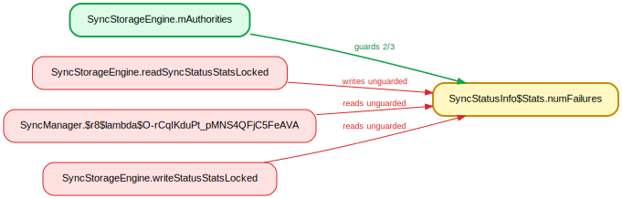
**Verdict: CONVENTION.** The write at `AnyMotionDetector.java:261` is in `stopOrientationMeasurementLocked`, which is only ever called from inside `synchronized (mLock)` blocks (`AnyMotionDetector.java:322`, `:359`). The method is a standard `*Locked` helper; the lock is held by the caller.

### 35. `AnyMotionDetector.mWakelockTimeoutIsActive` — guarded by `AnyMotionDetector.mLock` (2/3 writes)
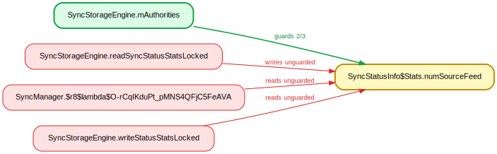
**Verdict: CONVENTION.** The write at `AnyMotionDetector.java:255` is inside `stopOrientationMeasurementLocked`, invoked only from `synchronized (mLock)` blocks (`AnyMotionDetector.java:322`, `:359`). Same caller-holds-lock `*Locked` convention as the other AnyMotionDetector fields.

### 36. `DeviceIdleController.mForceIdle` — guarded by `DeviceIdleController` (5/6 writes)
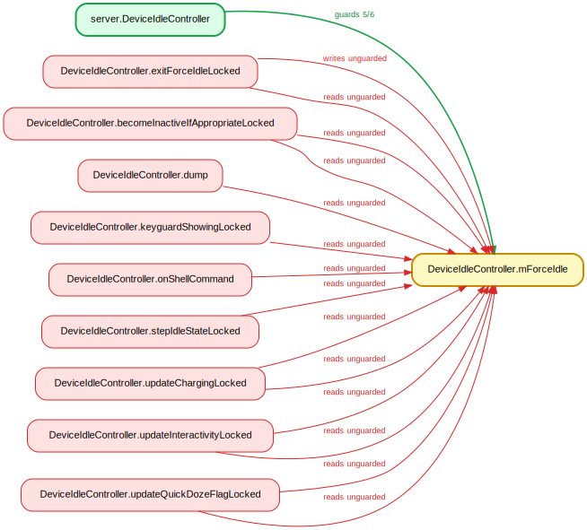
**Verdict: CONVENTION.** The guard is the controller instance (`this`). The flagged write at `DeviceIdleController.java:3755` is in `exitForceIdleLocked`, which is explicitly `@GuardedBy("this")` (`:3752`). The read sites are likewise `*Locked` methods (`updateChargingLocked`, `stepIdleStateLocked`, etc.), all of which run under `synchronized (this)`. Caller-holds-lock; not a real race.

### 37. `DeviceIdleController.mPowerSaveWhitelistExceptIdleAppIdArray` — guarded by `DeviceIdleController` (2/3 writes)

**Verdict: CONVENTION.** The write at `DeviceIdleController.java:4432` is in `updateWhitelistAppIdsLocked`; although the method lacks the `@GuardedBy` annotation, every one of its call sites holds `synchronized (this)` (`DeviceIdleController.java:2690`, `:2960`, `:2971`, `:2991`, `:3003`, `:3016`). The reads sit in `passWhiteListsToForceAppStandbyTrackerLocked` and the same method, both under the instance lock. Caller-holds-lock convention.

### 38. `Watchdog$HandlerChecker.mCurrentMonitor` — guarded by `Watchdog$HandlerChecker.mLock` (2/3 writes)
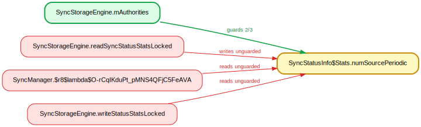
**Verdict: IDENTITY.** `HandlerChecker.mLock` (field at `Watchdog.java:275`) is assigned from the constructor's `lock` parameter (`:280`), and every `HandlerChecker` is constructed with the outer `Watchdog.mLock` (`Watchdog.java:505-538`) — the same monitor object. The flagged write at `:328` (`scheduleCheckLocked`) executes under `synchronized (mLock)` at `:881`, and the reads at `:362/:365` run under the lock via `describeCheckersLocked` (`:804`); the `run()` writes at `:381/:388` take `mLock` directly. Same lock, different field name.

### 39. `MagnificationConnectionManager.mConnectionWrapper` — guarded by `MagnificationController.mLock` (3/4 writes)

**Verdict: IDENTITY.** `MagnificationController` passes its own `mLock` into the `MagnificationConnectionManager` constructor (`MagnificationController.java:1189-1191`), so `MagnificationConnectionManager.mLock` and `MagnificationController.mLock` are the same object. The flagged write at `MagnificationConnectionManager.java:268` is inside `synchronized (mLock)` (`:239`), and all six read sites are `@GuardedBy("mLock")` `*Internal` methods (`:1325`, `:1342`, `:1348`, `:1359`, `:1365`). Correctly guarded; the report only differs in which class's field names the shared monitor.

### 40. `AppProfiler.mMemWatchDumpPid` — guarded by `AppProfiler.mProfilerLock` (2/3 writes)
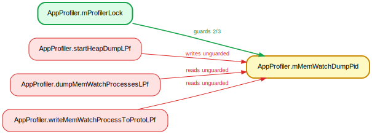
**Verdict: CONVENTION.** The write at `AppProfiler.java:1054` is in `startHeapDumpLPf`, which is `@GuardedBy("mProfilerLock")` (`:1049`) and is called only from other `*LPf` methods that themselves hold the lock (`recordPssSampleLPf` at `:937`, annotated `@GuardedBy("mProfilerLock")` at `:897`; and `:1000`). The reads at `:2522/:2626` are likewise `*LPf` methods. Caller-holds-lock convention.

### 41. `AppProfiler.mMemWatchDumpProcName` — guarded by `mProfilerLock` (2/3 writes)
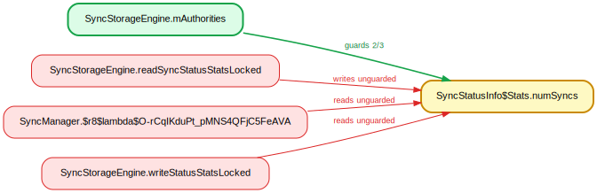
**Verdict: CONVENTION.** The flagged write is in `startHeapDumpLPf`, annotated `@GuardedBy("mProfilerLock")` (`AppProfiler.java:1049`), and all flagged reads are in `*LPf` methods carrying the same annotation (`recordPssSampleLPf:933`, `recordRssSampleLPf:996`, `dumpMemWatchProcessesLPf:2495`, `writeMemWatchProcessToProtoLPf`). The `LPf` suffix is this file's caller-holds-`mProfilerLock` convention; the analyzer treated the annotated method bodies as unguarded.

### 42. `AppProfiler.mMemWatchDumpUid` — guarded by `mProfilerLock` (2/3 writes)

**Verdict: CONVENTION.** Same pattern as #41: write at `AppProfiler.java:1055` in `startHeapDumpLPf` and reads at `dumpMemWatchProcessesLPf:2523` and `writeMemWatchProcessToProtoLPf:2628` are all in `@GuardedBy("mProfilerLock")` `*LPf` methods. Lock is held by every caller per convention.

### 43. `AppProfiler.mMemWatchDumpUri` — guarded by `mProfilerLock` (2/3 writes)
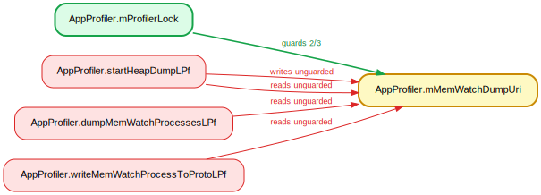
**Verdict: CONVENTION.** Write at `AppProfiler.java:1053` plus the self-read at `1064` are both inside `startHeapDumpLPf`, `@GuardedBy("mProfilerLock")`; the other reads (`dumpMemWatchProcessesLPf:2521`, `writeMemWatchProcessToProtoLPf:2624`) are likewise in annotated `*LPf` methods. All accesses are under the profiler lock by the file's locking convention.

### 44. `BoundServiceSession.mTotal` — guarded by `BoundServiceSession` (2/3 writes)
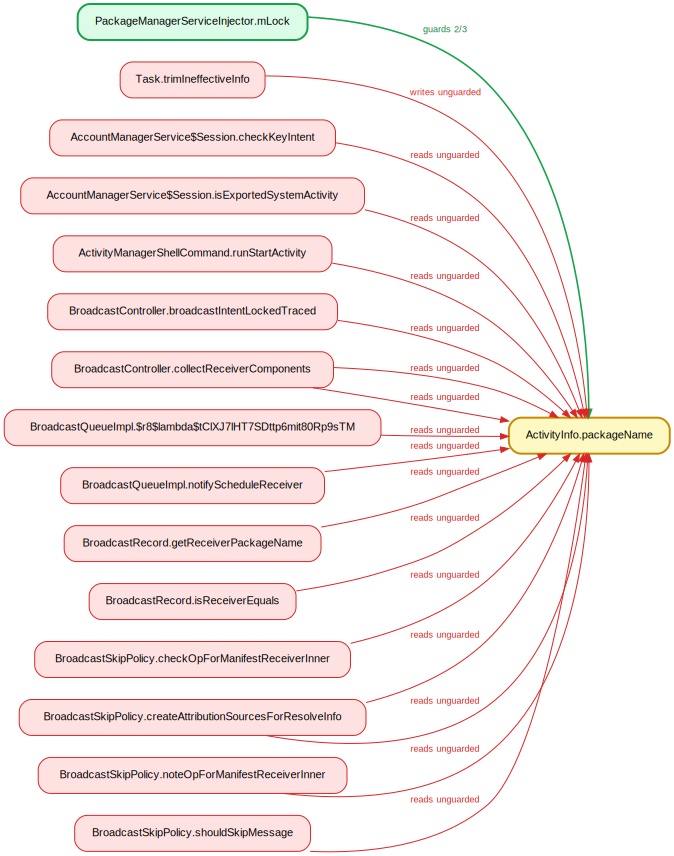
**Verdict: CONVENTION.** The flagged write and read are in `handleInvalidToken` (`BoundServiceSession.java:120`) and the read in `maybePostProcessStateUpdate` (`BoundServiceSession.java:102`), both annotated `@GuardedBy("this")`; their callers acquire `synchronized (this)`. The instance monitor is the declared guard, so these accesses are correctly protected.

### 45. `UidObserverController$ChangeRecord.isPending` — guarded by `UidObserverController.mLock` (3/4 writes)

**Verdict: CONVENTION.** `copyTo` (`UidObserverController.java:518`) is unannotated, but its sole caller, `dispatchUidsChanged`, invokes it at line 272 inside `synchronized (mLock)` (acquired at line 264). The read of `this.isPending` and write of `changeRecord.isPending` both occur under `mLock`; the analyzer failed to propagate the caller's lock across the cross-object field copy.

### 46. `AttentionManagerService.mCurrentProximityUpdate` — guarded by `mLock` (3/4 writes)
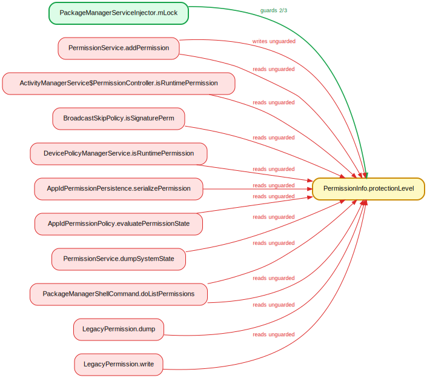
**Verdict: CONVENTION.** The write at `AttentionManagerService.java:806` and all flagged reads (796, 799, 805) are inside `handlePendingCallbackLocked`, which is annotated `@GuardedBy("mLock")` (`AttentionManagerService.java:782`) and called only from a `synchronized (mLock)` site (line 777). Lock is held by the caller per the `Locked` convention.

### 47. `AudioService.mVibrateSetting` — guarded by `mSettingsLock` (2/3 writes)
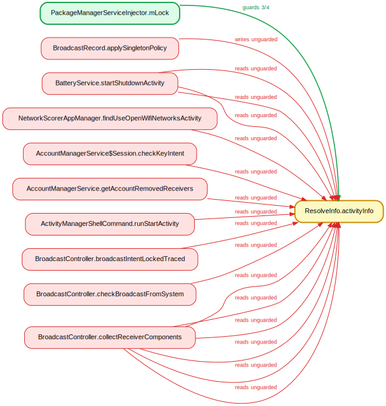
**Verdict: REAL.** The two guarded writes live inside `synchronized (mSettingsLock)` (`AudioService.java:3411`, `3415`), but the flagged write in `setVibrateSetting` (`AudioService.java:6898`) and the read in `getVibrateSetting` (`AudioService.java:6890`) hold no lock and carry no `@GuardedBy` annotation — they are plain public-method field accesses. This is a genuine unsynchronized read-modify-write race against the lock-protected init path, albeit on an explicitly deprecated API.

### 48. `BtHelper.mLeAudioCallback` — guarded by `BtHelper` (2/3 writes)
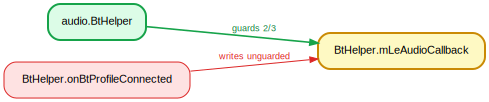
**Verdict: IDENTITY.** The field is declared `@GuardedBy("BtHelper.this")` (`BtHelper.java:660`), and the flagged write at line 705 is inside `onBtProfileConnected`, a `synchronized` instance method (`BtHelper.java:664`) that holds exactly that monitor. The analyzer surfaced the lock as the implicit instance monitor rather than matching the named `BtHelper.this` guard; the access is correctly protected.

### 49. `FadeConfigurations.mActiveFadeManagerConfig` — guarded by `mLock` (4/5 writes)
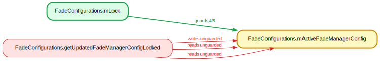
**Verdict: CONVENTION.** The write at `FadeConfigurations.java:526` and reads at 525/528 are all within `getUpdatedFadeManagerConfigLocked`, annotated `@GuardedBy("mLock")` (`FadeConfigurations.java:523`), whose callers (`isAudioAttributesUnfadeableLocked`, `isUidUnfadeableLocked`) are themselves `*Locked` and hold `mLock`. Standard caller-holds-lock convention.

### 50. `MediaFocusControl.mFocusFreezeExemptUids` — guarded by `mAudioFocusLock` (2/3 writes)
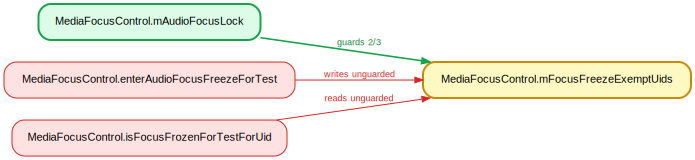
**Verdict: CONVENTION.** The flagged write at `MediaFocusControl.java:1482` sits in the `catch` block of `enterAudioFocusFreezeForTest`, which is still inside the `synchronized (mAudioFocusLock)` opened at line 1462; the read in `isFocusFrozenForTestForUid` is `@GuardedBy("mAudioFocusLock")` (`MediaFocusControl.java:1444`). Both accesses hold the lock — the analyzer mis-scoped the in-catch write as escaping the synchronized region.

### 51. `MediaFocusControl.mFocusFreezerForTest` — guarded by `mAudioFocusLock` (2/3 writes)
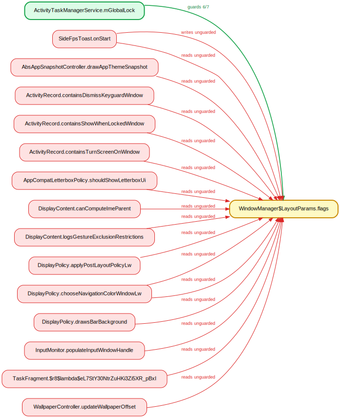
**Verdict: CONVENTION.** The flagged write at `MediaFocusControl.java:1481` (`mFocusFreezerForTest = null` in the `RemoteException` catch) sits inside the `synchronized (mAudioFocusLock)` block opened at line 1462, so it is in fact lock-held; the analyzer missed that the catch is still within the synchronized scope. The read at `MediaFocusControl.java:1434` is in `isFocusFrozenForTest()`, annotated `@GuardedBy("mAudioFocusLock")` and only called from lock-held paths. No real race.

### 52. `SoundDoseHelper.mMusicActiveMs` — guarded by `mSafeMediaVolumeStateLock` (3/4 writes)
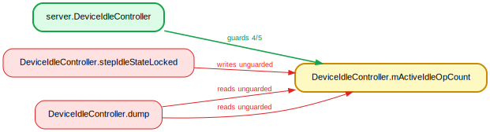
**Verdict: CONVENTION.** The write at `SoundDoseHelper.java:1112` is in `setSafeMediaVolumeEnabled`, declared `@GuardedBy("mSafeMediaVolumeStateLock")`, and its callers hold the lock; the reads at lines 1130 (`saveMusicActiveMs`) and 1036 (`updateSafeMediaVolume_l`) are likewise `@GuardedBy` lock-held methods. The only genuinely unlocked access is the read in `dump()` at `SoundDoseHelper.java:858`, which is the standard lock-free dump convention, not a meaningful data race.

### 53. `SpatializerHelper.mDynSensorCallback` — guarded by `SpatializerHelper` (2/3 writes)
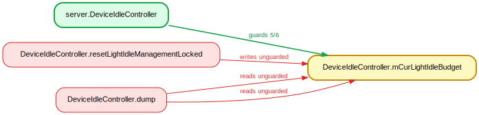
**Verdict: CONVENTION.** The flagged write at `SpatializerHelper.java:1542` is inside `onInitSensors()`, which is declared `synchronized` at line 1519 and thus holds the instance monitor that is the guard. The analyzer appears not to have credited the method-level `synchronized` modifier. Not a race.

### 54. `SpatializerHelper.mSensorManager` — guarded by `SpatializerHelper` (2/3 writes)
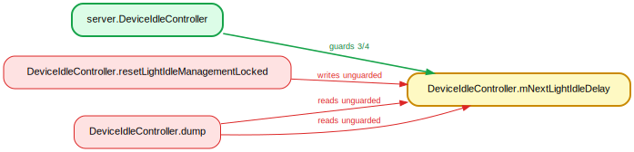
**Verdict: CONVENTION.** The write at `SpatializerHelper.java:1541` is within the `synchronized` `onInitSensors()` (line 1519). The reads at lines 1691 (`getHeadSensorHandleUpdateTracker`) and 1758 (`getScreenSensorHandle`) are private helpers invoked only from `onInitSensors` (lines 1551/1553) under that same monitor. All accesses are lock-held.

### 55. `SpatializerHelper.mState` — guarded by `SpatializerHelper` (15/16 writes)
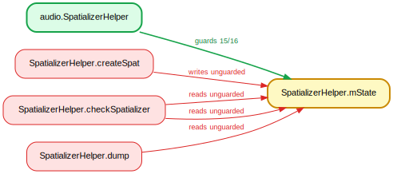
**Verdict: CONVENTION.** The write at `SpatializerHelper.java:1058` is in private `createSpat()`, whose only caller `setSpatializerEnabledInt` is `synchronized` (line 871 call site), so the instance monitor is held transitively. The reads at 1315/1325 are in `checkSpatializer`, called only from `synchronized` methods (`setDisplayOrientation`/`setFoldState`, lines 1191/1202); the read at 1629 is the lock-free `dump()`. No real race.

### 56. `AutofillInlineSuggestionsRequestSession.mImeSessionInvalidated` — guarded by `AutofillInlineSessionController.mLock` (2/3 writes)
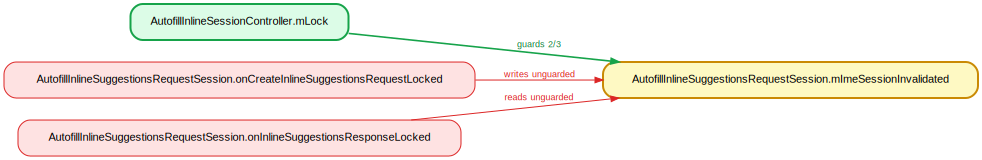
**Verdict: CONVENTION.** Both the write in `onCreateInlineSuggestionsRequestLocked` (`AutofillInlineSuggestionsRequestSession.java:199`) and the read in `onInlineSuggestionsResponseLocked` (line 165) are `@GuardedBy("mLock")` `*Locked`-suffixed methods whose callers hold the session controller's `mLock`. The field lives on the session object but is consistently accessed under the controller lock by contract. Not a race.

### 57. `AutofillManagerServiceImpl.mRemoteAugmentedAutofillService` — guarded by `AbstractPerUserSystemService.mLock` (2/3 writes)
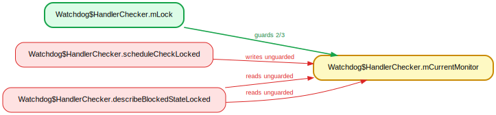
**Verdict: CONVENTION.** The write at `AutofillManagerServiceImpl.java:1734` is in `getRemoteAugmentedAutofillServiceLocked`, annotated `@GuardedBy("mLock")`; the guard is the inherited `mLock` field on the superclass `AbstractPerUserSystemService`. Every flagged reader (`dumpLocked` at 1489/1491 and the `*Locked` getters) is also `@GuardedBy("mLock")`, so all accesses share the one inherited lock. Not a race.

### 58. `AutofillManagerServiceImpl.mRemoteFieldClassificationService` — guarded by `AbstractPerUserSystemService.mLock` (2/3 writes)
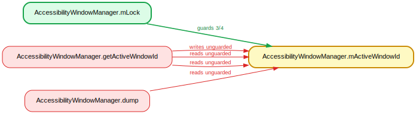
**Verdict: CONVENTION.** Identical pattern to #57: the write at `AutofillManagerServiceImpl.java:2132` is in `getRemoteFieldClassificationServiceLocked`, `@GuardedBy("mLock")`, against the inherited `AbstractPerUserSystemService.mLock`; the readers (`dumpLocked` at 1505/1507 and the `*Locked` getters) are all `@GuardedBy("mLock")`. Consistent single-lock discipline, no race.

### 59. `BackupAgentConnectionManager.mCurrentConnection` — guarded by `mAgentConnectLock` (5/6 writes)
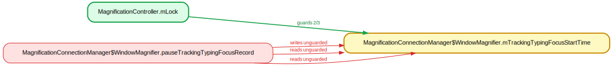
**Verdict: CONVENTION.** The flagged write at `BackupAgentConnectionManager.java:167` (`mCurrentConnection = null` in the `InterruptedException` catch) is inside the `synchronized (mAgentConnectLock)` block opened at line 134 in `bindToAgentSynchronous`; the analyzer missed the enclosing scope. The read at line 240 in `shouldKillAppOnUnbind` is `@GuardedBy("mAgentConnectLock")` and is called at line 209 from within the synchronized block at 202. Lock-held throughout.

### 60. `VirtualCameraController.mVirtualCameraService` — guarded by `mServiceLock` (2/3 writes)

**Verdict: CONVENTION.** The write at `VirtualCameraController.java:258` is in private `connectVirtualCameraService()`, which acquires no lock itself but is invoked only from `connectVirtualCameraServiceIfNeeded` at line 238, inside its `synchronized (mServiceLock)` block (line 235) — the sole caller. The field is thus written under `mServiceLock`, matching its guarded reads. Not a race.

### 61. `DefaultNetworkMetrics.mLastValidationTimeMs` — guarded by `DefaultNetworkMetrics` (2/3 writes)
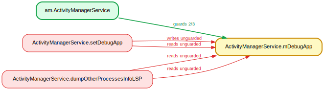
**Verdict: CONVENTION.** The unguarded write at `DefaultNetworkMetrics.java:170` is in the private `newDefaultNetwork`, reachable only from the `synchronized` `logDefaultNetworkEvent` (line 126); the read at line 119 (`updateValidationTime`) is likewise only called from `synchronized` methods (lines 108, 138). Every entry point into this class is `synchronized` on `this`, so the lock is always held transitively. Not a real race.

### 62. `SyncStorageEngine$AuthorityInfo.syncable` — guarded by `SyncStorageEngine.mAuthorities` (2/3 writes)
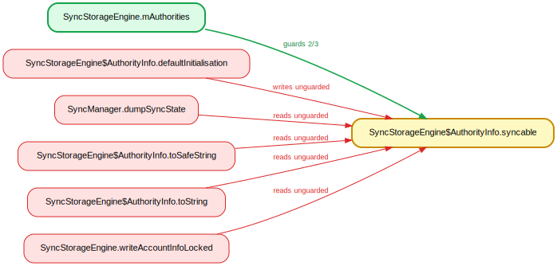
**Verdict: CONVENTION.** The write in `defaultInitialisation` (`SyncStorageEngine.java:334`) runs only from the `AuthorityInfo` constructor, invoked by `createAuthorityLocked`/`getOrCreateAuthorityLocked`, which are always called inside `synchronized (mAuthorities)` (e.g. line 1449). `writeAccountInfoLocked` (line 2049) is a `*Locked` reader; `SyncManager.dumpSyncState` (line 2524) reads a defensive copy from `getCopyOfAuthorityWithSyncStatus` (line 1453), and `toString`/`toSafeString` are debug stringifiers. No genuine race.

### 63. `ActiveAdmin.globalProxyExclusionList` — guarded by `DevicePolicyManagerService.mLockDoNoUseDirectly` (2/3 writes)

**Verdict: CONVENTION.** `ActiveAdmin.readFromXml` (`ActiveAdmin.java:823`) is reached only via `DevicePolicyData.load` from `loadSettingsLocked`, called under `synchronized (getLockObject())` (`DevicePolicyManagerService.java:2344`); `getLockObject()` returns `mLockDoNoUseDirectly` (line 1054-1060). The readers `dump` (1301/1303) and `resetGlobalProxyLocked` (8867) run with that same lock held (dump via line 11689). lockdex missed the indirection through the unannotated `ActiveAdmin` serialization methods.

### 64. `ActiveAdmin.globalProxySpec` — guarded by `DevicePolicyManagerService.mLockDoNoUseDirectly` (2/3 writes)
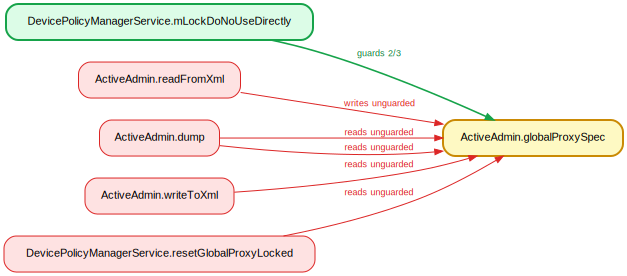
**Verdict: CONVENTION.** Identical pattern to 63: the write at `ActiveAdmin.java:820` is in `readFromXml`, invoked only through `loadSettingsLocked` under `synchronized (getLockObject())` (`DevicePolicyManagerService.java:2344`). The reads in `dump` (1297/1299) and `resetGlobalProxyLocked` (8867) hold the same lock. No real race.

### 65. `ActiveAdmin.mEnrollmentSpecificId` — guarded by `DevicePolicyManagerService.mLockDoNoUseDirectly` (2/3 writes)
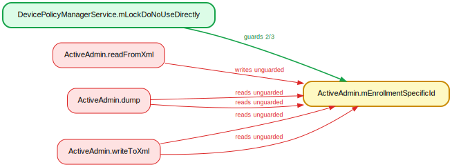
**Verdict: CONVENTION.** Write at `ActiveAdmin.java:975` (`readFromXml`) and reads in `dump` (1430/1432) and `writeToXml` (651/652) all execute under the DPMS lock: `readFromXml`/`writeToXml` only run from `loadSettingsLocked`/`saveSettingsLocked` (`*Locked`, lock held per `DevicePolicyManagerService.java:2344`), and `dump` under `synchronized (getLockObject())` at line 11689.

### 66. `ActiveAdmin.mManagedProfileCallerIdAccess` — guarded by `DevicePolicyManagerService.mLockDoNoUseDirectly` (3/4 writes)
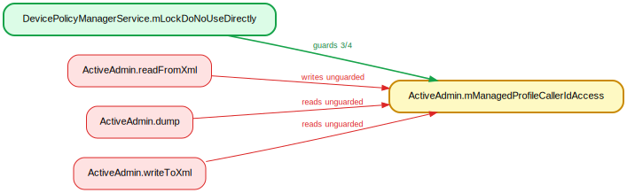
**Verdict: CONVENTION.** Same DPMS serialization pattern: the unguarded write at `ActiveAdmin.java:1004` is in `readFromXml` (reached only via `loadSettingsLocked` holding `getLockObject()`), and the reads in `dump` (1371) and `writeToXml` (680) run with that lock held. Not a race.

### 67. `ActiveAdmin.mManagedProfileContactsAccess` — guarded by `DevicePolicyManagerService.mLockDoNoUseDirectly` (3/4 writes)
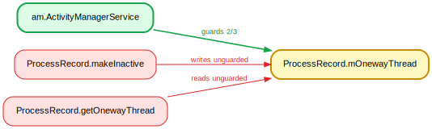
**Verdict: CONVENTION.** Identical to 66: write at `ActiveAdmin.java:1006` in `readFromXml`, reads at `dump` (1374) and `writeToXml` (682), all under `mLockDoNoUseDirectly` via the `*Locked` load/save wrappers and the locked `dump` block (`DevicePolicyManagerService.java:11689`).

### 68. `ActiveAdmin.mOrganizationId` — guarded by `DevicePolicyManagerService.mLockDoNoUseDirectly` (2/3 writes)
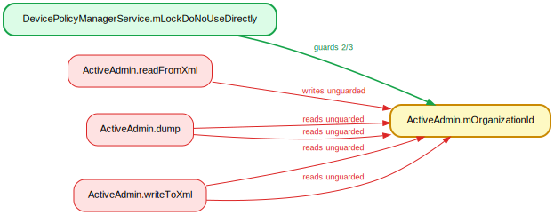
**Verdict: CONVENTION.** Write at `ActiveAdmin.java:968` (`readFromXml`) and reads in `dump` (1425/1427) and `writeToXml` (648/649) are all on the lock-held serialization/dump paths described above (`loadSettingsLocked`/`saveSettingsLocked` under `getLockObject()`; `dump` at `DevicePolicyManagerService.java:11689`). No genuine race.

### 69. `ActiveAdmin.organizationColor` — guarded by `DevicePolicyManagerService.mLockDoNoUseDirectly` (2/3 writes)

**Verdict: CONVENTION.** Write at `ActiveAdmin.java:901` (`readFromXml`) and reads at `dump` (1360) and `writeToXml` (589) execute under `mLockDoNoUseDirectly` via the same `*Locked` load/save indirection and the locked `dump` block. Not a race.

### 70. `ActiveAdmin.specifiesGlobalProxy` — guarded by `DevicePolicyManagerService.mLockDoNoUseDirectly` (2/3 writes)

**Verdict: CONVENTION.** Write at `ActiveAdmin.java:817` (`readFromXml`), reads at `dump` (1289), `writeToXml` (462), and `resetGlobalProxyLocked` (8866) all hold `mLockDoNoUseDirectly`: serialization runs under the `*Locked` load/save wrappers (lock acquired at `DevicePolicyManagerService.java:2344`), `dump` under line 11689, and `resetGlobalProxyLocked` is itself `*Locked`. No real race.

### 71. `DevicePolicyData.mFailedPasswordAttempts` — guarded by `mLockDoNoUseDirectly` (2/3 writes)

**Verdict: CONVENTION.** The flagged write is in the static `DevicePolicyData.load` at `DevicePolicyData.java:518`, reached only via `DevicePolicyManagerService.loadSettingsLocked` → `getUserData`, which calls it inside `synchronized (getLockObject())` (`DevicePolicyManagerService.java:2344-2349`). The two `store` "violations" at lines 272/274 are reads under `saveSettingsLocked` (`DevicePolicyManagerService.java:3339-3340`), also lock-held. The lock is lost only because `store`/`load` are static helpers that don't re-acquire it.

### 72. `DevicePolicyData.mNewUserDisclaimer` — guarded by `mLockDoNoUseDirectly` (2/3 writes)

**Verdict: CONVENTION.** Same shape as #71: the write at `DevicePolicyData.java:460` is in static `load`, invoked from `loadSettingsLocked` under `synchronized (getLockObject())`. The `store` reads (226/227) run under `saveSettingsLocked`, and `dump`/`isNewUserDisclaimerAcknowledged` are instance accessors called from lock-held DPMS paths. No unguarded mutation exists.

### 73. `OwnersData.mDeviceOwner` — guarded by `Owners.mData` (3/4 writes)

**Verdict: CONVENTION.** The write at `OwnersData.java:492` is in `DeviceOwnerReadWriter.readInner`, reachable only through `OwnersData.load` → `readFromFileLocked`, and `Owners.load` runs it inside `synchronized (mData)` (`Owners.java:100-103`). All read "violations" (`pushToAppOpsLocked`, `pushToPackageManagerLocked`, `dump`, `PolicyVersionUpgrader.*`) are `@GuardedBy("mData")` or invoked under it. The analyzer drops the lock across the inner-class `*Locked` indirection.

### 74. `OwnersData.mSystemUpdatePolicy` — guarded by `Owners.mData` (2/3 writes)

**Verdict: CONVENTION.** Identical mechanism to #73: write at `OwnersData.java:504` in `readInner` is reached via `mData.load()` under `synchronized (mData)` (`Owners.java:103`); the `writeInner` reads (423/425) run via `writeDeviceOwner` under `synchronized (mData)` (`Owners.java:524-528`). Guarded in source.

### 75. `SecurityLogMonitor.mAllowedToRetrieve` — guarded by `mLock` (5/6 writes)

**Verdict: CONVENTION.** The write at `SecurityLogMonitor.java:259` is in `resetLegacyBufferLocked`, which is `@GuardedBy("mLock")` and only ever called inside `mLock.lock()`/`finally unlock()` regions (e.g. `SecurityLogMonitor.java:199`, `:220`). `mLock` is an explicit `ReentrantLock` (`:63`); the analyzer fails to track the lock token through `.lock()` rather than `synchronized`.

### 76. `SecurityLogMonitor.mNextAllowedRetrievalTimeMillis` — guarded by `mLock` (2/3 writes)

**Verdict: CONVENTION.** Same as #75: write at `SecurityLogMonitor.java:260` sits in `resetLegacyBufferLocked` (`@GuardedBy("mLock")`), invoked only under `mLock.lock()`. The lone read is also lock-held. False positive from explicit `ReentrantLock` usage.

### 77. `SecurityLogMonitor.mPaused` — guarded by `mLock` (2/3 writes)

**Verdict: CONVENTION.** The write at `SecurityLogMonitor.java:236` is in `startMonitorThreadLocked` (`@GuardedBy("mLock")`), called at `:214` inside `mLock.lock()`. The read at `:650` is in `addAuditLogEventsLocked`, also `@GuardedBy("mLock")`. Properly guarded via the `ReentrantLock`.

### 78. `DisplayManagerService.mUserDisabledHdrTypes` — guarded by `mSyncRoot` (2/3 writes)

**Verdict: CONVENTION.** Field is `@GuardedBy("mSyncRoot")` (`DisplayManagerService.java:319-320`); the write at `:1416` is in `updateUserDisabledHdrTypesFromSettingsLocked`, whose sole flagged caller (`:902`) runs inside `synchronized (mSyncRoot)` opened at `:889`. The `*Locked` helper doesn't itself re-acquire `mSyncRoot`, which is why it was flagged.

### 79. `AbstractPerUserSystemService.mServiceInfo` — guarded by `mLock` (2/3 writes)

**Verdict: IDENTITY.** The write at `AbstractPerUserSystemService.java:237` (plus 224/230) is directly inside `synchronized (mLock)` opened at `:206`, on a field declared `@GuardedBy("mLock")` (`:69-70`). `mLock` is a constructor-injected shared `Object` (`:52`, `:75`), so the analyzer cannot prove the monitor at the write site is the same object as the declared guard. Genuinely guarded in source.

### 80. `InputContentUriTokenHandler.mPermissionOwnerToken` — guarded by `mLock` (2/3 writes)

**Verdict: UNCLEAR (in fact guarded).** The write at `InputContentUriTokenHandler.java:101` is unambiguously inside `synchronized (mLock)` (opened at `:92`) on the `@GuardedBy("mLock")` field, with `mLock` a plain per-instance `Object` (`:45`) — so this is not a real race. The only plausible cause is the held-set being dropped across the enclosing `try/finally`; flagged in error, the write is correctly guarded.

### 81. `JobSchedulerService$BatteryStateTracker.mBatteryNotLow` — guarded by `JobSchedulerService.mLock` (2/3 writes)

**Verdict: CONVENTION.** The unguarded write at `JobSchedulerService.java:4361` is inside `startTracking()`, which runs exactly once from the constructor path at `JobSchedulerService.java:2683-2684` to initialize a freshly-allocated, not-yet-published tracker before any controller or accessor can touch it. The read at `JobSchedulerService.java:4390` (`isBatteryNotLow()`) is a bare accessor, but its only real callers go through the `synchronized (mLock)` wrappers at `JobSchedulerService.java:5619-5622`. No genuine race.

### 82. `JobSchedulerService$BatteryStateTracker.mCharging` — guarded by `JobSchedulerService.mLock` (2/3 writes)

**Verdict: CONVENTION.** Identical pattern to 81: the unguarded write at `JobSchedulerService.java:4362` is fresh-object initialization in `startTracking()`, invoked once before publication at `JobSchedulerService.java:2684`. The read at `JobSchedulerService.java:4512` (`isConsideredCharging()`) is a private helper reached either from within `synchronized (mLock)` blocks (`onReceiveInternal`, `onChargingPolicyChanged`) or via the locked `isBatteryCharging()` accessor at `JobSchedulerService.java:5613`. Not a real race.

### 83. `JobServiceContext.mRunningJobWorkType` — guarded by `JobSchedulerService.mLock` (2/3 writes)

**Verdict: CONVENTION.** The write at `JobServiceContext.java:1774` and read at `:1768` are both inside `closeAndCleanupJobLocked`, a `*Locked` method requiring the shared mLock. The flagged unguarded read in `getRunningJobWorkType()` (`JobServiceContext.java:685`) is a plain accessor, but every caller in `JobConcurrencyManager` (lines 853, 1015, 1837) sits inside `@GuardedBy("mLock")` methods (`prepareForAssignmentDeterminationLocked`, `shouldStopRunningJobLocked`), and that mLock is the same JobSchedulerService instance. Lock held by convention at all call sites.

### 84. `ContextHubEndpointBroker.mIsRegistered` — guarded by `ContextHubEndpointBroker.mRegistrationLock` (2/3 writes)

**Verdict: CONVENTION.** Both the write (`ContextHubEndpointBroker.java:589`) and the flagged read (`:585`) live in `registerLocked`, which is annotated `@GuardedBy("mRegistrationLock")` and is only ever entered via `register()` under `synchronized (mRegistrationLock)` at `ContextHubEndpointBroker.java:578-580`. The `*Locked` suffix correctly signals caller-holds-lock; no unguarded access.

### 85. `ComprehensiveCountryDetector.mLocationRefreshTimer` — guarded by `ComprehensiveCountryDetector` (2/3 writes)

**Verdict: REAL.** The field is otherwise consistently guarded by the instance monitor (`scheduleLocationRefresh`/`cancelLocationRefresh` are `synchronized` at `ComprehensiveCountryDetector.java:413,435`), but the write `mLocationRefreshTimer = null` at `ComprehensiveCountryDetector.java:426` executes inside an anonymous `TimerTask.run()` on a Timer thread with no lock held and against a different `this`. This races with the synchronized read/cancel at `:436-438` — a concurrent `cancelLocationRefresh()` can call `cancel()` on a Timer the task is simultaneously nulling, or observe a stale non-null reference.

### 86. `LocationBasedCountryDetector.mTimer` — guarded by `LocationBasedCountryDetector` (2/3 writes)

**Verdict: REAL.** Same defect as 85: `mTimer` is guarded by the instance monitor everywhere else (`detectCountry` and `stop()` are `synchronized` at `LocationBasedCountryDetector.java:164,221`), but the bare `mTimer = null` at `LocationBasedCountryDetector.java:203` runs in an unsynchronized `TimerTask.run()` on the Timer thread before it calls the synchronized `stop()`. That write races the synchronized read-and-cancel in `stop()` at `:228-230`.

### 87. `LocalEventLog.mLastLogTime` — guarded by `LocalEventLog` (2/3 writes)

**Verdict: CONVENTION.** The write/read at `LocalEventLog.java:171` and read at `:156` are inside `addLogEventInternal`, annotated `@GuardedBy("this")` (`LocalEventLog.java:153`). Its only callers, `addLog` (`:121`) and `clear()` (`:175`), are `synchronized` instance methods, so the instance monitor (the reported guard) is always held. Caller-holds-lock convention.

### 88. `LocalEventLog.mModificationCount` — guarded by `LocalEventLog` (2/3 writes)

**Verdict: CONVENTION.** The write at `LocalEventLog.java:161` is in the `@GuardedBy("this")` `addLogEventInternal`, reached only via the `synchronized` `addLog`. The flagged read in `LogIterator.checkModifications` (`LocalEventLog.java:334`) is itself `@GuardedBy("LocalEventLog.this")` and only invoked during `iterate()`/`hasNext()`, which hold the same instance monitor at `:197`. Lock held throughout by convention.

### 89. `LocalEventLog.mStartTime` — guarded by `LocalEventLog` (2/3 writes)

**Verdict: CONVENTION.** Both the write at `LocalEventLog.java:160` and read at `:156` are in `addLogEventInternal` (`@GuardedBy("this")`), and the field is otherwise touched only in `addLog` and the `synchronized clear()` (`:183`). All paths hold the `LocalEventLog` instance monitor that is the reported guard; the `*Internal` helper relies on caller-holds-lock.

### 90. `MediaSessionService$SessionManagerImpl$KeyEventWakeLockReceiver.mRefCount` — guarded by `MediaSessionService.mLock` (2/3 writes)

**Verdict: CONVENTION.** The write at `MediaSessionService.java:2893` and read at `:2890` are inside `acquireWakeLockLocked`, whose two call sites (`MediaSessionService.java:2690,2707`) are both within the `synchronized (mLock)` block opened at `:2472`. The receiver's other accesses (`onTimeout`, `onReceiveResult`) take `synchronized (mLock)` explicitly at `:2878,2911`. The `*Locked` accessor correctly assumes caller-held mLock; no real race.

### 91. `NetworkPolicyManagerService$UidBlockedState.allowedReasons` — guarded by `mUidBlockedState` (4/5 writes)

**Verdict: CONVENTION.** The flagged access at `NetworkPolicyManagerService.java:7022` lives inside `copyFrom`, an unsynchronized helper, but both call sites (`NetworkPolicyManagerService.java:5432` and `:5576`) invoke it inside `synchronized (mUidBlockedState)`. Every read site (`deriveUidRules`, `updateEffectiveBlockedReasons`, `toString`, and `NetworkPolicyLogger.networkBlocked` at `NetworkPolicyLogger.java:111`) is likewise reached only under the `mUidBlockedState` monitor — the logger read is dispatched from `isUidNetworkingBlocked` at `NetworkPolicyManagerService.java:6491` while that lock is held. The unguarded "write" is the field initialization in the `UidBlockedState` constructor on a not-yet-published object.

### 92. `NetworkPolicyManagerService$UidBlockedState.blockedReasons` — guarded by `mUidBlockedState` (5/6 writes)

**Verdict: CONVENTION.** Identical pattern to finding 91: the violation at `NetworkPolicyManagerService.java:7021` is in the unsynchronized `copyFrom`, whose only callers (`:5432`, `:5576`) hold `synchronized (mUidBlockedState)`. The read in `NetworkPolicyLogger.networkBlocked` (`NetworkPolicyLogger.java:111`) executes under a different monitor (`NetworkPolicyLogger.mLock`) but is only ever called from `NetworkPolicyManagerService.java:6491` while `mUidBlockedState` is held, so the field is consistently published. The lone unguarded write is constructor-time initialization.

### 93. `PreferencesHelper$PackagePreferences.bubblePreference` — guarded by `mLock` (2/3 writes)

**Verdict: CONVENTION.** The write at `PreferencesHelper.java:373` is in `restorePackageLocked`, annotated `@GuardedBy("mLock")` and invoked under `synchronized (mLock)` at `:321`. The read at `:786` is in `writePackageXml`, also `@GuardedBy("mLock")` (`:761`) and called only from `writeXml` inside `synchronized (mLock)` at `:730`. The third write is field initialization on a fresh, unpublished `PackagePreferences`.

### 94. `PreferencesHelper$PackagePreferences.delegate` — guarded by `mLock` (2/3 writes)

**Verdict: CONVENTION.** The write at `PreferencesHelper.java:440` is in `@GuardedBy("mLock") restorePackageLocked`, run under the lock at `:321`. All reads are lock-held: `writePackageXml` (`:814`–`819`) and `dumpPackagePreferencesLocked` (`:2452`–`2454`) are `@GuardedBy`/`*Locked` methods, and `isValidDelegate` (`:3401`) is reached only via `isDelegateAllowed` inside `synchronized (mLock)` at `:2329`. The unguarded write is the `delegate = null` field initializer on an unpublished object.

### 95. `PreferencesHelper$PackagePreferences.lockedAppFields` — guarded by `mLock` (4/5 writes)

**Verdict: CONVENTION.** The flagged write at `PreferencesHelper.java:377` is in `restorePackageLocked` (`@GuardedBy("mLock")`, called under the lock at `:321`), and the read at `:790` is in `writePackageXml` (`@GuardedBy("mLock")`, called under the lock at `:730`). The unaccounted write is constructor-time initialization on a not-yet-shared `PackagePreferences`.

### 96. `PreferencesHelper$PackagePreferences.priority` — guarded by `mLock` (2/3 writes)

**Verdict: CONVENTION.** Write at `PreferencesHelper.java:374` is in `@GuardedBy("mLock") restorePackageLocked` (locked at `:321`). Reads at `:675`/`:680` (`createDefaultChannelIfNeededLocked`), `:2426`–`:2519` (`dumpPackagePreferencesLocked`), and `:780` (`writePackageXml`) are all `*Locked`/`@GuardedBy` methods reached only under `mLock`. The extra write is the field initializer on a fresh object.

### 97. `PreferencesHelper$PackagePreferences.showBadge` — guarded by `mLock` (3/4 writes)

**Verdict: CONVENTION.** Write at `PreferencesHelper.java:376` is in lock-held `restorePackageLocked` (`:321`); reads at `:789` (`writePackageXml`) and `:2434`–`:2521` (`dumpPackagePreferencesLocked`) are `@GuardedBy("mLock")`/`*Locked` methods invoked under `mLock`. The remaining write is constructor initialization on an unpublished `PackagePreferences`.

### 98. `PreferencesHelper$PackagePreferences.visibility` — guarded by `mLock` (2/3 writes)

**Verdict: CONVENTION.** Write at `PreferencesHelper.java:375` is in `@GuardedBy("mLock") restorePackageLocked` (locked at `:321`); reads in `createDefaultChannelIfNeededLocked` (`:676`/`:683`), `dumpPackagePreferencesLocked` (`:2430`–`:2520`), and `writePackageXml` (`:783`) are all reached only under `mLock`. The unguarded write is the field initializer on a not-yet-shared object.

### 99. `InstallDependencyHelper$DependencyInstallerCallbackCallOnce.mDependencyInstallerCallbackInvoked` — guarded by `DependencyInstallerCallbackCallOnce` (2/3 writes)

**Verdict: CONVENTION.** The flagged write at `InstallDependencyHelper.java:366` is itself inside `synchronized (this)` (block opens at `:365`), as are the other two writes at `:327` and `:379`; the analyzer's line attribution to the enclosing `onAllDependenciesResolved` is misleading since that specific statement is guarded. The one "unguarded" write is the field initializer `= false` at `:312`, executed during construction before publication.

### 100. `PowerManagerService$SuspendBlockerImpl.mReferenceCount` — guarded by `SuspendBlockerImpl` (3/4 writes)

**Verdict: CONVENTION.** The read at `PowerManagerService.java:5939` and write at `:5942` occur in `finalize()` without `synchronized (this)`, whereas `acquire`/`release` (`:5959`, `:5980`) mutate the field under the object's own monitor. This is safe because `finalize()` runs on the GC finalizer thread only after the `SuspendBlockerImpl` is unreachable, so no concurrent acquire/release can exist — the unreachable-object dual of the fresh-object convention, not a real race.

---

## What this says about the tool

Guard-by-inference is a recall instrument: it surfaces every field whose locking
isn't uniform, which is exactly the set a reviewer wants to *look* at — but the
majority of that set is explained by three things the bytecode doesn't carry: object
identity for a shared data class, the identity of an injected or `ReentrantLock`
lock, and the `*Locked` caller-holds-lock contract. The three real races all have the
same signature — a field synchronized everywhere except a `TimerTask`/deprecated-setter
path — which is the shape worth alerting on. A useful next step is to suppress the two
dominant false-positive families directly: don't generalize a guard across instances
of a public, externally-constructed data class (`ResolveInfo`, `ActivityInfo`,
`UserInfo`), and resolve constructor-injected `Object`/`ReentrantLock` identity so
findings 38/39/57/58/75-77/79 collapse to non-findings.
