# Findings — real field races in `system_server`

`lockdex races` flagged 554 inconsistently-guarded fields on a build's `services.jar`. Every one was read against AOSP source; **61** are genuine data races — a field guarded by a lock on its normal paths, but reached on a real, concurrent, unguarded path. Each is below with its diagram and the racing threads named. (The non-races — the same lock under a different name, one guarded instance of a shared data class, or a thread-confined object — are not listed here.)

The recurring shapes: a field written **after its `synchronized` block has closed**; a **lock-free read-modify-write on a public/binder entry**; a field read on a **handler/executor/HAL-callback thread** while written under a lock on a binder thread; and a field guarded by **two disjoint monitors** on different threads.

---

### 1. UserInfo.flags written after the mUsersLock block closes

`com.android.server.pm.UserManagerService$UserData.info.flags` — guarded by `com.android.server.pm.UserManagerService.mUsersLock` (14/19 writes, 27 reads)

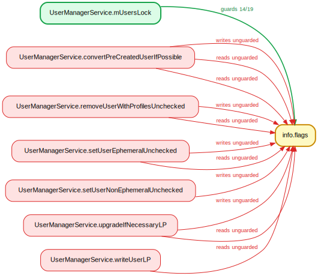

`setUserEphemeralUnchecked`/`setUserNonEphemeralUnchecked` mutate `userData.info.flags` *after* the `synchronized(mUsersLock)` block has closed (`UserManagerService.java:3651`/`3634`), holding only `mPackagesLock`; `convertPreCreatedUserIfPossible:6743` writes it with no `mUsersLock` at all. Concurrent readers take `mUsersLock` (e.g. `getUserInfo`→`LocalService.isUserInitialized`, `UserController.startProfiles:1900`) on binder/handler threads.

### 2. UsbPortManager.mTransactionId — lock-free ++ on a binder thread

`com.android.server.usb.UsbPortManager.mTransactionId` — guarded by `com.android.server.usb.UsbPortManager.mLock` (4/6 writes, 6 reads)

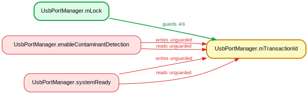

`enableContaminantDetection` does `++mTransactionId` with no lock (`UsbPortManager.java:365`) while `setPortRoles`/`resetUsbPort` increment under `synchronized(mLock)`. Two binder threads race the read-modify-write → lost updates / duplicate transaction IDs used to correlate async HAL callbacks.

### 3. NetworkPolicy.limitBytes stomped by factoryReset off-lock

`android.net.NetworkPolicy.limitBytes` — guarded by `com.android.server.net.NetworkPolicyManagerService.mNetworkPoliciesSecondLock` (5/6 writes, 9 reads)

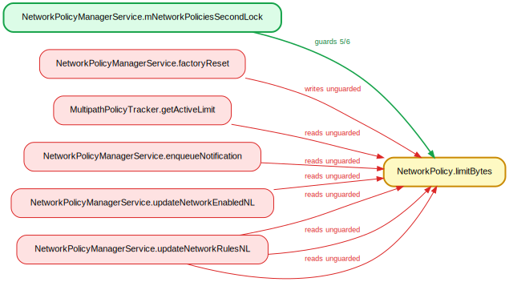

`factoryReset` (binder thread) writes `policy.limitBytes = LIMIT_DISABLED` (`NetworkPolicyManagerService.java:6460`) on the *live* policy objects — `getNetworkPolicies` returns `mNetworkPolicy.valueAt(i)` uncopied — while `updateNetworkRulesNL`/`updateNetworkEnabledNL`/`updateNotificationsNL` read it under `mNetworkPoliciesSecondLock` on the handler thread.

### 4. AccessibilityWindowManager.mActiveWindowId — unsynchronized lazy init

`com.android.server.accessibility.AccessibilityWindowManager.mActiveWindowId` — guarded by `com.android.server.accessibility.AccessibilityWindowManager.mLock` (3/4 writes, 10 reads)

`getActiveWindowId` does an unsynchronized read-check-then-write (`AccessibilityWindowManager.java:1758/1760/1762`), reached off the input/touch-explorer thread via `EventDispatcher.populateAccessibilityEvent`→`AMS.getActiveWindowId`, racing the `mLock`-guarded window-update writes on the a11y handler thread.

### 5. MyActivityController.mState — shell thread vs AMS binder callbacks

`com.android.server.am.ActivityManagerShellCommand$MyActivityController.mState` — guarded by `com.android.server.am.ActivityManagerShellCommand$MyActivityController` (2/3 writes, 3 reads)

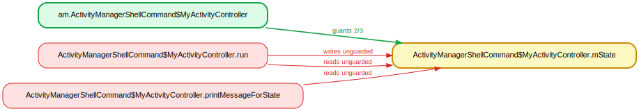

`run()` writes/reads `mState` with no lock (`ActivityManagerShellCommand.java:2415/2428`) on the shell-command thread, while the AMS binder thread delivers `appCrashed`/`appNotResponding` callbacks that set `mState` under `synchronized(this)` (via `waitControllerLocked`).

### 6. AudioService.mVibrateSetting — lock-free RMW on a public binder entry

`com.android.server.audio.AudioService.mVibrateSetting` — guarded by `com.android.server.audio.AudioService.mSettingsLock` (2/3 writes, 2 reads)

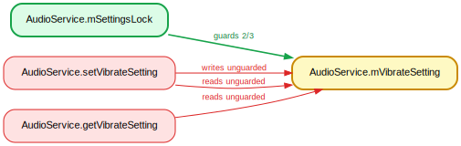

`setVibrateSetting` (`AudioService.java:6898`) and `getVibrateSetting` (`:6890`) read-modify-write the non-volatile int with no lock — public binder entries — while the init/reload writes hold `synchronized(mSettingsLock)`. Concurrent binder threads race (lost update). Deprecated API but a genuine race.

### 7. BtHelper.mScoAudioState — two disjoint locks

`com.android.server.audio.BtHelper.mScoAudioState` — guarded by `com.android.server.audio.BtHelper` (18/19 writes, 14 reads)

Written under two disjoint locks: `resetBluetoothSco` (`BtHelper.java:587`) holds `mDeviceBroker.mDeviceStateLock`, while ~18 other writers hold the `BtHelper` instance monitor (synchronized methods, e.g. `onScoAudioStateChanged`) on the BT broadcast thread.

### 8. UserBackupManagerService.mJournal — unsynchronized accessors

`com.android.server.backup.UserBackupManagerService.mJournal` — guarded by `com.android.server.backup.UserBackupManagerService.mQueueLock` (2/3 writes, 4 reads)

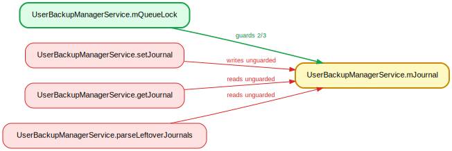

`mJournal` is a plain non-volatile field. The guarded writes run under `synchronized(mQueueLock)` (`:2333`/`2337`), but `getJournal()` (`:778`) is read at `BackupHandler.java:172` *outside* the `mQueueLock` block, and `parseLeftoverJournals` (`:1073`, posted at init) reads it lock-free — racing the binder-triggered `dataChanged` writes.

### 9. ShortcutPackage.mApiCallCount — mServiceLock vs mPackageItemLock

`com.android.server.pm.ShortcutPackage.mApiCallCount` — guarded by `com.android.server.pm.ShortcutService.mServiceLock` (5/6 writes, 5 reads)

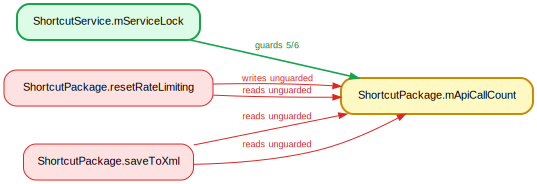

`resetRateLimiting`/`tryApiCall` write holding only `mServiceLock` (binder thread); `saveToXml:1761` reads holding only the per-item `mPackageItemLock` on the BackgroundThread save handler (`scheduleSave`→`injectPostToHandlerDebounced`). Disjoint locks, two threads.

### 10. HintManagerService$AppHintSession.mShouldForcePause — cleanup vs session lock

`com.android.server.power.hint.HintManagerService$AppHintSession.mShouldForcePause` — guarded by `com.android.server.power.hint.HintManagerService$AppHintSession` (2/3 writes, 5 reads)

`CleanUpHandler.cleanUpSession:1242` writes holding the service `mLock` (cleanup handler thread), but every in-class access holds `synchronized(this)` (session lock, binder threads). Disjoint locks, different threads.

### 11. PowerStatsService.mFinePowerMonitorStates — config thread vs binder

`com.android.server.powerstats.PowerStatsService.mFinePowerMonitorStates` — guarded by `com.android.server.powerstats.PowerStatsService` (2/3 writes, 1 reads)

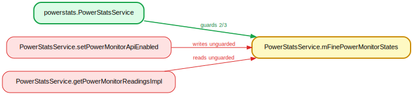

`setPowerMonitorApiEnabled` (via `refreshFlags`) writes on the DeviceConfig `OnPropertiesChangedListener` thread with no lock (`PowerStatsService.java:586`); `getPowerMonitorReadingsImpl` reads on a binder thread, unsynchronized (`:729`).

### 12. PowerStatsService.mPowerMonitorStates — config thread vs binder

`com.android.server.powerstats.PowerStatsService.mPowerMonitorStates` — guarded by `com.android.server.powerstats.PowerStatsService` (2/3 writes, 1 reads)

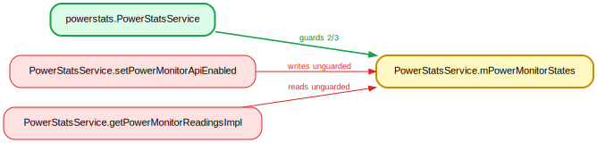

Same as the fine-states array: a config-listener-thread write (`:585`) vs an unlocked binder read (`:732`).

### 13. UriPermission.globalModeFlags — grantModes() runs off-lock

`com.android.server.uri.UriPermission.globalModeFlags` — guarded by `com.android.server.uri.UriGrantsManagerService.mLock` (2/3 writes, 6 reads)

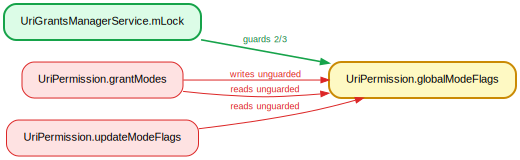

`grantModes()` runs *outside* `synchronized(mLock)` (`UriGrantsManagerService.java:982`, the block closes at `:981`) and does `globalModeFlags |= modeFlags` (`UriPermission.java:104`) on a perm that may be a pre-existing shared/escaped map entry — racing other-thread reads under `mLock`.

### 14. UriPermission.persistableModeFlags — grantModes() off-lock

`com.android.server.uri.UriPermission.persistableModeFlags` — guarded by `com.android.server.uri.UriGrantsManagerService.mLock` (3/4 writes, 9 reads)

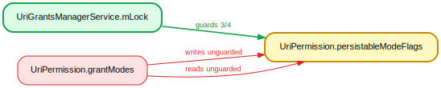

Same off-lock `grantModes` call (`UGMS:982`): `persistableModeFlags |= modeFlags` (`UriPermission.java:137`) races `takePersistableModes`/`revokeModes` under `mLock` on binder threads.

### 15. StorageManagerService.mPrimaryStorageUuid — read after the lock

`com.android.server.StorageManagerService.mPrimaryStorageUuid` — guarded by `com.android.server.StorageManagerService.mLock` (5/5 writes, 13 reads)

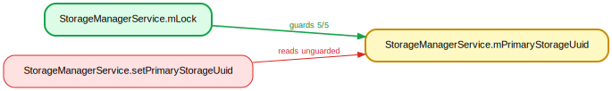

`setPrimaryStorageUuid:3113` reads `mPrimaryStorageUuid` *outside* `synchronized(mLock)` (the block closes at `:3107`); the field is written under `mLock` by concurrent `IStorageManager` binder threads (`onMoveStatusLocked:1929`).

### 16. AccessibilityWindowManager.mHasProxy — input thread fast-path

`com.android.server.accessibility.AccessibilityWindowManager.mHasProxy` — guarded by `com.android.server.accessibility.AccessibilityWindowManager.mLock` (2/2 writes, 5 reads)

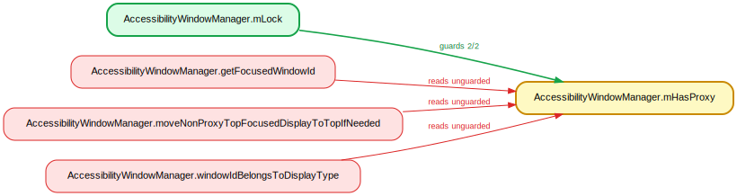

Non-volatile boolean written under `mLock` (binder threads), read with no lock on the input/gesture thread via the `AMS.getFocusedWindowId`/`windowIdBelongsToDisplayType`/`moveNonProxyTopFocusedDisplayToTopIfNeeded` fast-paths (`TouchState`→`AMS`).

### 17. AccessibilityWindowManager.mTouchInteractionInProgress — input thread read

`com.android.server.accessibility.AccessibilityWindowManager.mTouchInteractionInProgress` — guarded by `com.android.server.accessibility.AccessibilityWindowManager.mLock` (2/2 writes, 2 reads)

Non-volatile, written under `mLock`, read unlocked in the public `getActiveWindowId` (`:1758`) reached from the input thread via `EventDispatcher.populateAccessibilityEvent`.

### 18. ProcessProfileRecord.mThread — deliberate racy fast-path

`com.android.server.am.ProcessProfileRecord.mThread` — guarded by `com.android.server.am.AppProfiler.mProfilerLock` (3/3 writes, 2 reads)

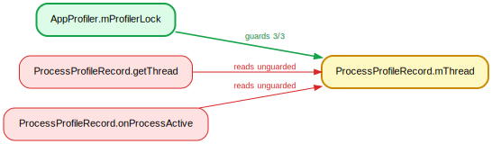

`onProcessActive` reads `mThread == null` at `L268` *outside* `synchronized(mProfilerLock)` (taken at `L269`); the field is `@GuardedBy(mProfilerLock)` and written under the lock (`298`/`303`/`329`) from other threads.

### 19. AudioService$VolumeStreamState.mIndexMin — lock-free getters

`com.android.server.audio.AudioService$VolumeStreamState.mIndexMin` — guarded by `com.android.server.audio.AudioService$VolumeStreamState` (5/5 writes, 12 reads)

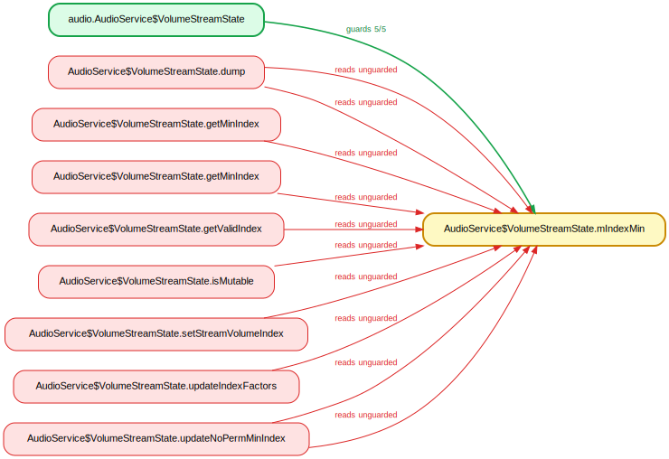

Lock-free getters `getMinIndex`/`getValidIndex`/`isMutable` (`AudioService.java:10544/10553/10769`) + a log read after the `sync(this)` block closes; written only under `sync(this)` in `updateIndexFactors`, reached from binder volume-adjust paths.

### 20. AudioService$VolumeStreamState.mIndexStepFactor — lock-free getter

`com.android.server.audio.AudioService$VolumeStreamState.mIndexStepFactor` — guarded by `com.android.server.audio.AudioService$VolumeStreamState` (4/4 writes, 2 reads)

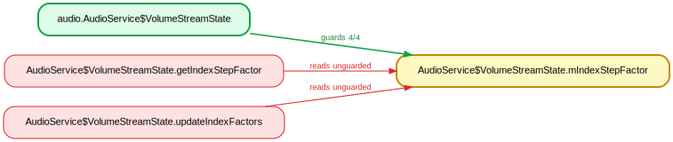

`getIndexStepFactor()` is lock-free (`10115`) and a read at `10091`/`10094` runs after the `sync(this)` block closes; the writer holds `sync(this)` in `updateIndexFactors` on the MSG_REINIT/serverDied thread.

### 21. AudioService.mUserSelectedVolumeControlStream — log read before the lock

`com.android.server.audio.AudioService.mUserSelectedVolumeControlStream` — guarded by `com.android.server.audio.AudioService.mForceControlStreamLock` (2/2 writes, 2 reads)

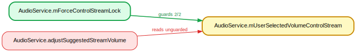

A DEBUG_VOL log read at `adjustSuggestedStreamVolume:4011` runs *before* the `synchronized(mForceControlStreamLock)` at `:4037`; the field is written under that lock (`5802`/`5810`/`5850`) on binder threads.

### 22. SoundDoseHelper.mSafeMediaVolumeState — lock-free getter on binder paths

`com.android.server.audio.SoundDoseHelper.mSafeMediaVolumeState` — guarded by `com.android.server.audio.SoundDoseHelper.mSafeMediaVolumeStateLock` (5/5 writes, 7 reads)

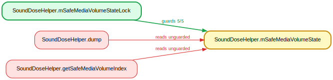

`getSafeMediaVolumeIndex:778` reads `mSafeMediaVolumeState` off-lock; called from `AudioService:4239,5700` (binder volume paths) while it is written under `mSafeMediaVolumeStateLock` (`1037-1047`).

### 23. autofill Session.mClientState — async-severed read

`com.android.server.autofill.Session.mClientState` — guarded by `com.android.server.infra.AbstractMasterSystemService.mLock` (2/2 writes, 10 reads)

`logSaveShown:4641` reads `mClientState` off-lock; it is dispatched async via `mHandler.sendMessage(obtainMessage(Session::logSaveShown, this))` (handler thread, no `mLock`), while the `@GuardedBy(mLock)` field is written on binder threads.

### 24. BiometricUserState.mInvalidationInProgress — AsyncTask read

`com.android.server.biometrics.sensors.BiometricUserState.mInvalidationInProgress` — guarded by `com.android.server.biometrics.sensors.BiometricUserState` (2/2 writes, 2 reads)

`doWriteStateInternal:97` reads the `@GuardedBy("this")` field off-lock; it runs via `AsyncTask.execute(mWriteStateRunnable)` (background thread), while the writers hold `synchronized(this)` (`130-131`).

### 25. FaceProvider.mHalInstanceNameCurrent — getVhal off-lock

`com.android.server.biometrics.sensors.face.aidl.FaceProvider.mHalInstanceNameCurrent` — guarded by `com.android.server.biometrics.sensors.face.aidl.FaceProvider` (3/3 writes, 6 reads)

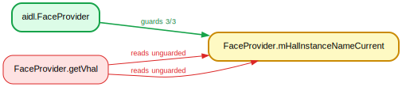

`getVhal:914/915` reads `mHalInstanceNameCurrent` unsynchronized, while the writer `getHalInstance()` is `synchronized(this)` (`296-329`); `getVhal` is a public/binder entry.

### 26. FingerprintProvider.mHalInstanceNameCurrent — getVhal off-lock

`com.android.server.biometrics.sensors.fingerprint.aidl.FingerprintProvider.mHalInstanceNameCurrent` — guarded by `com.android.server.biometrics.sensors.fingerprint.aidl.FingerprintProvider` (3/3 writes, 6 reads)

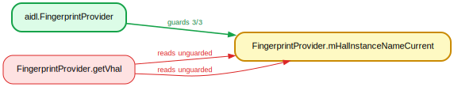

Identical to FaceProvider: `getVhal:1013/1014` reads off-lock while the writer `getHalInstance()` is synchronized.

### 27. ContextualSearchManagerService.mConfig — binder vs handler

`com.android.server.contextualsearch.ContextualSearchManagerService$ContextualSearchManagerStub.mConfig` — guarded by `com.android.server.contextualsearch.ContextualSearchManagerService$ContextualSearchManagerStub` (2/2 writes, 1 reads)

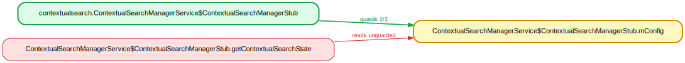

The binder `getContextualSearchState` reads `mConfig` (`:652`) with no `synchronized(this)`, while `invalidateToken`/`issueToken` write under `synchronized(this)` on the MSG_INVALIDATE_TOKEN main-looper Handler thread.

### 28. ContextualSearchManagerService.mToken — binder vs handler

`com.android.server.contextualsearch.ContextualSearchManagerService$ContextualSearchManagerStub.mToken` — guarded by `com.android.server.contextualsearch.ContextualSearchManagerService$ContextualSearchManagerStub` (2/2 writes, 2 reads)

Same method reads `mToken` (`:639`/`657`) unsynchronized; it is nulled by `invalidateToken` under `synchronized(this)` on the expiry Handler thread.

### 29. LightsService$LightImpl.mColor — two distinct monitors

`com.android.server.lights.LightsService$LightImpl.mColor` — guarded by `com.android.server.lights.LightsService$LightImpl` (2/2 writes, 5 reads)

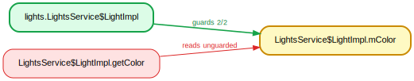

Written under `synchronized(this)` (the `LightImpl` monitor, `LightsService.java:392-400`); read under the *different* `synchronized(LightsService.this)` monitor (`getLightState:149`, `dump`) and lock-free from another component (`InputManagerService:2137`). Cross binder/input threads, two distinct monitors.

### 30. MediaSessionRecord.mPlaybackState — per-record lock vs service lock

`com.android.server.media.MediaSessionRecord.mPlaybackState` — guarded by `com.android.server.media.MediaSessionRecord.mLock` (2/2 writes, 7 reads)

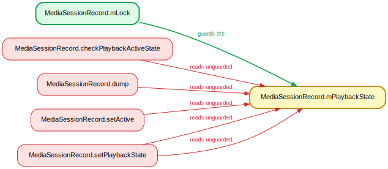

Writes hold the per-record `mLock` (`1468`/`1474`); `checkPlaybackActiveState()` (`547`) holds no monitor and is called cross-thread from `MediaSessionStack` (`260/334/402`) which holds the *different* `MediaSessionService.mLock`.

### 31. MediaSessionRecord.mVolumeType — per-record lock vs binder

`com.android.server.media.MediaSessionRecord.mVolumeType` — guarded by `com.android.server.media.MediaSessionRecord.mLock` (2/2 writes, 8 reads)

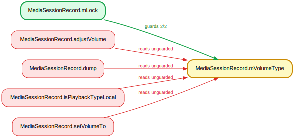

Writes hold `mLock` (`1525`/`1548`); `isPlaybackTypeLocal()`/`adjustVolume()`/`setVolumeTo()` read with no `mLock`, reached cross-thread from `MediaSessionStack`/binder.

### 32. MusicRecognitionManagerPerUserService.mRemoteService — executor read

`com.android.server.musicrecognition.MusicRecognitionManagerPerUserService.mRemoteService` — guarded by `com.android.server.infra.AbstractMasterSystemService.mLock` (2/2 writes, 5 reads)

`@GuardedBy(mLock)`; writes under `mLock` (`167`/`353`) on a binder thread, but the read at `276` runs in the streaming loop dispatched to `mMaster.mExecutorService` (async-severed thread) holding no lock.

### 33. OnDeviceIntelligenceManagerService.mRemoteInferenceService — unlocked getter

`com.android.server.ondeviceintelligence.OnDeviceIntelligenceManagerService.mRemoteInferenceService` — guarded by `com.android.server.ondeviceintelligence.OnDeviceIntelligenceManagerService.mLock` (3/3 writes, 3 reads)

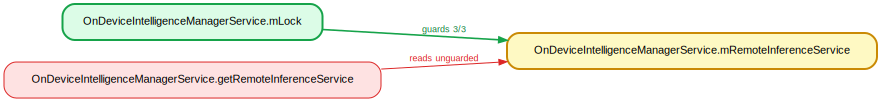

Set under `mLock` by binder threads (`:895`), but `getRemoteInferenceService` (`1349`) returns it unlocked; called from `InferenceServiceExecutor` on arbitrary executor threads.

### 34. OnDeviceIntelligenceManagerService.mRemoteOnDeviceIntelligenceService — unlocked getter

`com.android.server.ondeviceintelligence.OnDeviceIntelligenceManagerService.mRemoteOnDeviceIntelligenceService` — guarded by `com.android.server.ondeviceintelligence.OnDeviceIntelligenceManagerService.mLock` (3/3 writes, 4 reads)

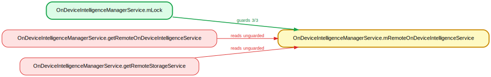

Same pattern: unlocked getters (`1354`, `getRemoteStorageService:1077`) read a field written under `mLock`, consumed off the executor thread.

### 35. PackageProperty.mActivityProperties — binder query vs install write

`com.android.server.pm.PackageProperty.mActivityProperties` — guarded by `com.android.server.pm.PackageManagerServiceInjector.mLock` (2/2 writes, 3 reads)

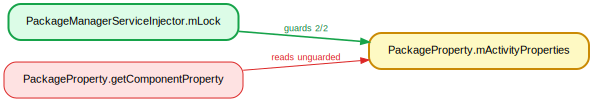

`mPackageProperty.queryProperty`→`getComponentProperty` (`260`) reads on a binder thread (`PMS:5747`, no `mLock`, snapshot only covers pkg-states) while the install-time writer holds `mLock`.

### 36. PackageProperty.mApplicationProperties — binder query vs install write

`com.android.server.pm.PackageProperty.mApplicationProperties` — guarded by `com.android.server.pm.PackageManagerServiceInjector.mLock` (2/2 writes, 4 reads)

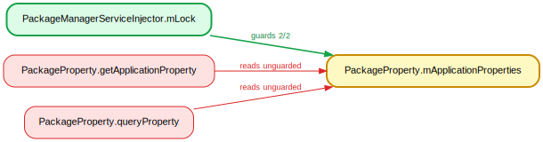

Binder-thread `queryProperty`/`getApplicationProperty` (`81`/`277`) vs `addAllProperties` reassignment under `mLock`.

### 37. PackageProperty.mProviderProperties — binder query vs install write

`com.android.server.pm.PackageProperty.mProviderProperties` — guarded by `com.android.server.pm.PackageManagerServiceInjector.mLock` (2/2 writes, 3 reads)

Same binder-vs-install race (`getComponentProperty:263`).

### 38. PackageProperty.mReceiverProperties — binder query vs install write

`com.android.server.pm.PackageProperty.mReceiverProperties` — guarded by `com.android.server.pm.PackageManagerServiceInjector.mLock` (2/2 writes, 3 reads)

Same (`getComponentProperty:266`).

### 39. PackageProperty.mServiceProperties — binder query vs install write

`com.android.server.pm.PackageProperty.mServiceProperties` — guarded by `com.android.server.pm.PackageManagerServiceInjector.mLock` (2/2 writes, 3 reads)

Same (`getComponentProperty:269`).

### 40. HintManagerService$ChannelItem.mConfig — binder getter vs death recipient

`com.android.server.power.hint.HintManagerService$ChannelItem.mConfig` — guarded by `com.android.server.power.hint.HintManagerService.mChannelMapLock` (2/2 writes, 3 reads)

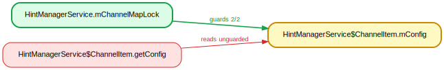

`getConfig()` reads `mConfig` lock-free in the binder `getSessionChannel` (`HintManagerService.java:1532/1537`, lock released after `getOrCreateMappedChannelItem`); the `DeathRecipient`/`removeChannelItem` writes `mConfig=null` under `mChannelMapLock` on another binder thread.

### 41. BatteryHistoryStepDetailsProvider.mCurStepCpuSystemTimeMs — two monitors

`com.android.server.power.stats.BatteryHistoryStepDetailsProvider.mCurStepCpuSystemTimeMs` — guarded by `com.android.server.power.stats.BatteryStatsImpl` (2/2 writes, 3 reads)

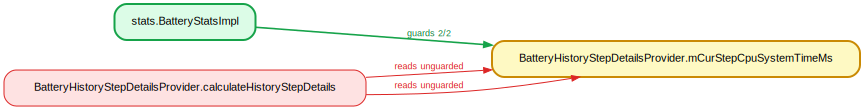

Writer `addCpuStats` holds the `BatteryStatsImpl` `this` monitor (external-stats worker thread); reader `calculateHistoryStepDetails` holds the *distinct* `mClock` monitor (`mHandler` thread). Two different lock identities, both visible in bytecode.

### 42. BatteryHistoryStepDetailsProvider.mCurStepCpuUserTimeMs — two monitors

`com.android.server.power.stats.BatteryHistoryStepDetailsProvider.mCurStepCpuUserTimeMs` — guarded by `com.android.server.power.stats.BatteryStatsImpl` (2/2 writes, 3 reads)

Same `this`(worker) vs `mClock`(handler) distinct-monitor race as the sibling CPU-time fields.

### 43. BatteryHistoryStepDetailsProvider.mCurStepStatIOWaitTimeMs — two monitors

`com.android.server.power.stats.BatteryHistoryStepDetailsProvider.mCurStepStatIOWaitTimeMs` — guarded by `com.android.server.power.stats.BatteryStatsImpl` (2/2 writes, 3 reads)

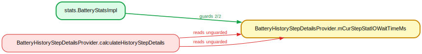

Same distinct-monitor race (`BatteryStatsImpl.this` worker vs `mClock` handler).

### 44. BatteryHistoryStepDetailsProvider.mCurStepStatIdleTimeMs — two monitors

`com.android.server.power.stats.BatteryHistoryStepDetailsProvider.mCurStepStatIdleTimeMs` — guarded by `com.android.server.power.stats.BatteryStatsImpl` (2/2 writes, 3 reads)

Same distinct-monitor race.

### 45. BatteryHistoryStepDetailsProvider.mCurStepStatIrqTimeMs — two monitors

`com.android.server.power.stats.BatteryHistoryStepDetailsProvider.mCurStepStatIrqTimeMs` — guarded by `com.android.server.power.stats.BatteryStatsImpl` (2/2 writes, 3 reads)

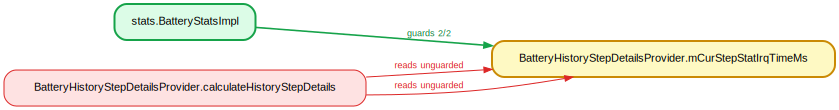

Same distinct-monitor race.

### 46. BatteryHistoryStepDetailsProvider.mCurStepStatSoftIrqTimeMs — two monitors

`com.android.server.power.stats.BatteryHistoryStepDetailsProvider.mCurStepStatSoftIrqTimeMs` — guarded by `com.android.server.power.stats.BatteryStatsImpl` (2/2 writes, 3 reads)

Same distinct-monitor race.

### 47. BatteryHistoryStepDetailsProvider.mCurStepStatSystemTimeMs — two monitors

`com.android.server.power.stats.BatteryHistoryStepDetailsProvider.mCurStepStatSystemTimeMs` — guarded by `com.android.server.power.stats.BatteryStatsImpl` (2/2 writes, 3 reads)

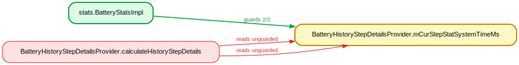

Same distinct-monitor race.

### 48. BatteryHistoryStepDetailsProvider.mCurStepStatUserTimeMs — two monitors

`com.android.server.power.stats.BatteryHistoryStepDetailsProvider.mCurStepStatUserTimeMs` — guarded by `com.android.server.power.stats.BatteryStatsImpl` (2/2 writes, 3 reads)

Same distinct-monitor race.

### 49. ThermalManagerService.mHalWrapper — HAL-death reassign vs statsd/dump

`com.android.server.power.thermal.ThermalManagerService.mHalWrapper` — guarded by `com.android.server.power.thermal.ThermalManagerService.mLock` (4/4 writes, 6 reads)

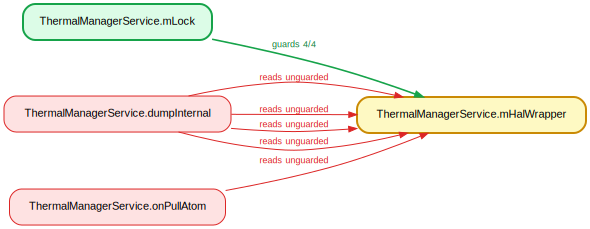

Non-volatile field reassigned under `mLock` on the HAL-reconnect/death thread (`:253-270`); read lock-free in `onPullAtom` (statsd-pull thread, `:544`) and `dumpInternal` (dumpsys thread, outside the `synchronized(mLock)` block closed at `:909`).

### 50. UserState.mPrintServiceRecommendations — handler write vs binder getter

`com.android.server.print.UserState.mPrintServiceRecommendations` — guarded by `com.android.server.print.PrintManagerService$PrintManagerImpl.mLock` (2/2 writes, 1 reads)

Non-volatile reference written under `mLock` on the handler thread (`handleDispatchPrintServiceRecommendationsUpdated:1192`); read lock-free by the getter (`:457`) from a binder thread after the lock is released.

### 51. RotationResolverShellCommand.mLastCallbackResultCode — escaped singleton

`com.android.server.rotationresolver.RotationResolverShellCommand$TestableRotationCallbackInternal.mLastCallbackResultCode` — guarded by `com.android.server.infra.AbstractMasterSystemService.mLock` (2/2 writes, 1 reads)

A static singleton escapes; written unguarded in `onSuccess`/`onFailure` on the callback thread (`:45`/`50`), read unguarded in `getLastCallbackCode` on the shell thread (`:58`). The reported `AbstractMasterSystemService.mLock` never touches this field.

### 52. PinnedSliceState.mSupportedSpecs — binder getter off-lock

`com.android.server.slice.PinnedSliceState.mSupportedSpecs` — guarded by `com.android.server.slice.SliceManagerService.mLock` (2/2 writes, 2 reads)

`getPinnedSpecs` (binder thread, `SliceManagerService:208`→`getSpecs`) holds no lock; the writes go under the injected `mLock` in `mergeSpecs`/`pin`.

### 53. StatsPullAtomService.mProcessStatsService — return after the lock

`com.android.server.stats.pull.StatsPullAtomService.mProcessStatsService` — guarded by `com.android.server.stats.pull.StatsPullAtomService.mProcStatsLock` (2/2 writes, 3 reads)

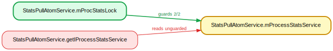

`getIProcessStatsService` returns the field (`L1310`) *after* exiting `synchronized(mProcStatsLock)`; `linkToDeath` nulls it on a binder thread (`L1301`).

### 54. StatsPullAtomService.mStorageService — return after the lock

`com.android.server.stats.pull.StatsPullAtomService.mStorageService` — guarded by `com.android.server.stats.pull.StatsPullAtomService.mStoragedLock` (2/2 writes, 3 reads)

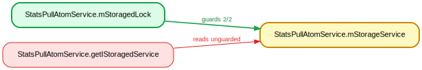

Return at `L1243` outside `synchronized(mStoragedLock)`; `linkToDeath` null-write on a binder thread (`L1234`).

### 55. StatsPullAtomService.mVoldService — return after the lock

`com.android.server.stats.pull.StatsPullAtomService.mVoldService` — guarded by `com.android.server.stats.pull.StatsPullAtomService.mVoldLock` (2/2 writes, 3 reads)

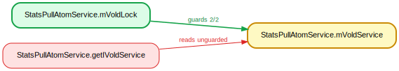

Return at `L1266` outside `synchronized(mVoldLock)`; `linkToDeath` null-write (`L1257`).

### 56. UriPermission.ownedModeFlags — grantModes() off-lock

`com.android.server.uri.UriPermission.ownedModeFlags` — guarded by `com.android.server.uri.UriPermission` (6/6 writes, 9 reads)

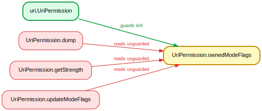

`grantModes` runs without `mLock` (`UGMS:982`, after the block closes) and `updateModeFlags` reads `ownedModeFlags` (`104`), racing owner-set mutations under `synchronized(this)` on another thread.

### 57. UriPermission.persistedModeFlags — grantModes() off-lock

`com.android.server.uri.UriPermission.persistedModeFlags` — guarded by `com.android.server.uri.UriGrantsManagerService.mLock` (5/5 writes, 17 reads)

Same `mLock`-escaping `grantModes` path; `updateModeFlags` reads `persistedModeFlags`, racing `takePersistableModes`/`revokeModes` under `mLock` on binder threads.

### 58. UsbPortManager$PortInfo.mUsbPortStatus — binder read off-lock

`com.android.server.usb.UsbPortManager$PortInfo.mUsbPortStatus` — guarded by `com.android.server.usb.UsbPortManager.mLock` (3/3 writes, 44 reads)

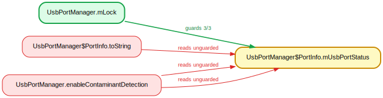

The public `enableContaminantDetection` reads `portInfo.mUsbPortStatus` unguarded (`:355`/`357`), straight from a `UsbService` binder method (`:1052`, no `mLock`); written under `mLock` on the USB handler thread.

### 59. VoiceInteraction SoundTriggerSession.mSessionInternalCallback — read after the lock

`com.android.server.voiceinteraction.VoiceInteractionManagerService$VoiceInteractionManagerServiceStub$SoundTriggerSession.mSessionInternalCallback` — guarded by `com.android.server.voiceinteraction.VoiceInteractionManagerService$VoiceInteractionManagerServiceStub$SoundTriggerSession.this$1` (2/2 writes, 3 reads)

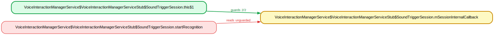

The read at `:1939` (the `mSession.startRecognition` argument) is *outside* the `synchronized(Stub.this)` block that closed at `:1937`; it is nulled by `stopRecognition` under the lock on another binder thread (`:1963`).

### 60. WallpaperData.mPendingStaticDescription — FileObserver thread

`com.android.server.wallpaper.WallpaperData.mPendingStaticDescription` — guarded by `com.android.server.wallpaper.WallpaperManagerService.mLock` (3/3 writes, 2 reads)

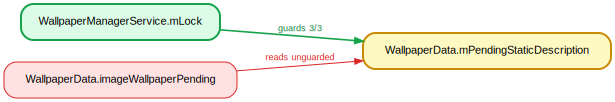

`imageWallpaperPending` (`:59`) is called from `updateWallpapers` (`WMS:284`) on the FileObserver/inotify thread with no `mLock`; the field is written under `mLock` on binder threads.

### 61. WearableSensingManagerPerUserService.mRemoteService — check outside the lock

`com.android.server.wearable.WearableSensingManagerPerUserService.mRemoteService` — guarded by `com.android.server.infra.AbstractMasterSystemService.mLock` (2/2 writes, 6 reads)

`destroyLocked` reads `mRemoteService != null` (`:132`) *outside* the `synchronized(mLock)` that opens at `:133`; the writes (`:135`, `ensureRemoteServiceInitiated:148`) are under `mLock` and reachable from binder threads / `onBinderDied`. A check-then-act read across threads.
