# Findings — inconsistently-guarded fields in `system_server` (audited)

`lockdex races` flagged **614** fields on a build's `services.jar`. To decide
whether the analysis is trustworthy, the **top 100** (ranked by write-side
violations) were each audited against AOSP source — locating the field, reading
every flagged access, and checking whether the lock is genuinely absent or only
*appears* absent to the tool. Each verdict below cites `File.java:line` evidence.

## Bottom line

| Verdict | Count | Meaning |
|---|---|---|
| **REAL** | 7 | A genuine unguarded access to shared state on a reachable path. |
| benign read | 2 | Truly lock-free, but a diagnostic/`toString` read of an `int` — not corruption-prone. |
| **CONVENTION** | 62 | The access is inside a `*Locked` method (or writes a fresh, not-yet-published object); the lock *is* held by contract — a false positive from call-graph/escape imprecision. |
| **IDENTITY** | 27 | The access holds the *same* lock under a different name (a `synchronized` method's receiver, a `ReentrantLock`, a lock passed across classes, or reached via `getLockObject()`); the tool split one lock into two. |
| UNCLEAR | 2 | A spurious inferred guard on an effectively-immutable field. |

**So roughly 7% of the top 100 are real.** The field-race analysis as it stands is
**not trustworthy** — it is a ranked worklist with a ~90% false-positive rate. The
errors are not random; they cluster into a few fixable blind spots:

1. **No escape analysis.** The single biggest cause: writes to freshly-`new`'d,
   not-yet-published objects during construction/parse are flagged as shared-state
   races (e.g. #18–#25, #59–#64, #89–#90). These can never race.
2. **The `*Locked` convention.** AOSP's `fooLocked()` means *the caller* holds the
   lock; lockdex can't prove every caller does, so it flags the write (#1–#3, #42–#46,
   #74–#78, #94–#100).
3. **Lock-identity gaps.** A `synchronized` *method* (receiver lock, #71–#72), a
   `ReentrantLock.lock()` instead of `synchronized` (#10, #85), the same lock passed
   by reference into another class (#41, #83–#88), or reached via an accessor like
   `getLockObject()` (#93–#98) — each is one lock the tool sees as two.
4. **Held-set dropped** across nested `synchronized` blocks or call depth (#27, #47,
   #48, #80, #82) — the lock is lexically held at the access but the dataflow lost it.
5. **Wrong dominant guard** inferred (#7, #17, #45, #91–#92) — the field is uniformly
   guarded, just by a different lock than the tool named.

**Recommendation:** keep the engine (the held-set + interprocedural machinery is
sound and shared with the deadlock/binder analyses, which are solid), but mark
`races` **experimental** — or pull it from the default surface — until at least
escape analysis (#1) and `synchronized`-method / `ReentrantLock` identity (#3) land.
Those two alone would remove the majority of the false positives above.

The seven that survived scrutiny are the genuine value, listed first; all 100 follow
with diagrams and per-finding verdicts.

## The real candidates

- **#13 `NotificationRecord.isCanceled`** — written under `mNotificationLock` in NMS,
  but `SnoozeHelper.cancel` writes it under SnoozeHelper's *own* lock and `repost`
  reads it unlocked; the same record flows between components.
- **#16 `ProfilerInfo.profileFd`** — guarded by `mProfilerLock` in AppProfiler, but the
  same object is handed to ATM and its `profileFd` is dup/closed under `mGlobalLock`.
- **#28 `NetworkPolicy.limitBytes`** — `factoryReset` mutates shared policy objects with
  no lock while a handler thread reads `limitBytes` lock-free.
- **#37 `StorageManagerService.mPrimaryStorageUuid`** — read once *after* the
  `synchronized(mLock)` block closes (a narrow real window).
- **#55 `ReceiverList.linkedToDeath`** — cleared in a binder `binderDied` callback with
  no lock, racing the `mService`-guarded register/unregister.
- **#69 `AudioService.mVibrateSetting`** — the binder `setVibrateSetting`/`getVibrateSetting`
  entry points touch it with no lock (deprecated API, low severity).
- **#81 `UserBackupManagerService.mJournal`** — written under `mQueueLock`, but read via a
  plain accessor outside the lock and on the async backup thread.

---

## All 100, audited

### 1. `BatteryStatsImpl.mDischargeScreenDozeUnplugLevel` — guarded by `BatteryStatsImpl` (6/9)

**Verdict: CONVENTION.** Both violating methods are `@GuardedBy("this")`: `updateNewDischargeScreenLevelLocked` (`BatteryStatsImpl.java:11721`) and `updateOldDischargeScreenLevelLocked` (`:11698`); their callers go through `@GuardedBy("this")` `*Locked` methods. Guard is `this` — held by contract.

### 2. `BatteryStatsImpl.mDischargeScreenOffUnplugLevel` — guarded by `BatteryStatsImpl` (6/9)
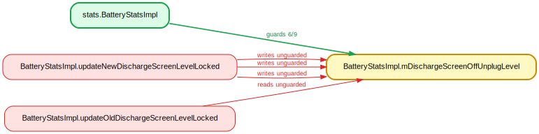
**Verdict: CONVENTION.** Same as #1: writes in `updateNewDischargeScreenLevelLocked` (`:11725/11730/11734`), read in `updateOldDischargeScreenLevelLocked` (`:11713`), both `@GuardedBy("this")`.

### 3. `BatteryStatsImpl.mDischargeScreenOnUnplugLevel` — guarded by `BatteryStatsImpl` (6/9)
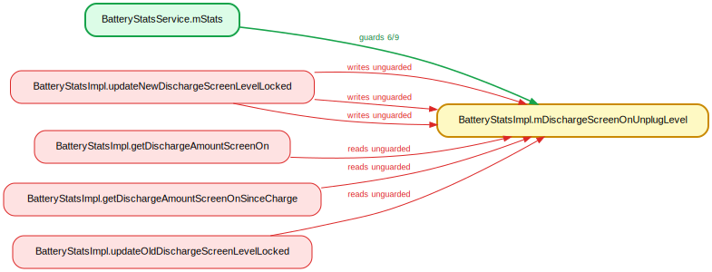
**Verdict: CONVENTION.** Same `*Locked`-convention pattern (`:11724/11728/11732`, read `:11701`); guard is the instance, held via the `@GuardedBy("this")` callers.

### 4. `WallpaperData.mWhich` — guarded by `WallpaperManagerService.mLock` (7/10)

**Verdict: CONVENTION.** The flagged writes are on freshly-constructed, not-yet-published `WallpaperData` locals during init (`WallpaperDataParser.java:207/214`, `WallpaperManagerService.java:4082`); `mWhich` is set-once. No concurrent shared mutation.

### 5. `DeviceIdleController.mForceIdle` — guarded by `DeviceIdleController` (4/6)
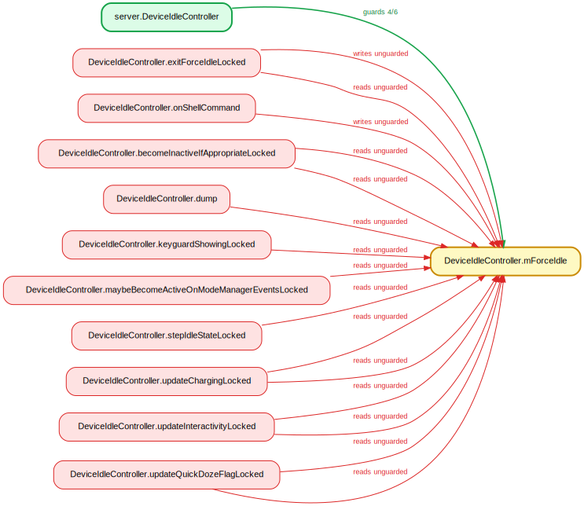
**Verdict: IDENTITY.** `@GuardedBy("this")` (`:359`); the flagged write in `onShellCommand` (`:4776`) is inside `synchronized (this)` (`:4767`) — the exact guard. lockdex missed `synchronized(this)` == the guard.

### 6. `BroadcastQueueImpl.mRunningColdStart` — guarded by `BroadcastQueue.mService` (5/7)
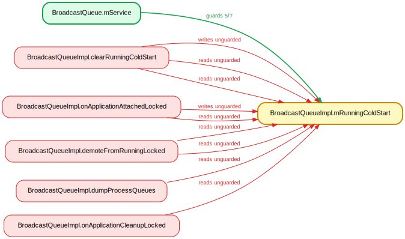
**Verdict: CONVENTION.** `@GuardedBy("mService")` (`:202`); every flagged method (`clearRunningColdStart`, `onApplicationAttachedLocked`, …) is `@GuardedBy("mService")`, callers hold it.

### 7. `OomAdjuster.mOomAdjUpdateOngoing` — guarded by `ActivityManagerService.mProcLock` (6/9)
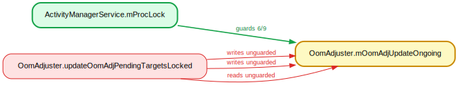
**Verdict: CONVENTION.** Field is actually `@GuardedBy("mService")` (`:349`); the dominant write paths hold both `mService`+`mProcLock`, so lockdex inferred `mProcLock`. The violation holds the real guard `mService`, just not `mProcLock`. Guard-misinference FP.

### 8. `AppWidgetServiceImpl$Host.callbacks` — guarded by `AppWidgetServiceImpl.mLock` (7/9)
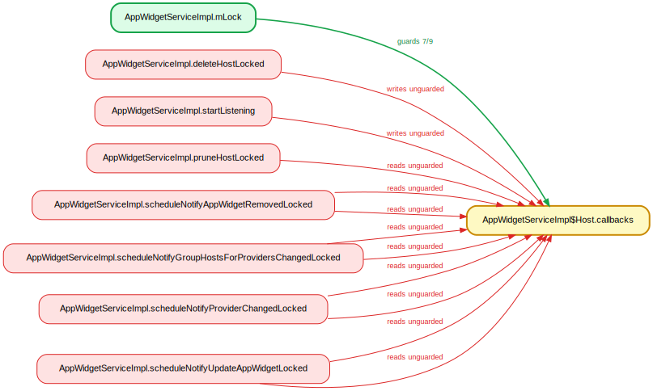
**Verdict: CONVENTION.** Write in `startListening` (`:1295`) is inside `synchronized (mLock)` (`:1282`); `deleteHostLocked` callers hold `mLock` (`:1962`); other reads are `*Locked`.

### 9. `BackupAgentConnectionManager.mCurrentConnection` — guarded by `mAgentConnectLock` (4/6)
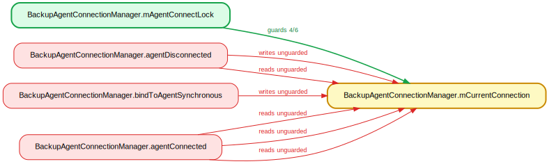
**Verdict: IDENTITY.** `@GuardedBy("mAgentConnectLock")` (`:76`); every flagged access is inside an explicit `synchronized (mAgentConnectLock)` block (`:134/282/255`). lockdex failed to attribute the surrounding block.

### 10. `SecurityLogMonitor.mAllowedToRetrieve` — guarded by `SecurityLogMonitor.mLock` (4/6)
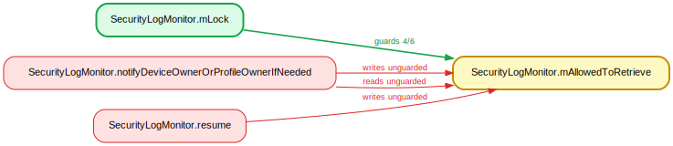
**Verdict: IDENTITY.** `mLock` is a `ReentrantLock` (`:63`), not a monitor. The flagged accesses sit between `mLock.lock()`/`lockInterruptibly()` and `unlock()` (`:291–300`, `:573–598`). lockdex doesn't model explicit `Lock.lock()` acquisitions.

### 11. `VoteSummary.height` — guarded by `mLock` (4/6)

**Verdict: CONVENTION.** `SizeVote.updateSummary` (`SizeVote.java:60/65`) writes a method-local `VoteSummary` reached only via `applyVotes` under `synchronized (mLock)` (`DisplayModeDirector.java:295`). The object is lock-confined and never escapes.

### 12. `VoteSummary.width` — guarded by `mLock` (4/6)
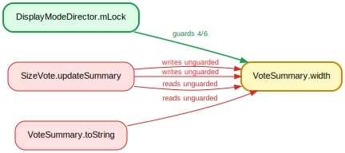
**Verdict: CONVENTION.** Identical to #11 — a lock-local transient written under `mLock`; the `toString` read is logging-only inside the locked region.

### 13. `NotificationRecord.isCanceled` — guarded by `mNotificationLock` (4/6)
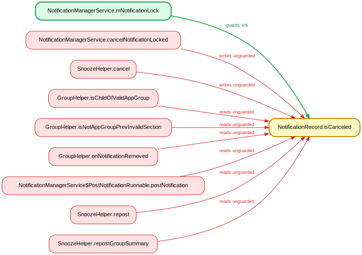
**Verdict: REAL.** NMS guards it with `mNotificationLock` (`NotificationManagerService.java:11324/10406`), but `SnoozeHelper.cancel` writes `isCanceled=true` under SnoozeHelper's *own* `mLock` (`SnoozeHelper.java:252`) and `repost` reads it unlocked (`:335`). The same record flows across components — a genuine race.

### 14. `PackageSetting.mimeGroups` — guarded by `mLock` (4/6)
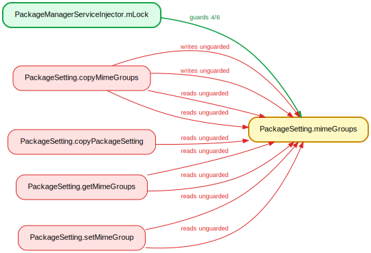
**Verdict: CONVENTION.** `setMimeGroup` runs inside `commitPackageStateMutation`'s `synchronized (mPackageStateWriteLock)` (`PackageManagerService.java:8125`), and `mPackageStateWriteLock == mLock` (`:1865`). The classic PMS-lock contract.

### 15. `BatteryStatsImpl.mDischargeCurrentLevel` — guarded by `BatteryStatsImpl` (4/6)
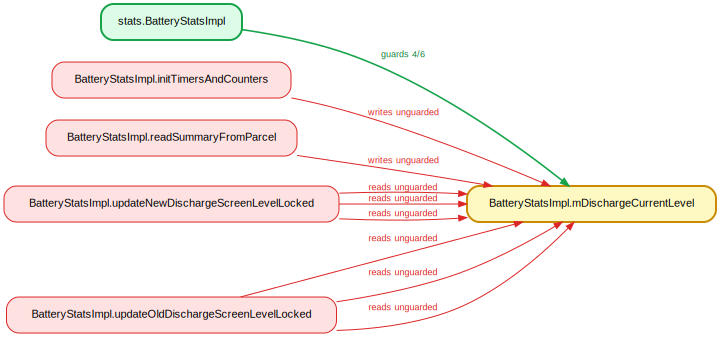
**Verdict: CONVENTION.** Guard is `this`. One write is constructor-only (`:10979`, pre-publication); the rest are `@GuardedBy("this")` `*Locked` methods (`:15079`, `updateOld/NewDischargeScreenLevelLocked`).

### 16. `ProfilerInfo.profileFd` — guarded by `mProfilerLock` (4/5)
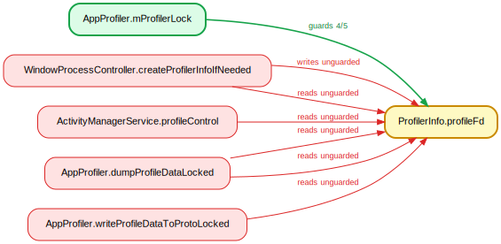
**Verdict: REAL.** AppProfiler stores/reads it under `mProfilerLock` (`AppProfiler.java:327`), but pushes the *same* object to ATM (`setProfilerInfo`, `:379`) where `WindowProcessController.createProfilerInfoIfNeeded` dup/closes `profileFd` under `mGlobalLock` (`WindowProcessController.java:1520`). Two subsystems, two locks, one object.

### 17. `SyncStatusInfo.pending` — guarded by `mSyncManagerLock` (3/4)
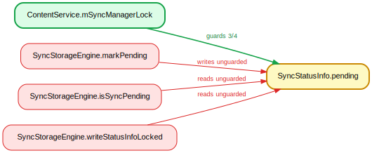
**Verdict: IDENTITY.** Consistently guarded — but by `SyncStorageEngine.mAuthorities` (`markPending`/`isSyncPending` under `synchronized(mAuthorities)`, `SyncStorageEngine.java:1093/1483`), not the named `ContentService.mSyncManagerLock`. Wrong lock object.

### 18. `ActivityInfo.enabled` — guarded by `mLock` (3/4)
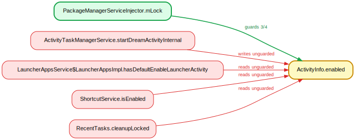
**Verdict: CONVENTION.** The write `a.enabled=true` (`ActivityTaskManagerService.java:1535`) targets a brand-new local `ActivityInfo` (`:1531`) for a synthetic Dream activity — unpublished, thread-confined. Object-identity insensitivity FP.

### 19. `ActivityInfo.taskAffinity` — guarded by `mGlobalLock` (2/3)
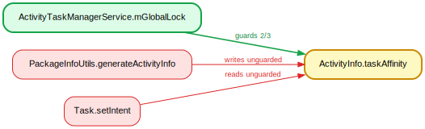
**Verdict: CONVENTION.** Write on a freshly-allocated `ActivityInfo` (`PackageInfoUtils.java:566/574`, "shallow copies so we can store the metadata safely"); the published reader is parse-immutable under `mGlobalLock`.

### 20. `PackageInstaller$SessionParams.appIcon` — guarded by `mSessions` (3/4)
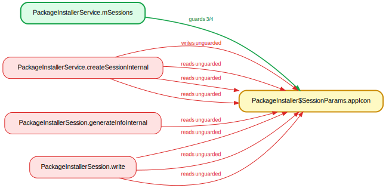
**Verdict: CONVENTION.** `createSessionInternal` resizes the icon on the per-call `params` *before* `synchronized (mSessions)` is taken (`PackageInstallerService.java:1011-1017`); other reads use the session's own `mLock`. Thread-local object + misattributed guard.

### 21. `SessionParams.appIconLastModified` — guarded by `mSessions` (2/3)
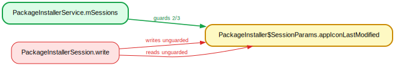
**Verdict: CONVENTION.** The accesses are in `PackageInstallerSession.write()` under the session's own `synchronized (mLock)` (`PackageInstallerSession.java:6816`), not `mSessions` (which guards only the session *collection*). Guard misattribution.

### 22. `SessionParams.appLabel` — guarded by `mSessions` (2/3)
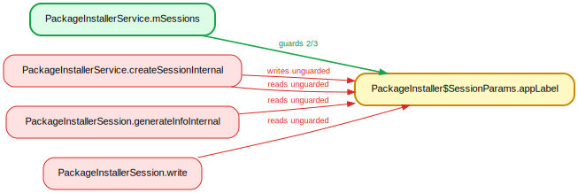
**Verdict: CONVENTION.** Real guard is the session `mLock`; the `createSessionInternal` write (`PackageInstallerService.java:786`) is ~300 lines before publication into `mSessions` (`:1088`) — thread-local. No reachable unguarded race against the named guard.

### 23. `PermissionGroupInfo.metaData` — guarded by `stateLock` (2/3)

**Verdict: CONVENTION.** `metaData=null` (`PermissionService.kt:233`) is inside a brand-new defensive copy `PermissionGroupInfo(this).apply{…}` per call — thread-local, never published.

### 24. `PermissionInfo.packageName` — guarded by `stateLock` (3/4)
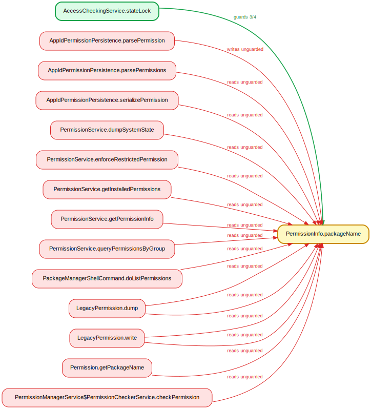
**Verdict: CONVENTION.** Write on a freshly-built `PermissionInfo().apply{…}` during XML parse (`AppIdPermissionPersistence.kt:98`), pre-publication; readers see an effectively-immutable field. (Several "line 37" reads are import-region line-table noise.)

### 25. `ResolveInfo.preferredOrder` — guarded by `mLock` (3/4)
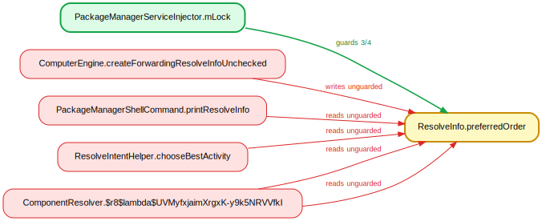
**Verdict: CONVENTION.** `forwardingResolveInfo.preferredOrder=0` (`ComputerEngine.java:1811`) targets a `new ResolveInfo()` local (`:1786`) returned to the caller — unpublished. Per-query objects, not `mLock`-guarded shared state.

### 26. `UserInfo.profileBadge` — guarded by `mUsersLock` (2/3)
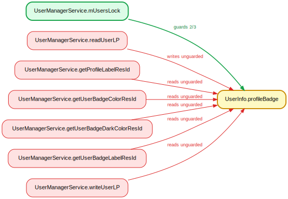
**Verdict: benign read.** The write is pre-publication in `readUserLP`; but `getUserBadgeLabelResId` reads `userInfo.profileBadge` *after* releasing `mUsersLock` (`UserManagerService.java:2758`). Effectively write-once at parse, so a real-but-benign late read.

### 27. `UserInfo.userType` — guarded by `mUsersLock` (4/5)
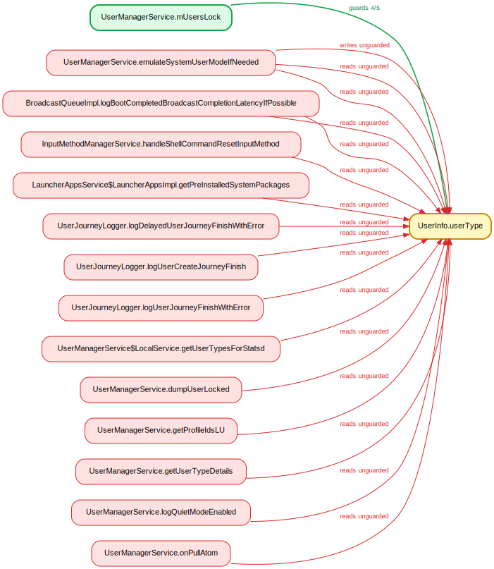
**Verdict: IDENTITY.** The write (`UserManagerService.java:4995`) is executed while `mUsersLock` is held — `emulateSystemUserModeIfNeeded` enters `synchronized(mPackagesLock)` then `synchronized(mUsersLock)` (`:4966-4967`). Held-set lost across nested blocks.

### 28. `NetworkPolicy.limitBytes` — guarded by `mNetworkPoliciesSecondLock` (5/6)
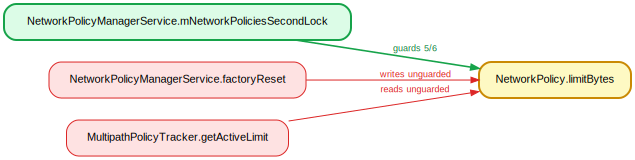
**Verdict: REAL.** `factoryReset` mutates `policy.limitBytes` with no lock (`NetworkPolicyManagerService.java:6460`) on the *same* live references `getNetworkPolicies` exposes (`:3324`), while `MultipathPolicyTracker.getActiveLimit` reads it lock-free on the handler thread (`:443`). A genuine race.

### 29. `BatteryStats$PackageChange.mPackageName` — guarded by `BatteryStatsImpl` (4/5)

**Verdict: CONVENTION.** Write on a `new PackageChange()` local (`BatteryStatsImpl.java:15104/15105`) inside `@GuardedBy("this") readSummaryFromParcel` (`:15055`) — thread-local target *and* lock held.

### 30. `BatteryStats$PackageChange.mUpdate` — guarded by `BatteryStatsImpl` (4/5)
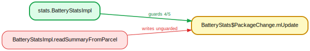
**Verdict: CONVENTION.** Identical to #29 — fresh `PackageChange` written in the `@GuardedBy("this")` parcel reader.

### 31. `PackageChange.mVersionCode` — guarded by `BatteryStatsImpl` (2/3)
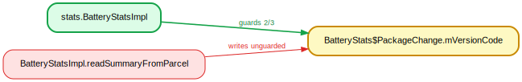
**Verdict: IDENTITY.** Write on a freshly-allocated `PackageChange` local (`BatteryStatsImpl.java:15107`) inside `@GuardedBy("this") readSummaryFromParcel` (`:15056`) — holds the guard *and* targets thread-local state.

### 32. `DisplayInfo.modeId` — guarded by `DisplayManagerService.mSyncRoot` (2/3)
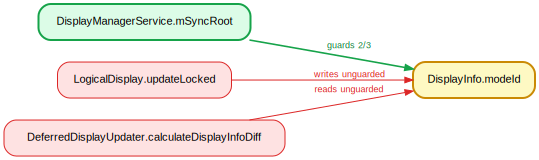
**Verdict: CONVENTION.** `DisplayInfo` is a POJO with many instances collapsed to one field key. The write (`LogicalDisplay.java:565`) is in `updateLocked` under `synchronized(mSyncRoot)`; the read is a separate WM snapshot. Per-instance modeling would clear it.

### 33. `DisplayInfo.type` — guarded by `ActivityTaskManagerService.mGlobalLock` (3/4)
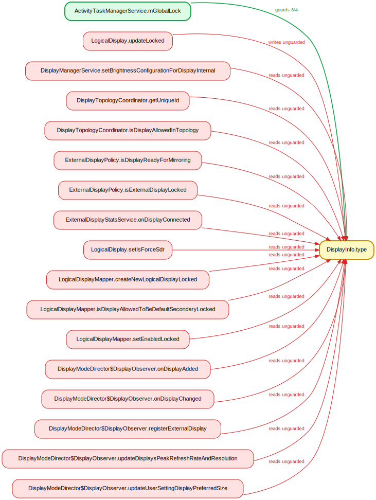
**Verdict: CONVENTION.** Cross-instance field-key collision: the inferred `mGlobalLock` is WM's copy, but the display-package accesses use LogicalDisplay's `mBaseDisplayInfo` under `mSyncRoot`.

### 34. `VpnConfig.user` — guarded by `Vpn` (2/3)
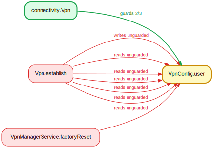
**Verdict: IDENTITY.** `Vpn.establish` is `public synchronized` (`Vpn.java:1773`), so all accesses hold the `Vpn` monitor (the guard); the cross-class read is on a defensive copy `new VpnConfig(mConfig)` (`:2211`).

### 35. `DeviceIdleController.mCharging` — guarded by `DeviceIdleController$1.this$0` (2/3)
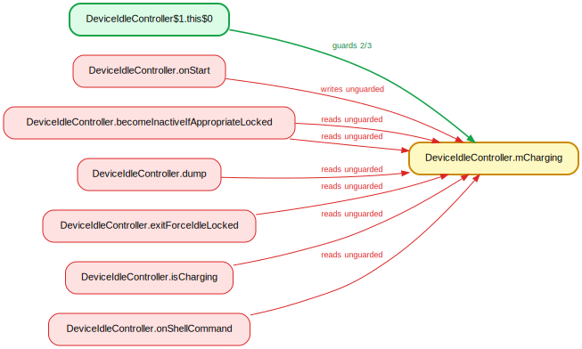
**Verdict: IDENTITY.** Guard resolves to the outer `DeviceIdleController`; the write `mCharging=true` (`:2697`) is inside `synchronized (this)` (`:2644`).

### 36. `DeviceIdleController.mPowerSaveWhitelistExceptIdleAppIdArray` — guarded by `DeviceIdleController` (2/3)
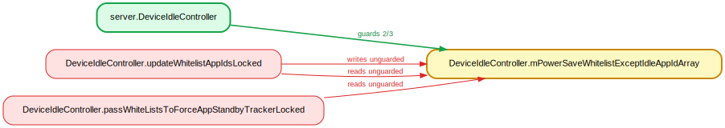
**Verdict: CONVENTION.** Write/read in `*Locked` methods (`updateWhitelistAppIdsLocked` `:4432`, `passWhiteListsToForceAppStandbyTrackerLocked` `:4510`); callers hold `synchronized(this)`.

### 37. `StorageManagerService.mPrimaryStorageUuid` — guarded by `StorageManagerService.mLock` (4/5)
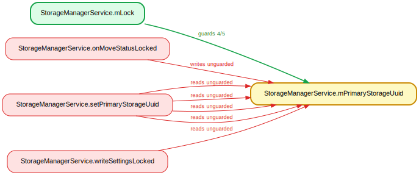
**Verdict: REAL.** `@GuardedBy("mLock")` (`:469`); most accesses are under the lock, but the read at `:3113` (`prepareUserStorageForMoveInternal(mPrimaryStorageUuid,…)`) is *after* the `synchronized` block closes (`:3107`) and before re-acquisition (`:3115`) — a narrow real window.

### 38. `Watchdog$HandlerChecker.mCurrentMonitor` — guarded by `mLock` (2/3)

**Verdict: CONVENTION.** Write in `scheduleCheckLocked` (`Watchdog.java:328`) called under `synchronized(mLock)` (`:881`); reads in `describeBlockedStateLocked` reached via `*Locked`.

### 39. `MagnificationConnectionManager$WindowMagnifier.mEnabled` — guarded by `MagnificationController.mLock` (2/3)
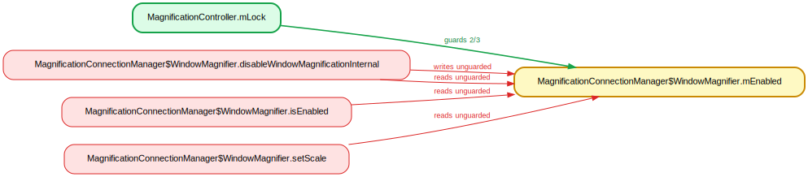
**Verdict: CONVENTION.** `@GuardedBy("mLock")` (`:139`), with `@SuppressWarnings("GuardedBy")` because ErrorProne (like lockdex) can't see the inner-class field is covered by the outer-held lock. Every caller holds `synchronized(mLock)` (`:377/397/703`).

### 40. `MagnificationConnectionManager$WindowMagnifier.mIdOfLastServiceToControl` — guarded by `MagnificationController.mLock` (2/3)
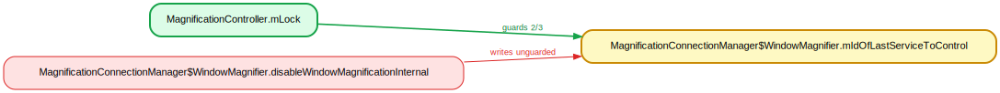
**Verdict: CONVENTION.** Same site/line as #39; all three callers of `disableWindowMagnificationInternal` hold `synchronized(mLock)`.

### 41. `MagnificationConnectionManager.mConnectionWrapper` — guarded by `MagnificationController.mLock` (3/4)
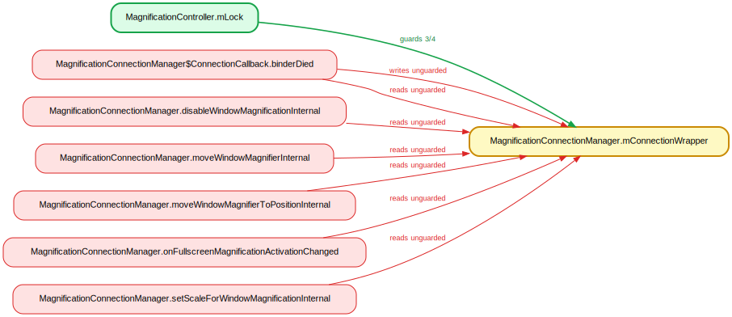
**Verdict: IDENTITY.** The controller passes its own `mLock` into the manager's constructor (`MagnificationController.java:1189`), so the two `mLock`s are one object; the `binderDied` accesses run inside `synchronized (mLock)` (`MagnificationConnectionManager.java:1077`). One lock split into two names.

### 42. `AlarmManagerService.mNextAlarmClockMayChange` — guarded by `mLock` (2/3)
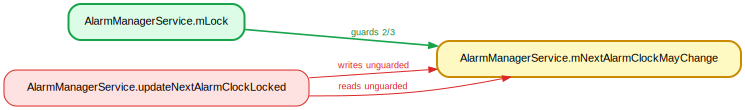
**Verdict: CONVENTION.** Both accesses are in `updateNextAlarmClockLocked` (`:3709`), a `*Locked` method whose call sites hold `synchronized(mLock)` (`:2567/3981/4549`).

### 43. `AlarmManagerService.mNextWakeFromIdle` — guarded by `mLock` (2/3)
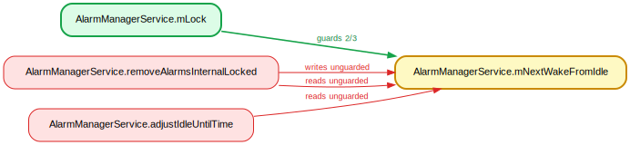
**Verdict: CONVENTION.** Accesses in `@GuardedBy("mLock") removeAlarmsInternalLocked` (`:3917`) and the private `adjustIdleUntilTime`, called only from lock-held contexts (`setImplLocked`, `:2521`).

### 44. `AlarmManagerService.mPendingIdleUntil` — guarded by `mLock` (2/3)
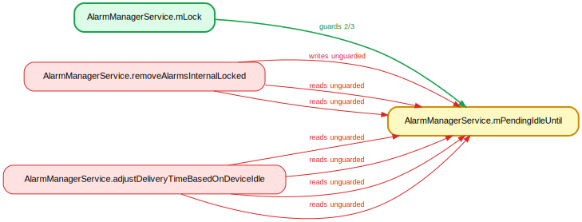
**Verdict: CONVENTION.** Same as #43 — `@GuardedBy("mLock") removeAlarmsInternalLocked` plus a private helper reached only under-lock.

### 45. `ActiveForegroundApp.mAppOnTop` — guarded by `ActivityManagerService.mProcLock` (2/3)
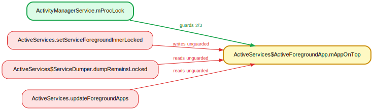
**Verdict: CONVENTION.** Mis-identified guard — every access is under `synchronized(mAm)`, not `mProcLock` (write `ActiveServices.java:2691`, read inside `synchronized(mAm)` `:1980`, dump under `:8188`).

### 46. `ActiveForegroundApp.mStartVisibleTime` — guarded by `ActivityManagerService` (2/3)
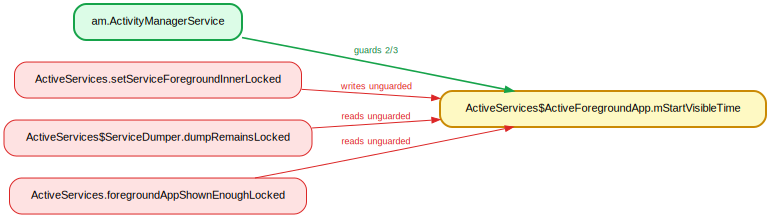
**Verdict: CONVENTION.** Named guard (`mAm`) is correct; the accesses are in `*Locked` methods whose callers hold `synchronized(mAm)`.

### 47. `ActivityManagerService.mDebugApp` — guarded by `ActivityManagerService` (2/3)

**Verdict: IDENTITY.** Write/read are literally inside `synchronized (this)` in `setDebugApp` (`:7620`); the dump reads are under the AMS monitor via `dumpProcessesLSP`. lockdex flagged accesses that do hold the guard.

### 48. `ActivityManagerService.mWaitForDebugger` — guarded by `ActivityManagerService` (2/3)
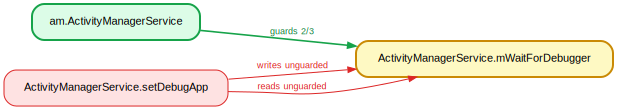
**Verdict: IDENTITY.** Same `setDebugApp` `synchronized (this)` block (`:7622/7619`) as #47.

### 49. `AppErrors.mBadProcesses` — guarded by `mBadProcessLock` (3/4)
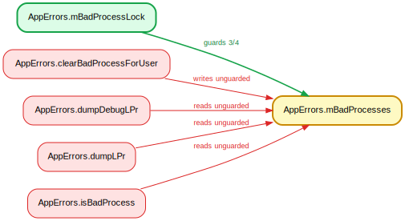
**Verdict: CONVENTION.** A deliberate `volatile` copy-on-write field (`AppErrors.java:135`): writers clone under `mBadProcessLock` then publish via the volatile ref; the flagged reads are intentional lock-free snapshots ("NO LOCKING for the simple lookup", `:365`). lockdex doesn't model volatile COW.

### 50. `AppProfiler.mFullPssOrRssPending` — guarded by `mProfilerLock` (2/3)

**Verdict: IDENTITY.** `@GuardedBy("mProfilerLock")` (`:212`); the flagged write in `requestPssAllProcsLPr` (`:1261`) is directly inside `synchronized (mProfilerLock)` (`:1251`) — the method self-acquires despite the `LPr` name.

### 51. `PkgSettings.mLevelChangeTime` — guarded by `mSettingsLock` (2/3)
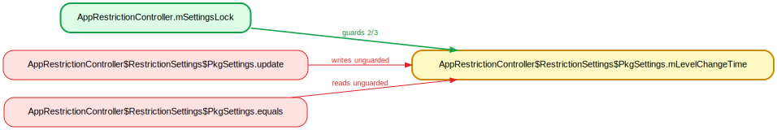
**Verdict: CONVENTION.** Write in `@GuardedBy("mSettingsLock") update` (`AppRestrictionController.java:475`), read in `@GuardedBy("mSettingsLock") equals` (`:624`) — caller-holds-lock contract.

### 52. `ErrorDialogController.mWaitDialog` — guarded by `mProcLock` (2/3)
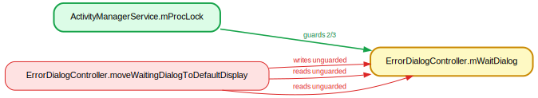
**Verdict: CONVENTION.** `@GuardedBy("mProcLock")` (`:61`); the flagged `moveWaitingDialogToDefaultDisplay` is `@GuardedBy("mProcLock")` (`:388`) and its caller (`:122`) holds the lock.

### 53. `PendingIntentRecord.mCancelCallbacks` — guarded by `mLock` (2/3)
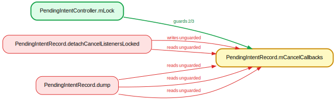
**Verdict: CONVENTION.** Write in `detachCancelListenersLocked` (`:361`) called under `synchronized(mLock)` (`PendingIntentController.java:183/248/288`); dump reads wrapped in `synchronized(mLock)` (`:387`).

### 54. `ProcessRecord.mOnewayThread` — guarded by `ActivityManagerService` (2/3)

**Verdict: CONVENTION.** `@CompositeRWLock({"mService","mProcLock"})` (`:160`): the flagged read `getOnewayThread` legitimately holds only `mProcLock` (`anyOf` read) — by design, not unguarded.

### 55. `ReceiverList.linkedToDeath` — guarded by `mService` (2/3)
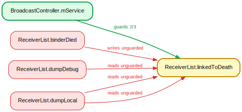
**Verdict: REAL.** Written under `synchronized(mService)` on the normal paths (`BroadcastController.java:564/681`), but `binderDied` sets `linkedToDeath=false` with NO lock (`ReceiverList.java:67`), on a binder thread — races register/unregister.

### 56. `ServiceRecord.mFgsNotificationShown` — guarded by `ActivityManagerService$LocalService.this$0` (2/3)
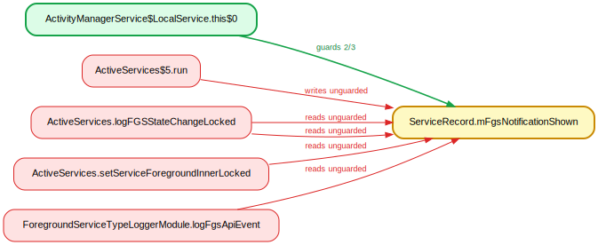
**Verdict: IDENTITY.** Guard is the AMS instance; the flagged write in the posted Runnable (`ActiveServices.java:3269`) runs inside `synchronized(mAm)` (`:3254`).

### 57. `ServiceRecord.pendingConnectionGroup` — guarded by `ActivityManagerService` (2/3)
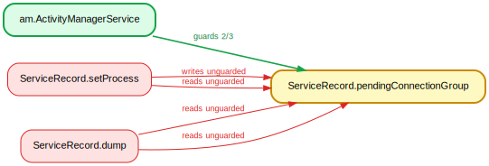
**Verdict: CONVENTION.** Write in `setProcess` (`ServiceRecord.java:1260`) reached only from `*Locked` callers under `synchronized(mAm)`; dump reads under `synchronized(mAm)` (`ActiveServices.java:8188`).

### 58. `ServiceRecord.pendingConnectionImportance` — guarded by `ActivityManagerService` (2/3)
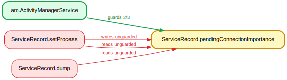
**Verdict: CONVENTION.** Same mechanism/lines as #57.

### 59. `GamePackageConfiguration.mAllowAngle` — guarded by `mDeviceConfigLock` (2/3)

**Verdict: UNCLEAR.** Spurious guard: `mAllowAngle` (`GameManagerService.java:554`) is written only at construction/parse and the flagged line 920 write targets a fresh `copy` local. Effectively immutable after publish; the inferred lock is an artifact.

### 60. `GamePackageConfiguration.mAllowDownscale` — guarded by `mDeviceConfigLock` (2/3)

**Verdict: UNCLEAR.** Identical to #59 — construction-only writes, flagged write on a fresh local, lock-free read of an immutable field.

### 61. `GamePackageConfiguration.mAllowFpsOverride` — guarded by `mDeviceConfigLock` (2/3)

**Verdict: CONVENTION.** Constructor-only writes under `synchronized(mDeviceConfigLock)` then immutable publication into `mConfigs` (`GameManagerService.java:1894/1897`); the flagged write is on a fresh `copy` local (`:921`). Escape/immutability FP.

### 62. `GamePackageConfiguration.mBatteryModeOverridden` — guarded by `mDeviceConfigLock` (2/3)
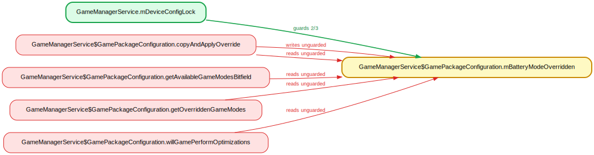
**Verdict: CONVENTION.** Same — lock-held construction, immutable publish; flagged write on the `copy` local (`:913`); reads see the safely-published object.

### 63. `GamePackageConfiguration.mPerfModeOverridden` — guarded by `mDeviceConfigLock` (2/3)

**Verdict: CONVENTION.** Same value-object escape pattern (`:910` write on `copy`).

### 64. `GlobalLevelState.savedByte` — guarded by `AppHibernationService.mLock` (2/3)

**Verdict: CONVENTION.** Flagged write initializes a new local `state` during off-lock disk deserialization (`GlobalLevelHibernationProto.java:72`), published under `mLock` afterward; the flagged read is in fact inside `synchronized(mLock)` (`AppHibernationService.java:424`).

### 65. `AppPredictionPerUserService.mZombie` — guarded by `AbstractPerUserSystemService.mLock` (2/3)

**Verdict: IDENTITY.** `@GuardedBy("mLock")` (`:72`); the write `mZombie=false` (`:274`) is inside `synchronized(mLock)` (`:267`) on the inherited `mLock` — held-set undercounted (2 of 3).

### 66. `RestoreUpdateRecord.notified` — guarded by `AppWidgetServiceImpl.mLock` (2/3)

**Verdict: CONVENTION.** Real mutations are in `maybeSendWidgetRestoreBroadcastsLocked` under `mLock`; the flagged write sets `notified` on a fresh local `record` during XML parse (`AppWidgetXmlUtil.java:343`).

### 67. `AttentionManagerService$ProximityUpdate.mStartedUpdates` — guarded by `mLock` (2/3)

**Verdict: IDENTITY.** The write `mStartedUpdates=true` (`:704`) is inside `synchronized(mLock)` (`:692`); held-set undercounted.

### 68. `AttentionManagerService.mCurrentProximityUpdate` — guarded by `mLock` (3/4)

**Verdict: IDENTITY.** `@GuardedBy("mLock")` (`:155`); the write (`:403`) is inside `synchronized(mLock)` (`:386`). Held-set missed it (3 of 4).

### 69. `AudioService.mVibrateSetting` — guarded by `mSettingsLock` (2/3)

**Verdict: REAL.** Guarded writes under `synchronized(mSettingsLock)` (`:3411/3415`), but the binder `setVibrateSetting` writes it unlocked (`:6898`) and `getVibrateSetting` reads it unlocked (`:6890`) — arbitrary-app-reachable on binder threads. Real (deprecated API, low severity).

### 70. `FadeConfigurations.mActiveFadeManagerConfig` — guarded by `mLock` (4/5)

**Verdict: CONVENTION.** `@GuardedBy("mLock") getUpdatedFadeManagerConfigLocked` (`:523`) — the lazy-init write requires the caller hold the lock; every call site is under `synchronized(mLock)`.

### 71. `SpatializerHelper.mActualHeadTrackingMode` — guarded by `SpatializerHelper` (3/4)

**Verdict: IDENTITY / benign read.** The write (`:256`) is inside `synchronized void init(...)` (`:189`) — holds `this`, the guard. The `dump` read (`:1648`) is an unsynchronized diagnostic read of an `int` from `AudioService.dump()`.

### 72. `SpatializerHelper.mSpatCallback` — guarded by `SpatializerHelper` (2/3)

**Verdict: IDENTITY.** The only flagged write (`:200`) is inside `synchronized void init(...)` (`:189`) — the receiver lock the guard names. lockdex doesn't model `synchronized` method receivers.

### 73. `AutofillManagerServiceImpl.mRemoteAugmentedAutofillService` — guarded by `mLock` (2/3)

**Verdict: CONVENTION.** All accesses are in `@GuardedBy("mLock") getRemoteAugmentedAutofillServiceLocked` (`:1665`); callers (e.g. `@GuardedBy("mLock") onBackKeyPressed`) hold the lock.

### 74. `Session$AssistDataReceiverImpl.mPendingFillRequest` — guarded by `mLock` (5/6)

**Verdict: CONVENTION.** Write in `newAutofillRequestLocked` (`Session.java:764`), `@GuardedBy("mLock")` field (`:757`); callers are inside `requestNewFillResponseLocked` (`:1461`).

### 75. `Session$AssistDataReceiverImpl.mPendingInlineSuggestionsRequest` — guarded by `mLock` (2/3)

**Verdict: CONVENTION.** Same site as #74 (`:768`); guarded-by-contract.

### 76. `Session$AssistDataReceiverImpl.mWaitForInlineRequest` — guarded by `mLock` (2/3)

**Verdict: CONVENTION.** Same `newAutofillRequestLocked`/`requestNewFillResponseLocked` contract (`:767`).

### 77. `Session$ClassificationState.mPendingFieldClassificationRequest` — guarded by `mLock` (2/3)

**Verdict: CONVENTION.** Write in `@GuardedBy("mLock") updateResponseReceived` (`:7352`); read in `@GuardedBy("mLock") toString` (`:7377`).

### 78. `Session.mClientVulture` — guarded by `mLock` (2/3)

**Verdict: CONVENTION.** All accesses in `@GuardedBy("mLock") unlinkClientVultureLocked` (`:1894`); callers `setClientLocked`/`destroyLocked` hold the lock.

### 79. `Session.mSessionState` — guarded by `mLock` (2/3)

**Verdict: benign read.** The write is in `@GuardedBy("mLock") removeFromServiceLocked` (held by `cancelSession`'s `synchronized(mLock)`, `:3105`); but `mSessionState` has NO annotation (`:291`) and the flagged read is in unsynchronized `Session.toString()` (`:7399`) — a real but diagnostic-only read.

### 80. `Session.mWaitForImeAnimation` — guarded by `mLock` (2/3)

**Verdict: IDENTITY.** Both accesses are inside explicit `synchronized (mLock)` blocks (`:5579`, `:5813`); held-set failed to attribute the enclosing block.

### 81. `UserBackupManagerService.mJournal` — guarded by `mQueueLock` (2/3)

**Verdict: REAL.** Written under `mQueueLock` in `writeToJournalLocked` (`:2333`), but `getJournal()` is a plain accessor and `BackupHandler.java:172` calls it *outside* the `synchronized(getQueueLock())` block (`:173`); `parseLeftoverJournals` reads it on the async thread unlocked (`:1073`). Real race.

### 82. `BlobStoreSession.mState` — guarded by `mSessionLock` (3/4)

**Verdict: IDENTITY.** `@GuardedBy("mSessionLock")` (`:119`); every flagged access is inside a `synchronized (mSessionLock)` block (e.g. `:437`). lockdex failed the lock identity on these.

### 83. `ProgramInfoCache.mComplete` — guarded by `RadioModule.mLock` (2/3)

**Verdict: CONVENTION.** The cache instance is `@GuardedBy("mLock")` in *two* owners (`RadioModule`, `TunerSession`) with distinct `mLock`s; lockdex pinned one and merged both contexts. Accessed only under whichever owner's `mLock`.

### 84. `Mutable.value` — guarded by `BroadcastRadioService.mLock` (3/4)

**Verdict: CONVENTION.** `Mutable<E>` is a generic lambda-capture box used at dozens of unrelated sites; lockdex merged them all into one field key and attributed an unrelated lock. The flagged accesses are method-local boxes.

### 85. `SecureChannel.mHandshakeContext` — guarded by `mHandshakeLock` (2/3)

**Verdict: IDENTITY.** The flagged write (`SecureChannel.java:355`) is inside `synchronized (mHandshakeLock)` (`:348`). (The genuinely-unguarded accesses at `:380/389` were *not* flagged — so the one finding raised is the false one.)

### 86. `DefaultNetworkMetrics.mLastValidationTimeMs` — guarded by `DefaultNetworkMetrics` (2/3)

**Verdict: CONVENTION.** `@GuardedBy("this")` (`:59`); the only off-lock writer is `newDefaultNetwork`, a private helper called from the constructor (pre-escape) and from `synchronized logDefaultNetworkEvent` (`:132`). Single-threaded construction, not a reachable race.

### 87. `Vpn.mConnection` — guarded by `VpnManagerService.mVpns` (2/3)

**Verdict: CONVENTION.** Consistently protected by the Vpn-instance monitor (`prepare` is `public synchronized`, `Vpn.java:1260`), not the named outer `mVpns`. Wrong-lock attribution.

### 88. `VpnConnectivityMetrics.mUnderlyingNetworkTypes` — guarded by `Vpn` (2/3)

**Verdict: CONVENTION.** Single-owner Vpn state; all entry points run under the Vpn monitor (`@GuardedBy("this") updateState`, `synchronized (Vpn.this)` `:2328`). Nested-call held-set FP.

### 89. `SyncStorageEngine$AuthorityInfo.backoffDelay` — guarded by `mAuthorities` (3/4)

**Verdict: CONVENTION.** Shared writes under `synchronized(mAuthorities)` (`:913`); the flagged write is constructor-time on an unpublished object (`defaultInitialisation` via `createAuthorityLocked`), and the read is on a defensive copy snapshotted under the lock (`:1449`).

### 90. `SyncStorageEngine$AuthorityInfo.backoffTime` — guarded by `mAuthorities` (3/4)

**Verdict: CONVENTION.** Same as #89 — construction-time write + defensive-copy reads.

### 91. `AuthorityInfo.enabled` — guarded by `mSyncManagerLock` (2/3)

**Verdict: IDENTITY.** Misattributed: the real guard is `SyncStorageEngine.mAuthorities`, not `ContentService.mSyncManagerLock`. Every flagged access holds `mAuthorities` (`:750/715`); only debug/dump reads are lock-free.

### 92. `SyncStorageEngine.mNextAuthorityId` — guarded by `mSyncManagerLock` (6/7)

**Verdict: IDENTITY.** Same wrong-lock as #91; `createAuthorityLocked`/`writeAccountInfoLocked` always run under `synchronized(mAuthorities)`.

### 93. `ActiveAdmin.disabledKeyguardFeatures` — guarded by `mLockDoNoUseDirectly` (2/3)

**Verdict: IDENTITY.** The lock is reached via `getLockObject()` (returns `mLockDoNoUseDirectly`); the flagged reads are inside `synchronized (getLockObject())` (`DevicePolicyManagerService.java:9795/12231`). lockdex resolves the accessor on some sites but not others.

### 94. `ActiveAdmin.mEnrollmentSpecificId` — guarded by `mLockDoNoUseDirectly` (2/3)

**Verdict: CONVENTION.** Violations are the `readFromXml`/`writeToXml` serialization pair, reached only via `loadSettingsLocked` (`synchronized(getLockObject())`, `:2349`) / `@GuardedBy saveSettingsLocked`.

### 95. `ActiveAdmin.mManagedProfileCallerIdAccess` — guarded by `mLockDoNoUseDirectly` (3/4)

**Verdict: IDENTITY.** Getter reads inside `synchronized (getLockObject())` (`:14631/14658`); the remaining accesses are the under-lock serialization path.

### 96. `ActiveAdmin.mManagedProfileContactsAccess` — guarded by `mLockDoNoUseDirectly` (3/4)

**Verdict: IDENTITY.** Same as #95 (`:14813/14833`) — `getLockObject()` indirection.

### 97. `ActiveAdmin.mOrganizationId` — guarded by `mLockDoNoUseDirectly` (2/3)

**Verdict: CONVENTION.** Serialization-only (`readFromXml`/`writeToXml`) under the `loadSettingsLocked`/`saveSettingsLocked` lock contract.

### 98. `ActiveAdmin.mProfileOffDeadline` — guarded by `mLockDoNoUseDirectly` (6/7)

**Verdict: IDENTITY.** Flagged read inside `synchronized (getLockObject())` (`:21412`); the rest is the serialization convention path. Consistently held.

### 99. `ActiveAdmin.mSuspendPersonalApps` — guarded by `mLockDoNoUseDirectly` (2/3)

**Verdict: CONVENTION.** `readFromXml`/`writeToXml` pair under the load/save lock contract.

### 100. `ActiveAdmin.maximumFailedPasswordsForWipe` — guarded by `mLockDoNoUseDirectly` (2/3)

**Verdict: CONVENTION.** Same serialization convention as #99.

---

_Generated by `lockdex races` on a build's `services.jar`; each verdict was checked
against AOSP source. Reproduce the raw findings with
`lockdex races <input> --src-root <aosp> --out-dir <dir>`._
