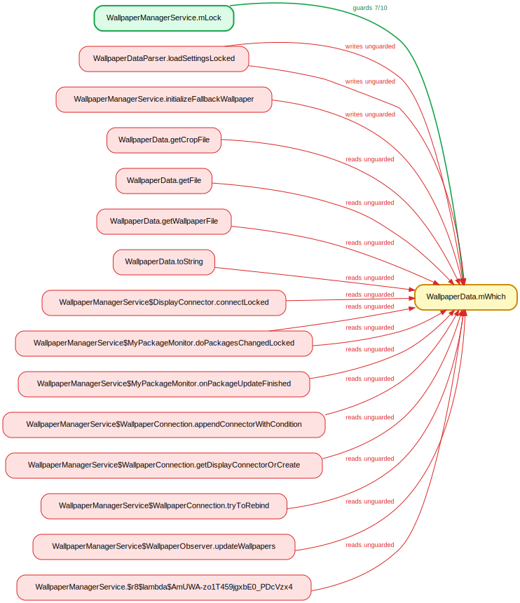

# Findings — inconsistently-guarded fields in `system_server`

`lockdex races` reconstructs `@GuardedBy` from the bytecode. For every field it
records the locks held on each read and write — interprocedurally, by intersecting
the held-set over a method's callers (`must_entry`), so a field written inside a
helper counts as guarded when the helper is *always* reached under the lock. A
field guarded by one lock on a clear majority (≥2/3) of its writes, but accessed
without it somewhere, is reported: the stray accesses are the suspected races.

On a build's `services.jar` it flags **614** fields in about two seconds.
`final`/`volatile` fields, constructor writes, and compiler-synthesized methods are
excluded.

## On soundness — read this before dismissing a row

The must-hold result is **sound given the call graph**: when a write is reported
unguarded, a modeled call path genuinely reaches it without the lock. Two
consequences:

- **Depth is never the problem.** The held-set propagates exactly through any call
  depth, and direct/private calls are resolved exactly — so a flag on a private
  call chain is *guaranteed*: some real path reaches that write without the guard.
- The **only** false-positive source is RTA over-approximation: a virtual/interface
  call resolved to a target the runtime never actually dispatches there, which adds
  a spurious (lockless) caller and poisons the intersection. So the place to look
  is always the *public* methods on the path — and "is every caller of this
  `*Locked` method actually holding the lock?" is itself a real question.

Lock identity is unified across names: a singleton held in a field and used as its
own `synchronized(this)` monitor (e.g. `BatteryStatsService.mStats`, which *is* a
`BatteryStatsImpl`) is one lock, not two.

## Worked examples

### `BatteryStatsImpl.mDischargeScreenDozeUnplugLevel` — @GuardedBy(`BatteryStatsImpl`)

Guarded by the `BatteryStatsImpl` monitor on 6 of 9 writes (after unifying it with
`BatteryStatsService.mStats`). The three that are not are in the private
`updateNewDischargeScreenLevelLocked` — and because that method and its
package-private caller `updateDischargeScreenLevelsLocked` are direct calls, the
unguarded path is *exact*. It bottoms out at the public `noteScreenStateLocked` /
`setBatteryStateLocked` (`*Locked` methods that assume the caller holds the
monitor). The finding is the legitimate question: does every caller of those two
actually hold it?

### `WallpaperData.mWhich` — @GuardedBy(`WallpaperManagerService.mLock`)

Guarded by `mLock` on 7 of 10 writes; the unguarded path runs through
`WallpaperDataParser.loadSettingsLocked` — a different class touching the data
object's field while loading.

## Top 50 by write-side violations

Ranked by writes that miss the guard (the clearest races); unguarded reads are
counted too (read/write races) but ranked lower.

| field | @GuardedBy | guarded writes | unguarded W/R | example unguarded site |
|---|---|---|---|---|
| `BatteryStatsImpl.mDischargeScreenDozeUnplugLevel` | `stats.BatteryStatsImpl` | 6/9 | 3/1 | `BatteryStatsImpl.updateNewDischargeScreenLevelLocked`:11726 |
| `BatteryStatsImpl.mDischargeScreenOffUnplugLevel` | `stats.BatteryStatsImpl` | 6/9 | 3/1 | `BatteryStatsImpl.updateNewDischargeScreenLevelLocked`:11725 |
| `BatteryStatsImpl.mDischargeScreenOnUnplugLevel` | `stats.BatteryStatsImpl` | 6/9 | 3/1 | `BatteryStatsImpl.updateNewDischargeScreenLevelLocked`:11724 |
| `WallpaperData.mWhich` | `WallpaperManagerService.mLock` | 7/10 | 3/13 | `WallpaperDataParser.loadSettingsLocked`:207 |
| `DeviceIdleController.mForceIdle` | `server.DeviceIdleController` | 4/6 | 2/13 | `DeviceIdleController.exitForceIdleLocked`:3755 |
| `BroadcastQueueImpl.mRunningColdStart` | `BroadcastQueue.mService` | 5/7 | 2/7 | `BroadcastQueueImpl.clearRunningColdStart`:753 |
| `OomAdjuster.mOomAdjUpdateOngoing` | `ActivityManagerService.mProcLock` | 6/9 | 2/1 | `OomAdjuster.updateOomAdjPendingTargetsLocked`:861 |
| `AppWidgetServiceImpl$Host.callbacks` | `AppWidgetServiceImpl.mLock` | 7/9 | 2/9 | `AppWidgetServiceImpl.deleteHostLocked`:2893 |
| `BackupAgentConnectionManager.mCurrentConnection` | `BackupAgentConnectionManager.mAgentConnectLock` | 4/6 | 2/4 | `BackupAgentConnectionManager.agentDisconnected`:296 |
| `SecurityLogMonitor.mAllowedToRetrieve` | `SecurityLogMonitor.mLock` | 4/6 | 2/1 | `SecurityLogMonitor.notifyDeviceOwnerOrProfileOwnerIfNeeded`:592 |
| `VoteSummary.height` | `DisplayModeDirector.mLock` | 4/6 | 2/3 | `SizeVote.updateSummary`:60 |
| `VoteSummary.width` | `DisplayModeDirector.mLock` | 4/6 | 2/2 | `SizeVote.updateSummary`:59 |
| `NotificationRecord.isCanceled` | `NotificationManagerService.mNotificationLock` | 4/6 | 2/6 | `NotificationManagerService.cancelNotificationLocked`:11324 |
| `PackageSetting.mimeGroups` | `PackageManagerServiceInjector.mLock` | 4/6 | 2/7 | `PackageSetting.copyMimeGroups`:704 |
| `BatteryStatsImpl.mDischargeCurrentLevel` | `stats.BatteryStatsImpl` | 4/6 | 2/6 | `BatteryStatsImpl.initTimersAndCounters`:10979 |
| `ProfilerInfo.profileFd` | `AppProfiler.mProfilerLock` | 4/5 | 1/5 | `WindowProcessController.createProfilerInfoIfNeeded`:1522 |
| `SyncStatusInfo.pending` | `ContentService.mSyncManagerLock` | 3/4 | 1/2 | `SyncStorageEngine.markPending`:1101 |
| `ActivityInfo.enabled` | `PackageManagerServiceInjector.mLock` | 3/4 | 1/3 | `ActivityTaskManagerService.startDreamActivityInternal`:1535 |
| `ActivityInfo.taskAffinity` | `ActivityTaskManagerService.mGlobalLock` | 2/3 | 1/1 | `PackageInfoUtils.generateActivityInfo`:574 |
| `PackageInstaller$SessionParams.appIcon` | `PackageInstallerService.mSessions` | 3/4 | 1/7 | `PackageInstallerService.createSessionInternal`:1017 |
| `PackageInstaller$SessionParams.appIconLastModified` | `PackageInstallerService.mSessions` | 2/3 | 1/1 | `PackageInstallerSession.write`:6915 |
| `PackageInstaller$SessionParams.appLabel` | `PackageInstallerService.mSessions` | 2/3 | 1/3 | `PackageInstallerService.createSessionInternal`:786 |
| `PermissionGroupInfo.metaData` | `AccessCheckingService.stateLock` | 2/3 | 1/0 | `PermissionService.generatePermissionGroupInfo`:233 |
| `PermissionInfo.packageName` | `AccessCheckingService.stateLock` | 3/4 | 1/14 | `AppIdPermissionPersistence.parsePermission`:98 |
| `ResolveInfo.preferredOrder` | `PackageManagerServiceInjector.mLock` | 3/4 | 1/4 | `ComputerEngine.createForwardingResolveInfoUnchecked`:1811 |
| `UserInfo.profileBadge` | `UserManagerService.mUsersLock` | 2/3 | 1/5 | `UserManagerService.readUserLP`:6151 |
| `UserInfo.userType` | `UserManagerService.mUsersLock` | 4/5 | 1/15 | `UserManagerService.emulateSystemUserModeIfNeeded`:4995 |
| `NetworkPolicy.limitBytes` | `NetworkPolicyManagerService.mNetworkPoliciesSecondLock` | 5/6 | 1/1 | `NetworkPolicyManagerService.factoryReset`:6460 |
| `BatteryStats$PackageChange.mPackageName` | `stats.BatteryStatsImpl` | 4/5 | 1/0 | `BatteryStatsImpl.readSummaryFromParcel`:15105 |
| `BatteryStats$PackageChange.mUpdate` | `stats.BatteryStatsImpl` | 4/5 | 1/0 | `BatteryStatsImpl.readSummaryFromParcel`:15106 |
| `BatteryStats$PackageChange.mVersionCode` | `stats.BatteryStatsImpl` | 2/3 | 1/0 | `BatteryStatsImpl.readSummaryFromParcel`:15107 |
| `DisplayInfo.modeId` | `DisplayManagerService.mSyncRoot` | 2/3 | 1/1 | `LogicalDisplay.updateLocked`:565 |
| `DisplayInfo.type` | `ActivityTaskManagerService.mGlobalLock` | 3/4 | 1/15 | `LogicalDisplay.updateLocked`:555 |
| `VpnConfig.user` | `connectivity.Vpn` | 2/3 | 1/6 | `Vpn.establish`:1827 |
| `DeviceIdleController.mCharging` | `DeviceIdleController$1.this$0` | 2/3 | 1/6 | `DeviceIdleController.onStart`:2697 |
| `DeviceIdleController.mPowerSaveWhitelistExceptIdleAppIdArray` | `server.DeviceIdleController` | 2/3 | 1/2 | `DeviceIdleController.updateWhitelistAppIdsLocked`:4432 |
| `StorageManagerService.mPrimaryStorageUuid` | `StorageManagerService.mLock` | 4/5 | 1/5 | `StorageManagerService.onMoveStatusLocked`:1929 |
| `Watchdog$HandlerChecker.mCurrentMonitor` | `Watchdog$HandlerChecker.mLock` | 2/3 | 1/2 | `Watchdog$HandlerChecker.scheduleCheckLocked`:328 |
| `MagnificationConnectionManager$WindowMagnifier.mEnabled` | `MagnificationController.mLock` | 2/3 | 1/3 | `MagnificationConnectionManager$WindowMagnifier.disableWindowMagnificationInternal`:1174 |
| `MagnificationConnectionManager$WindowMagnifier.mIdOfLastServiceToControl` | `MagnificationController.mLock` | 2/3 | 1/0 | `MagnificationConnectionManager$WindowMagnifier.disableWindowMagnificationInternal`:1175 |
| `MagnificationConnectionManager.mConnectionWrapper` | `MagnificationController.mLock` | 3/4 | 1/6 | `MagnificationConnectionManager$ConnectionCallback.binderDied`:1083 |
| `AlarmManagerService.mNextAlarmClockMayChange` | `AlarmManagerService.mLock` | 2/3 | 1/1 | `AlarmManagerService.updateNextAlarmClockLocked`:3713 |
| `AlarmManagerService.mNextWakeFromIdle` | `AlarmManagerService.mLock` | 2/3 | 1/2 | `AlarmManagerService.removeAlarmsInternalLocked`:3970 |
| `AlarmManagerService.mPendingIdleUntil` | `AlarmManagerService.mLock` | 2/3 | 1/6 | `AlarmManagerService.removeAlarmsInternalLocked`:3966 |
| `ActiveServices$ActiveForegroundApp.mAppOnTop` | `ActivityManagerService.mProcLock` | 2/3 | 1/2 | `ActiveServices.setServiceForegroundInnerLocked`:2691 |
| `ActiveServices$ActiveForegroundApp.mStartVisibleTime` | `am.ActivityManagerService` | 2/3 | 1/2 | `ActiveServices.setServiceForegroundInnerLocked`:2695 |
| `ActivityManagerService.mDebugApp` | `am.ActivityManagerService` | 2/3 | 1/3 | `ActivityManagerService.setDebugApp`:7621 |
| `ActivityManagerService.mWaitForDebugger` | `am.ActivityManagerService` | 2/3 | 1/1 | `ActivityManagerService.setDebugApp`:7622 |
| `AppErrors.mBadProcesses` | `AppErrors.mBadProcessLock` | 3/4 | 1/3 | `AppErrors.clearBadProcessForUser`:391 |
| `AppProfiler.mFullPssOrRssPending` | `AppProfiler.mProfilerLock` | 2/3 | 1/0 | `AppProfiler.requestPssAllProcsLPr`:1261 |
---

`lockdex races <input> --src-root <aosp> --out-dir <dir>` writes the full set
(`races.json`), a per-field diagram, and the offending lines in source;
`--field <name>` / `--guard <lock>` narrows it to one field or lock. See the
[README](../README.md#inconsistently-guarded-fields).
